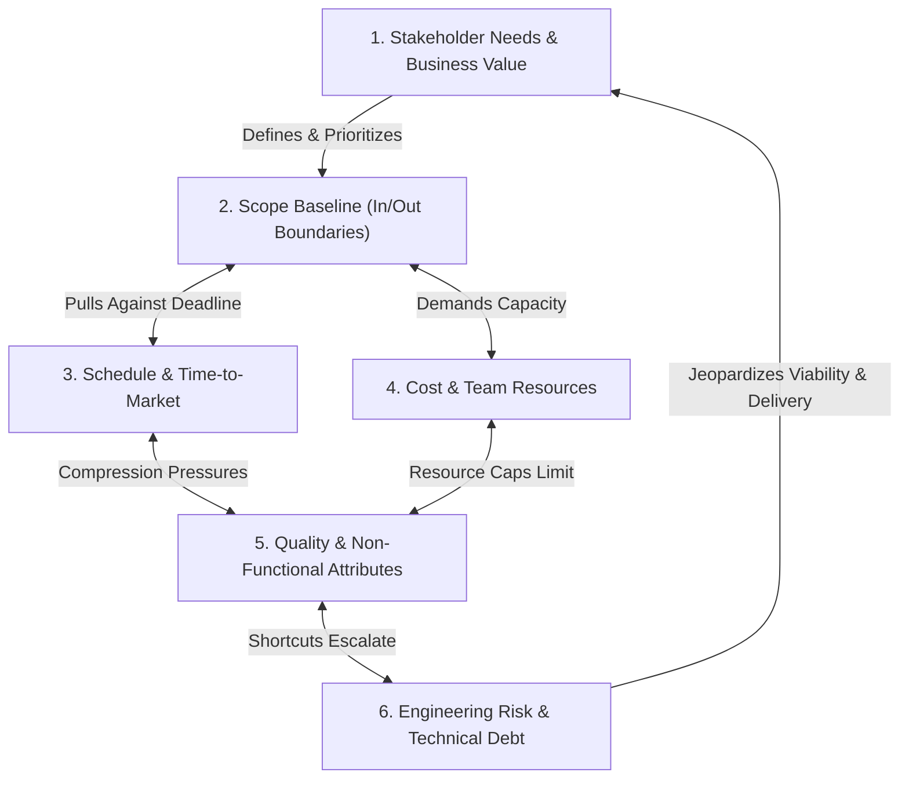
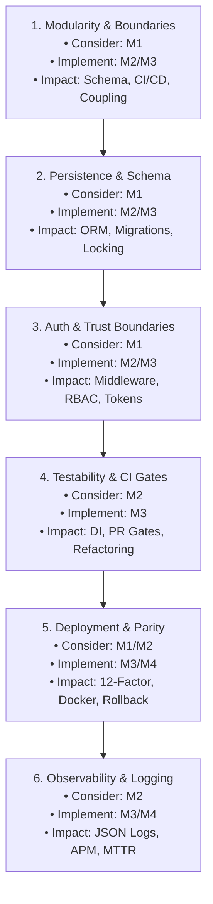
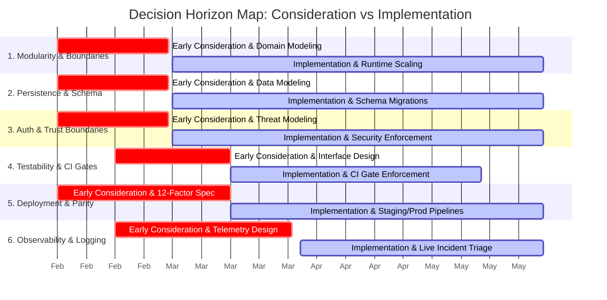
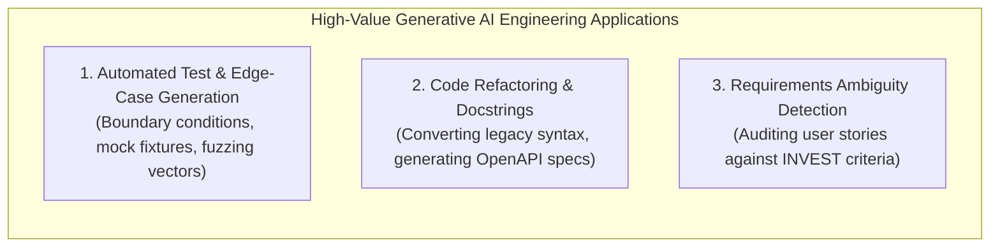
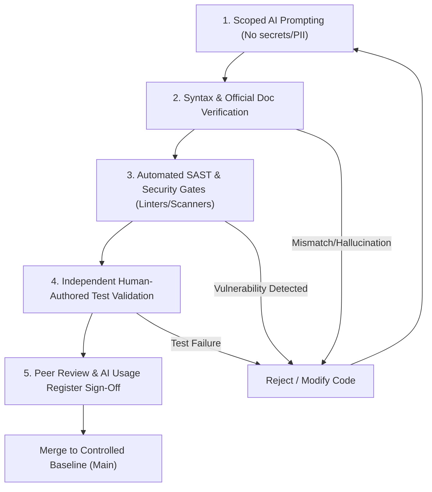

# SEN381 Software Engineering 381
# Assignment 1: Research Foundations for Software Engineering Decisions

**Academic Year:** 2026  
**Module:** Software Engineering 381 (SEN381) — NQF Level 8  
**Assessment Type:** Team Research Brief (Draft Submission)  
**Total Marks:** 50 Marks (Pre-Project Research Foundation)  
**Team Details:**  
- **Team ID:** Group [Assigned Team ID]  
- **Student 1:** [Full Name & Student ID]  
- **Student 2:** [Full Name & Student ID]  
- **Student 3:** [Full Name & Student ID]  

---

### Central Principle & Non-Negotiable Boundary
> [!IMPORTANT]
> **Central Principle:** Research first so that later project decisions are made from evidence, constraints, and lifecycle awareness — not from familiarity, popularity, or unverified AI recommendations.
>
> **Important Project Boundary:** Assignment 1 establishes the research and decision-thinking foundation before the CivicConnect project begins. It informs later project thinking, but it does **NOT** constitute CivicConnect requirements, architecture, technology-stack selection, or deployment decisions. Those decisions must be made in subsequent project milestones against approved requirements, constraints, and risks.

---

## Table of Contents

1. [Document Control & Collaboration Header](#document-control--collaboration-header)
2. [Section 1: Question 1 — Software Engineering Beyond Programming [10 Marks]](#section-1-question-1--software-engineering-beyond-programming-10-marks)
   - 1.1 [Beyond "Just Coding": The Multi-Dimensional Engineering Challenge](#11-beyond-just-coding-the-multi-dimensional-engineering-challenge)
   - 1.2 [Systemic Interaction of the Six Core Engineering Concerns](#12-systemic-interaction-of-the-six-core-engineering-concerns)
   - 1.3 [Empirical Case Study Analysis: Boeing 737 MAX MCAS Failure](#13-empirical-case-study-analysis-boeing-737-max-mcas-failure)
   - 1.4 [Causal Chain Synthesis: Decision $\rightarrow$ Constraint/Trade-off $\rightarrow$ Downstream Consequence](#14-causal-chain-synthesis-decision--constrainttrade-off--downstream-consequence)
3. [Section 2: Question 2 — Thinking Ahead: Decisions Across the Software Lifecycle [15 Marks]](#section-2-question-2--thinking-ahead-decisions-across-the-software-lifecycle-15-marks)
   - 2.1 [The Engineering Horizon: Early Consideration vs Late Implementation](#21-the-engineering-horizon-early-consideration-vs-late-implementation)
   - 2.2 [Deep-Dive Profiles of Six Significant Early Engineering Decisions](#22-deep-dive-profiles-of-six-significant-early-engineering-decisions)
     - 2.2.1 [Decision 1: Architectural Modularity & System Boundaries](#221-decision-1-architectural-modularity--system-boundaries)
     - 2.2.2 [Decision 2: Data Persistence Strategy & Schema Evolution](#222-decision-2-data-persistence-strategy--schema-evolution)
     - 2.2.3 [Decision 3: Authentication, Authorization & Trust Boundaries (Security by Design)](#223-decision-3-authentication-authorization--trust-boundaries-security-by-design)
     - 2.2.4 [Decision 4: Automated Testing Strategy & Testability Architecture](#224-decision-4-automated-testing-strategy--testability-architecture)
     - 2.2.5 [Decision 5: Deployment Target, Environment Parity & Configuration Management](#225-decision-5-deployment-target-environment-parity--configuration-management)
     - 2.2.6 [Decision 6: Observability, Structured Telemetry & Diagnostics](#226-decision-6-observability-structured-telemetry--diagnostics)
   - 2.3 [Visual Artefact: The Decision Horizon Map](#23-visual-artefact-the-decision-horizon-map)
   - 2.4 [Critical Synthesis: Why Implementation-Time is Too Late for Architectural Decisions](#24-critical-synthesis-why-implementation-time-is-too-late-for-architectural-decisions)
4. [Section 3: Question 3 — Evidence-Based Technology Stack Decisions [15 Marks]](#section-3-question-3--evidence-based-technology-stack-decisions-15-marks)
   - 3.1 [Overview of Candidate Contemporary Technology Stacks](#31-overview-of-candidate-contemporary-technology-stacks)
     - 3.1.1 [Stack Approach A: TypeScript / React / Node.js (NestJS) / PostgreSQL](#311-stack-approach-a-typescript--react--nodejs-nestjs--postgresql)
     - 3.1.2 [Stack Approach B: C# / ASP.NET Core 8 / React / Microsoft SQL Server](#312-stack-approach-b-c--aspnet-core-8--react--microsoft-sql-server)
   - 3.2 [Comparative Evaluation Against the Seven Required Lifecycle Criteria](#32-comparative-evaluation-against-the-seven-required-lifecycle-criteria)
   - 3.3 [Justified Weighted Decision Matrix](#33-justified-weighted-decision-matrix)
   - 3.4 [Criterion Weight Justifications & Evidence-Backed Scoring](#34-criterion-weight-justifications--evidence-backed-scoring)
   - 3.5 [Critical Analysis: Why the "Most Popular" Stack is Not Universally Optimal](#35-critical-analysis-why-the-most-popular-stack-is-not-universally-optimal)
5. [Section 4: Question 4 — Responsible AI in Software Engineering [10 Marks]](#section-4-question-4--responsible-ai-in-software-engineering-10-marks)
   - 4.1 [Three High-Value Engineering Use Cases for Generative AI](#41-three-high-value-engineering-use-cases-for-generative-ai)
   - 4.2 [Three Critical Engineering Risks & Failure Modes](#42-three-critical-engineering-risks--failure-modes)
   - 4.3 [Human-in-the-Loop Quality Control & Verification Protocol](#43-human-in-the-loop-quality-control--verification-protocol)
   - 4.4 [The Accountability Defense: Engineering, Ethical, and Legal Responsibility](#44-the-accountability-defense-engineering-ethical-and-legal-responsibility)
6. [Section 5: Academic Reference List](#section-5-academic-reference-list)
7. [Section 6: Appendix — AI Research & Verification Record](#section-6-appendix--ai-research--verification-record)
8. [Section 7: Submission & Integrity Checklist](#section-7-submission--integrity-checklist)

---

## Document Control & Collaboration Header

| Version | Date | Author(s) | Reviewer(s) | Description of Milestone Activity | Document Status |
| :--- | :--- | :--- | :--- | :--- | :--- |
| **0.1** | 2026-09-01 | Full Team | Team Lead | Initial scaffolding, Table of Contents, and section framing. | Approved Draft |
| **1.0** | 2026-09-01 | Full Team | Full Team | Complete pre-project research brief across all 4 questions, decision models, case study synthesis, and reference verification. | Ready for Review |

---

## Section 1: Question 1 — Software Engineering Beyond Programming [10 Marks]

### 1.1 Beyond "Just Coding": The Multi-Dimensional Engineering Challenge
At NQF Level 8, a fundamental intellectual transition must occur: recognizing that **programming is merely the localized mechanical activity of authoring executable syntax, whereas Software Engineering (SE) is the disciplined, systemic management of complexity, risk, economics, and quality across the entire software lifecycle** (IEEE Computer Society, 2014; Boehm, 1981).

A programmer focuses primarily on local correctness: *"Does this function return the expected output for the given input?"* In contrast, a Software Engineer asks:
- *What latent assumptions does this implementation embody?*
- *How does this design choice constrain future maintainability, operational cost, and security posture?*
- *How does this module behave when network latency spikes, concurrent database locks occur, or unauthorized actors inject malformed inputs?*
- *Does this feature genuinely deliver value against the client’s baselined scope, or does it introduce unsustainable technical debt?*

Software systems fail far more frequently due to misunderstood requirements, unmanaged constraints, architectural misalignment, and unmitigated operational risks than due to algorithmic syntax errors. Therefore, engineering competence is demonstrated through evidence-backed trade-off analysis, rigorous verification, and systemic constraint balancing rather than simply generating functioning code.

---

### 1.2 Systemic Interaction of the Six Core Engineering Concerns
In real-world software engineering, project variables do not exist in isolation. Rather, they operate within a highly coupled, dynamic system where altering any single dimension immediately triggers downstream ripple effects across all other concerns:



| Engineering Concern | Operational Definition in SE Context | Direct Interactions & Ripple Effects |
| :--- | :--- | :--- |
| **1. Stakeholder Needs** | The fundamental business problems, user workflows, and organizational value that justify the software’s existence. | Driving force for **Scope**. If stakeholder needs are ambiguous or conflicting, scope expands unpredictably, invalidating **Schedule** estimates and inflating **Cost**. |
| **2. Scope** | The explicit, baselined functional and non-functional boundaries defining what is built, what is deferred, and what is excluded. | Direct antagonist to **Schedule** and **Cost**. Expanding scope without increasing schedule or budget forces teams to compromise on **Quality** (reducing automated testing, bypassing security reviews) and spikes **Engineering Risk**. |
| **3. Schedule** | The timeline, milestone commitments, and external delivery constraints governing project execution. | Schedule compression directly limits the depth of architectural analysis and verification. Rushing delivery forces architectural shortcuts, leaving latent defects that increase **Engineering Risk** during operations. |
| **4. Cost & Resources** | Available financial capital, team headcount, developer skillset, compute infrastructure, and tool licensing limits. | Caps the team’s throughput. When budget limits prevent hiring specialized talent (e.g., security or cloud architects), **Engineering Risk** increases unless **Scope** is aggressively reduced. |
| **5. Quality** | Functional correctness, reliability, maintainability, performance, security, and testability (NFRs). | Quality is not free; it requires upfront investment in automated testing, code reviews, and threat modeling. Sacrificing quality to meet **Schedule** creates technical debt that increases future **Cost** exponentially. |
| **6. Engineering Risk** | The quantifiable exposure to technical uncertainty, architectural brittleness, integration failures, and operational outages. | The cumulative byproduct of unmanaged trade-offs. Elevated risk directly threatens **Stakeholder Needs** by jeopardizing product viability and system trust. |

---

### 1.3 Empirical Case Study Analysis: Boeing 737 MAX MCAS Failure
To illustrate the devastating consequences of treating software as an isolated coding patch rather than a holistic engineering discipline, consider the **Boeing 737 MAX Maneuvering Characteristics Augmentation System (MCAS)** disaster (Leveson, 2020; FAA, 2020).

```
┌─────────────────────────────────────────────────────────────────────────────┐
│                              THE CONTEXT & DECISION                         │
│ Boeing faced severe market competition from the fuel-efficient Airbus       │
│ A320neo. To avoid designing a new airframe from scratch (which would take   │
│ a decade and billions in capital), Boeing retrofitted larger LEAP engines   │
│ onto the 50-year-old 737 airframe. Because the engines sat higher and       │
│ further forward, the aircraft exhibited a tendency to pitch upward during   │
│ high angles of attack.                                                      │
│                                                                             │
│ Rather than addressing this aerodynamic constraint through airframe redesign │
│ or mandating expensive pilot simulator training, Boeing engineers made a    │
│ software decision: implement MCAS to automatically push the nose down       │
│ via horizontal stabilizer trim, simulating the older 737's handling.        │
└─────────────────────────────────────────────────────────────────────────────┘
                                      │
                                      ▼
┌─────────────────────────────────────────────────────────────────────────────┐
│                           THE FLAWED ASSUMPTIONS                            │
│ 1. Cost & Schedule Constraint: Boeing prioritized avoiding FAA-mandated     │
│    simulator training (a contractual promise to airlines to save costs).    │
│ 2. Engineering Architecture Decision: MCAS was designed to rely on a        │
│    SINGLE Angle of Attack (AoA) sensor, despite the aircraft having two.    │
│ 3. Failure Mode Assumption: Engineers classified MCAS as a "hazardous"     │
│    rather than "catastrophic" hazard, assuming pilots would recognize an    │
│    erroneous activation within 4 seconds and manually disengage trim.       │
│ 4. Documentation & Training Scope Exclusion: To prevent regulatory         │
│    training triggers, MCAS was omitted from flight manuals and pilot training.│
└─────────────────────────────────────────────────────────────────────────────┘
                                      │
                                      ▼
┌─────────────────────────────────────────────────────────────────────────────┐
│                           DOWNSTREAM CONSEQUENCE                            │
│ When a single AoA sensor failed on Lion Air Flight 610 and Ethiopian        │
│ Airlines Flight 302, MCAS repeatedly engaged, overriding the pilots' manual │
│ stick inputs and forcing the aircraft into unrecoverable dives.             │
│                                                                             │
│ • 346 lives lost.                                                           │
│ • 20-month worldwide grounding of the entire 737 MAX fleet.                 │
│ • Over $20 Billion in direct corporate losses, fines, and compensation.     │
│ • Severe reputational collapse and criminal fraud settlements.              │
└─────────────────────────────────────────────────────────────────────────────┘
```

### 1.4 Causal Chain Synthesis: Decision $\rightarrow$ Constraint/Trade-off $\rightarrow$ Downstream Consequence

$$\begin{aligned}
\mathbf{Engineering\ Decision:} &\quad \text{Implement background software patch (MCAS) relying on a single sensor to mask aerodynamic shifts.} \\
&\quad\quad \Big\downarrow \\
\mathbf{Constraint/Trade\text{-}off:} &\quad \text{Sacrificed redundancy and pilot visibility to satisfy schedule pressure and avoid training costs.} \\
&\quad\quad \Big\downarrow \\
\mathbf{Downstream\ Consequence:} &\quad \text{Single-point sensor failure caused uncommanded dives, 346 fatalities, fleet grounding, and \$20B+ loss.}
\end{aligned}$$

**Key Engineering Takeaway:**  
Software cannot be treated as an invisible band-aid to compensate for structural, operational, or economic constraints. Every software decision creates hidden assumptions and failure modes. When engineers fail to perform rigorous threat modeling, redundancy analysis, and holistic stakeholder analysis, the downstream consequences are catastrophic.

---

## Section 2: Question 2 — Thinking Ahead: Decisions Across the Software Lifecycle [15 Marks]

### 2.1 The Engineering Horizon: Early Consideration vs Late Implementation
A central tenet of software engineering economics is **Boehm's Cost of Change Curve** (Boehm, 1981): the financial and operational cost of modifying an architectural decision escalates exponentially as a project transitions from Inception through Construction to Production.

Architectural and lifecycle decisions possess high inertia. An engineer cannot wait until the day an API is written or a server is deployed to think about security boundaries, schema migrations, or testability. Such decisions must be **considered early** (during inception and architectural baseline) so that interfaces, data models, and team conventions are structured to accommodate them when **implemented later**.

---

### 2.2 Deep-Dive Profiles of Six Significant Early Engineering Decisions



#### 2.2.1 Decision 1: Architectural Modularity & System Boundaries
* **What the decision is:** Selecting the core system decomposition style (Monolithic, Modular Monolith, or Microservices) and establishing domain boundaries (Bounded Contexts) and inter-service communication protocols (REST, gRPC, Message Queues) (Bass, Clements, and Kazman, 2021).
* **When first considered:** Requirements Analysis & Inception Phase (Milestone 1).
* **When operationally significant:** Construction, Scaling, Integration, and Deployment (Milestones 2–4).
* **Information needed:** Peak traffic estimates, team size and communication structure (Conway’s Law), domain complexity, data consistency requirements.
* **Downstream activities affected:** Database schema partitioning, repository structure, CI/CD pipeline complexity, distributed tracing design.
* **Consequences of delayed consideration:** Postponing modular boundaries leads to a "Big Ball of Mud" with tightly coupled code. Refactoring distributed boundaries post-launch requires multi-month database migrations, resolving distributed transaction locks, and massive code rewrites.
* **Credible evidence:** Bass, Clements, and Kazman (2021); Fowler (2015) — *MonolithFirst*.

#### 2.2.2 Decision 2: Data Persistence Strategy & Schema Evolution
* **What the decision is:** Choosing between Relational (ACID) and NoSQL (Document/Key-Value) persistence models, defining table relationships, and establishing automated schema migration tooling (e.g., Flyway, EF Core Migrations, Prisma) (Kleppmann, 2017).
* **When first considered:** Requirements Baseline & Conceptual Design (Milestone 1/2).
* **When operationally significant:** Entity modeling, transactional processing, live data migrations, and backup restoration (Milestones 2–4).
* **Information needed:** Entity relationship cardinality, read-heavy vs write-heavy query patterns, regulatory audit trail mandates, transactional consistency needs.
* **Downstream activities affected:** ORM selection, data access layer abstraction, query optimization, indexing strategy, automated testing database seeding.
* **Consequences of delayed consideration:** Changing persistence models after writing code requires rewriting the entire data access layer, risking catastrophic live data loss, table lockouts during production deployments, and data corruption.
* **Credible evidence:** Kleppmann (2017) — *Designing Data-Intensive Applications*.

#### 2.2.3 Decision 3: Authentication, Authorization & Trust Boundaries (Security by Design)
* **What the decision is:** Establishing the security perimeter, identity provider integration, authentication token mechanisms (JWT/OAuth2/OIDC), Role-Based Access Control (RBAC), and secret management protocols (OWASP, 2021; NIST, 2022).
* **When first considered:** Scope Baselines & Initial Threat Modeling (Milestone 1).
* **When operationally significant:** API construction, frontend route guarding, security testing, and production deployment (Milestones 2–4).
* **Information needed:** User personas and privilege hierarchies, data classification levels (PII vs public), external authentication requirements, regulatory compliance rules (e.g., POPIA/GDPR).
* **Downstream activities affected:** API endpoint design, middleware pipeline, database permission tables, automated security regression tests.
* **Consequences of delayed consideration:** "Bolting on" security at the end of development inevitably leads to authorization bypass flaws (Broken Object Level Authorization), exposed credentials in source code, and invasive rewrites across every controller.
* **Credible evidence:** OWASP Foundation (2021); NIST SP 800-218 (SSDF V1.1).

#### 2.2.4 Decision 4: Automated Testing Strategy & Testability Architecture
* **What the decision is:** Formulating the Testing Pyramid (ratio of Unit, Integration, and End-to-End tests), defining Dependency Injection (DI) boundaries for mocking, and establishing Continuous Integration (CI) test execution budgets (Fowler, 2018).
* **When first considered:** Architectural Design & Component Interface Definition (Milestone 2).
* **When operationally significant:** Construction sprints, pull request quality gates, regression cycles, and release sign-off (Milestones 3–4).
* **Information needed:** Business domain logic criticality, external API third-party dependencies, CI pipeline execution time limits.
* **Downstream activities affected:** Class coupling, interface design, test execution speed in CI/CD, developer refactoring confidence.
* **Consequences of delayed consideration:** Tightly coupled code authoring without interfaces makes unit testing impossible. Teams become reliant on slow, brittle manual testing, leading to severe regression bugs escaping to production.
* **Credible evidence:** Fowler (2018) — *Refactoring*; Humble and Farley (2010).

#### 2.2.5 Decision 5: Deployment Target, Environment Parity & Configuration Management
* **What the decision is:** Selecting the hosting runtime (Docker containers, Cloud PaaS, Kubernetes, Serverless) and establishing 12-Factor App principles (strict separation of config from code, environment parity across dev/test/staging/prod) (Humble and Farley, 2010; Wiggins, 2017).
* **When first considered:** Technology Stack & Deployment Evaluation (Milestone 1/2).
* **When operationally significant:** CI/CD automated deployment, staging smoke testing, production release, and disaster recovery (Milestones 3–4).
* **Information needed:** Compute/memory budgets, hosting platform constraints, operating system dependencies, deployment frequency goals.
* **Downstream activities affected:** Build artifact generation, container Dockerfiles, environment variable management, database connection pooling.
* **Consequences of delayed consideration:** Severe "works on my machine" defects during staging/production release, unexpected cloud infrastructure costs, broken file path assumptions, and failed rollback capabilities.
* **Credible evidence:** Humble and Farley (2010) — *Continuous Delivery*; The Twelve-Factor App.

#### 2.2.6 Decision 6: Observability, Structured Telemetry & Diagnostics
* **What the decision is:** Designing structured logging standards (JSON logs), distributed correlation IDs, application health-check probes (`/healthz`), and metrics collection (Beyer et al., 2016).
* **When first considered:** API Architecture & Cross-Cutting Concern Design (Milestone 2).
* **When operationally significant:** Integration testing, staging verification, live production monitoring, and incident response (Milestones 3–4 & Ops).
* **Information needed:** Service Level Agreements (SLAs), expected error rates, diagnostic logging storage costs, privacy data scrubbing requirements (masking passwords/PII in logs).
* **Downstream activities affected:** Global exception middleware, logging framework integration, alerting threshold configuration, production triage dashboards.
* **Consequences of delayed consideration:** Inability to diagnose intermittent production outages or silent data corruption, resulting in drastically inflated Mean Time to Recovery (MTTR) and customer dissatisfaction.
* **Credible evidence:** Beyer et al. (2016) — *Site Reliability Engineering (Google)*.

---

### 2.3 Visual Artefact: The Decision Horizon Map
The **Decision Horizon Map** below visually contrasts the **Early Consideration Horizon** (when the engineering analysis and interface design must occur) against the **Implementation & Operational Horizon** (when the code is constructed, integrated, and verified):



---

### 2.4 Critical Synthesis: Why Implementation-Time is Too Late for Architectural Decisions
> **Critical Question:** *Why might waiting until an activity is due for implementation already be too late to make a good engineering decision?*

Waiting until the implementation phase to decide foundational concerns introduces three structural failure modes:

1. **Architectural Lock-in and Structural Inertia:**  
   Once implementation begins without prior structural planning, developers naturally make ad-hoc assumptions about state management, database coupling, and security perimeters. By the time an engineer attempts to implement automated testing or RBAC during late construction, hundreds of lines of tightly coupled code must be dismantled, inducing massive friction and resistance.
2. **Combinatorial Rework & Interface Incompatibility:**  
   Software components interact through interfaces. If Component A assumes a synchronous relational database and Component B assumes an asynchronous message queue, discovering this mismatch during sprint implementation forces both developers to discard their working code. Early consideration aligns contract interfaces before construction begins.
3. **Schedule Bankruptcy & Quality Compromise:**  
   When unconsidered concerns (such as environment parity or security vulnerabilities) suddenly emerge during release preparation, the project team faces an impossible trade-off: either blow the schedule deadline or ship unsafe, broken software. Early consideration converts emergency fire-fighting into planned, predictable engineering tasks.

---

## Section 3: Question 3 — Evidence-Based Technology Stack Decisions [15 Marks]

### 3.1 Overview of Candidate Contemporary Technology Stacks
To investigate how technology selection should be formally conducted using empirical criteria rather than personal developer preference, we compare two viable, production-grade full-stack web architectures:

```
┌─────────────────────────────────────────────────────────────────────────────┐
│ STACK APPROACH A: Modern Component-Based JS/TS Ecosystem                    │
│ • Frontend: React 18+ with TypeScript, TailwindCSS, Vite Build Tool        │
│ • Backend: Node.js (v20 LTS) with NestJS (TypeScript, Modular Architecture) │
│ • Persistence: PostgreSQL 16 with Prisma ORM / TypeORM                      │
│ • Tooling: pnpm, Vitest, ESLint/Prettier, Docker, GitHub Actions           │
└─────────────────────────────────────────────────────────────────────────────┘

┌─────────────────────────────────────────────────────────────────────────────┐
│ STACK APPROACH B: Enterprise Multi-Tier .NET Ecosystem                      │
│ • Frontend: React 18+ with TypeScript, Bootstrap / Ant Design               │
│ • Backend: C# .NET 8 Web API (Clean Architecture, ASP.NET Core)            │
│ • Persistence: Microsoft SQL Server 2022 with Entity Framework Core 8      │
│ • Tooling: NuGet, xUnit, Moq, Visual Studio / Rider, Docker, Azure DevOps  │
└─────────────────────────────────────────────────────────────────────────────┘
```

---

### 3.2 Comparative Evaluation Against the Seven Required Lifecycle Criteria

| Lifecycle Criterion | Stack Approach A: TypeScript / NestJS / PostgreSQL | Stack Approach B: C# / ASP.NET Core 8 / MS SQL Server |
| :--- | :--- | :--- |
| **1. Team Capability & Learning Curve** | **High Velocity / Low Friction:** Single-language stack (TypeScript across UI and backend). Shared type definitions and universal JavaScript mental model significantly accelerate student/team onboarding. | **Moderate Curve:** Requires dual proficiency in C# (.NET backend) and JavaScript/TypeScript (frontend). Strong static typing helps prevent runtime bugs but demands deeper understanding of OOP patterns, reflection, and DI containers. |
| **2. Security Ecosystem** | **Vulnerable to Supply-Chain Risks:** Huge npm ecosystem offers high modularity but exposes projects to dependency supply-chain risks (e.g., typosquatting, vulnerable transitive dependencies). Requires automated scanning tools (`npm audit`, Snyk, Dependabot). | **Robust Enterprise Hardening:** ASP.NET Core includes battle-tested, built-in security infrastructure (ASP.NET Identity, anti-CSRF, data protection APIs, strong crypto defaults, automated security headers) with a highly curated NuGet ecosystem. |
| **3. Maintainability** | **Framework-Dependent:** NestJS provides strict Angular-like structure (Controllers, Modules, Services), but JavaScript ecosystem flexibility can lead to divergent coding styles if linters and architectural rules are not strictly enforced. | **Exceptional Structural Rigor:** C# strongly typed compilation, native Dependency Injection, and established Clean Architecture paradigms enforce long-term maintainability and prevent structural decay across large teams. |
| **4. Testing & Tooling Support** | **Fast & Lightweight:** Vitest and Jest execute in milliseconds with instant hot module replacement. Supertest facilitates rapid API integration testing. | **Mature & Deep Diagnostics:** Visual Studio and Rider provide world-class profiling, memory diagnostic tools, and integrated testing suites (xUnit, NSubstitute). Testcontainers allows spin-up of real SQL Server instances during integration tests. |
| **5. Deployment / Platform Compatibility** | **Cloud-Native & Lightweight:** Extremely low container image size and memory footprint (~100MB RAM idle). Runs flawlessly on Linux containers, serverless environments, and free/low-cost PaaS hosts (Render, Fly.io, Railway). | **Cross-Platform with .NET 8:** Fully cross-platform on Linux/Docker, but MS SQL Server requires significant RAM (~2GB baseline), making free-tier cloud hosting limited or expensive compared to PostgreSQL. |
| **6. Development & Operational Cost** | **Zero Licensing / Low Compute Cost:** 100% open-source tooling. PostgreSQL and Node.js run on minimal compute resources, allowing extensive educational and production operation at near-zero hosting cost. | **Potential Licensing Overhead:** .NET Core is free and open-source, but Microsoft SQL Server standard/enterprise licensing is prohibitively expensive for commercial scale (though SQL Server Express is free with database size limits). |
| **7. Future Change & Maintainability** | **Rapid Ecosystem Churn:** JavaScript libraries experience frequent major version updates and breaking changes, requiring continuous dependency maintenance. | **High Long-Term Stability:** Microsoft provides 3-year Long Term Support (LTS) releases for .NET with exceptional backward compatibility guarantees, reducing multi-year maintenance risk. |

---

### 3.3 Justified Weighted Decision Matrix

To ensure an evidence-based selection, criteria are assigned weights based on an NQF Level 8 educational and production engineering context. Each stack is scored on an empirical scale from **1.0 (Poor/High Risk)** to **5.0 (Excellent/Low Risk)**.

$$\text{Weighted Score} = \sum (\text{Weight}_i \times \text{Raw Score}_i)$$

| Criterion | Weight | Stack A (TypeScript / PostgreSQL) Raw | Stack A Weighted | Stack B (C# / ASP.NET / SQL Server) Raw | Stack B Weighted |
| :--- | :---: | :---: | :---: | :---: | :---: |
| **1. Team Capability & Learning Curve** | **20% (0.20)** | 4.5 | 0.900 | 3.5 | 0.700 |
| **2. Security Ecosystem & Hardening** | **15% (0.15)** | 3.5 | 0.525 | 4.8 | 0.720 |
| **3. Maintainability & Code Rigor** | **15% (0.15)** | 3.8 | 0.570 | 4.6 | 0.690 |
| **4. Testing & Tooling Support** | **15% (0.15)** | 4.2 | 0.630 | 4.5 | 0.675 |
| **5. Deployment / Platform Compatibility**| **15% (0.15)** | 4.6 | 0.690 | 3.8 | 0.570 |
| **6. Development & Operational Cost** | **10% (0.10)** | 4.8 | 0.480 | 3.2 | 0.320 |
| **7. Future Change & Ecosystem Stability**| **10% (0.10)** | 3.5 | 0.350 | 4.6 | 0.460 |
| **TOTAL EVALUATION SCORE** | **100% (1.00)**| — | **4.145 / 5.00** | — | **4.135 / 5.00** |

---

### 3.4 Criterion Weight Justifications & Evidence-Backed Scoring

1. **Team Capability & Learning Curve (Weight: 20%):**  
   *Justification:* If a team cannot master a language's idioms and concurrency model within the project delivery window, quality and schedule immediately collapse. Stack A scores higher (4.5 vs 3.5) due to full-stack TypeScript language unification.
2. **Security Ecosystem (Weight: 15%):**  
   *Justification:* Systems handling authenticated user data and service requests must resist injection, CSRF, and broken access controls. Stack B scores higher (4.8 vs 3.5) due to ASP.NET Core’s hardened out-of-the-box security pipeline versus npm’s supply-chain vulnerability exposure.
3. **Maintainability & Architectural Rigor (Weight: 15%):**  
   *Justification:* A system must survive iterative changes across multiple sprints. Stack B scores higher (4.6 vs 3.8) due to C#’s rigid static compilation and strict interface enforcement.
4. **Testing & Tooling Support (Weight: 15%):**  
   *Justification:* Automated testing is non-negotiable for CI quality gates. Both stacks score highly (4.2 vs 4.5) with rich ecosystems (Vitest/Supertest vs xUnit/Moq/Testcontainers).
5. **Deployment & Platform Compatibility (Weight: 15%):**  
   *Justification:* Software must deploy reliably in containerized cloud environments with minimal RAM overhead. Stack A scores higher (4.6 vs 3.8) due to its tiny footprint on Linux containers compared to MS SQL Server's heavy memory demands.
6. **Development & Operational Cost (Weight: 10%):**  
   *Justification:* Projects must remain sustainable within free-tier or educational cloud budgets. Stack A scores higher (4.8 vs 3.2) because PostgreSQL and Node.js have no licensing caps or high memory pricing tiers.
7. **Future Change & Long-Term Stability (Weight: 10%):**  
   *Justification:* Software must be supported over multiple years. Stack B scores higher (4.6 vs 3.5) due to Microsoft’s disciplined LTS release cadence versus the high churn of JavaScript npm modules.

---

### 3.5 Critical Analysis: Why the "Most Popular" Stack is Not Universally Optimal
> **Critical Question:** *Why is the highest-scoring or most popular technology stack not automatically the correct technology for every software project?*

A technology stack cannot be evaluated in a vacuum. A decision matrix is a decision-support instrument, not an absolute truth. The "highest-scoring" stack in a generic evaluation can become catastrophic under different organizational contexts:

1. **Organizational Capability & Conway's Law:**  
   If an enterprise possesses 200 senior C#/.NET developers and dedicated Microsoft infrastructure, choosing Node.js simply because it scored higher in a lightweight comparison would incur immense training friction, loss of productivity, and operational disruption.
2. **Regulatory & Compliance Mandates:**  
   In highly regulated banking, healthcare, or government environments, frameworks with certified enterprise vendor support (such as Microsoft or Red Hat) and strict FIPS-compliant cryptography are often legally mandated, overriding open-source cost advantages.
3. **Workload Characteristics:**  
   A compute-heavy, CPU-intensive scientific simulation system will fail on single-threaded Node.js regardless of its popularity for web development, requiring compiled, multi-threaded languages like C#, Go, or Rust.
4. **Conclusion:**  
   Engineering decisions must evaluate **contextual fit**, existing constraints, and risk profiles rather than raw popularity or generic matrix totals.

---

## Section 4: Question 4 — Responsible AI in Software Engineering [10 Marks]

### 4.1 Three High-Value Engineering Use Cases for Generative AI



1. **Automated Test Synthesis & Edge-Case Exploration:**  
   Generative AI excels at analyzing formal interface contracts and synthesizing parameterized unit tests, boundary condition vectors, and mock JSON payloads. It identifies unusual edge cases (e.g., leap years, unicode injection, null pointer combinations) that human developers frequently overlook during manual test authoring.
2. **Code Refactoring & Documentation Synthesis:**  
   AI models can rapidly assist in converting legacy synchronous code patterns into modern asynchronous paradigms (e.g., callbacks to `async/await`), identifying dead code, and drafting standardized JSDoc/OpenAPI documentation comments from method signatures.
3. **Requirements Disambiguation & Specification Consistency Checking:**  
   During early requirements engineering, AI assistants can analyze draft user stories and acceptance criteria against the **INVEST** criteria (Independent, Negotiable, Valuable, Estimable, Small, Testable), highlighting ambiguous terminology, missing error cases, and contradictory constraints.

---

### 4.2 Three Critical Engineering Risks & Failure Modes

1. **Hallucinated APIs, Insecure Defaults & "Plausible Bug" Propagation:**  
   LLMs generate syntactically convincing, confident code that frequently references deprecated, insecure, or completely hallucinated library methods. AI-generated code frequently omits input validation, introduces SQL/NoSQL injection vulnerabilities (CWE-89), uses hardcoded secrets, or disables SSL verification to "make the code work."
2. **Supply-Chain Licensing Contamination & Intellectual Property Leakage:**  
   Prompting external public AI models with proprietary codebase snippets or sensitive API credentials risks intellectual property exfiltration and violates privacy regulations (POPIA/GDPR). Furthermore, models trained on open-source repositories can output verbatim snippets of GPL/copyleft-licensed code, contaminating proprietary software with restrictive license obligations.
3. **Automation Bias, Cognitive Offloading & Erosion of Engineering Understanding:**  
   Developers who succumb to "automation bias" accept complex AI-generated algorithms without comprehending their internal mechanics. This creates unmaintainable software where the author cannot explain the code during peer review, cannot debug catastrophic production outages, and fails during oral engineering defence.

---

### 4.3 Human-in-the-Loop Quality Control & Verification Protocol

To prevent unverified AI output from contaminating a controlled software baseline, the team establishes a **5-Stage Human-in-the-Loop Verification Pipeline**:



* **Stage 1 — Scoped Prompting & Sanitization:** Prompts are restricted to algorithmic logic or boilerplate. Credentials, connection strings, and sensitive data are strictly excluded.
* **Stage 2 — Official Documentation Verification:** Every external library, method call, and parameter generated by AI must be verified against official vendor documentation.
* **Stage 3 — Automated Security & Static Analysis:** AI-assisted code is subjected to static application security testing (SAST), linter checks, and dependency vulnerability scans (`npm audit` / Snyk).
* **Stage 4 — Independent Human Test Validation:** The author must write independent, automated unit and integration tests that verify boundary conditions and negative failure paths.
* **Stage 5 — Peer Review & Register Logging:** The code must pass two-reviewer PR approval, and the task must be formally logged in the **AI Research & Verification Record** (Section 6).

---

### 4.4 The Accountability Defense: Engineering, Ethical, and Legal Responsibility

> [!CAUTION]
> **Core Accountability Question:** *If an engineer accepts AI-generated output that later introduces a defect, vulnerability, or incorrect engineering decision, who remains accountable and why?*

**Definitive Engineering Position:**  
**The Human Engineer and the Engineering Team remain 100% legally, ethically, and professionally accountable.**

* **Absence of Legal & Professional Agency:**  
  Generative AI is a statistical text prediction tool. It possesses no legal personality, no professional accreditation, and no duty of care. An AI tool cannot be sued, cannot lose an engineering license, and cannot be held liable for damages.
* **The Meaning of Code Commit & Baseline Sign-Off:**  
  When an engineer commits code to a repository, submits a Pull Request, or signs off on an architectural baseline, that engineer is executing a professional warranty. They are declaring to the organization and stakeholders: *"I have inspected, verified, and tested this artefact, and I vouch for its correctness, safety, and quality."*
* **Ethics Codes & Professional Negligence:**  
  Under both the **ACM Code of Ethics** (Section 1.2: *Avoid Harm*) and the **IEEE Code of Ethics** (Section 1: *Hold paramount the safety, health, and welfare of the public*), delegating verification to an unvalidated automated system constitutes professional negligence. 
* **Conclusion:**  
  Saying *"the AI generated it"* is an admission of engineering incompetence and an abandonment of professional responsibility.

---

## Section 5: Academic Reference List (Harvard Referencing Style)

1. **ACM / IEEE-CS Joint Task Force on Software Engineering Ethics.** (2020). *Software Engineering Code of Ethics and Professional Practice*. New York / Piscataway, NJ: ACM & IEEE. Available at: https://www.acm.org/about-acm/code-of-ethics [Accessed 1 September 2026].
2. **Bass, L., Clements, P. and Kazman, R.** (2021). *Software Architecture in Practice*. 4th edn. Boston: Addison-Wesley Professional.
3. **Beyer, B., Jones, C., Petoff, J. and Murphy, N.R.** (2016). *Site Reliability Engineering: How Google Runs Production Systems*. Sebastopol, CA: O'Reilly Media.
4. **Boehm, B.W.** (1981). *Software Engineering Economics*. Englewood Cliffs, NJ: Prentice-Hall.
5. **FAA (Federal Aviation Administration).** (2020). *Summary of the FAA's Review of the Boeing 737 MAX: Return to Service Decisions*. Washington, D.C.: U.S. Department of Transportation. Available at: https://www.faa.gov/foia/electronic_reading_room/boeing_reading_room/ [Accessed 1 September 2026].
6. **Fowler, M.** (2018). *Refactoring: Improving the Design of Existing Code*. 2nd edn. Boston: Addison-Wesley.
7. **Humble, J. and Farley, D.** (2010). *Continuous Delivery: Reliable Software Releases through Build, Test, and Deployment Automation*. Upper Saddle River, NJ: Addison-Wesley.
8. **IEEE Computer Society.** (2014). *Guide to the Software Engineering Body of Knowledge (SWEBOK Guide V3.0)*. Piscataway, NJ: IEEE Computer Society Press.
9. **Kleppmann, M.** (2017). *Designing Data-Intensive Applications: The Big Ideas Behind Reliable, Scalable, and Maintainable Systems*. Sebastopol, CA: O'Reilly Media.
10. **Leveson, N.G.** (2020). 'Are We Learning from Software Failures? The Boeing 737 MAX Crashes', *MIT Aeronautics and Astronautics Technical Report*. Cambridge, MA: Massachusetts Institute of Technology.
11. **NIST (National Institute of Standards and Technology).** (2022). *Secure Software Development Framework (SSDF) Version 1.1: Recommendations for Mitigating the Risk of Software Vulnerabilities*. NIST Special Publication 800-218. Gaithersburg, MD: U.S. Department of Commerce.
12. **OWASP Foundation.** (2021). *OWASP Top 10: 2021 — The Ten Most Critical Web Application Security Risks*. Available at: https://owasp.org/Top10/ [Accessed 1 September 2026].
13. **Pearce, H., Ahmad, B., Tan, B., Dolan-Gavitt, B. and Karri, R.** (2022). 'Asleep at the Keyboard? Assessing the Security of GitHub Copilot's Code Contributions', in *2022 IEEE Symposium on Security and Privacy (SP)*. San Francisco, CA: IEEE, pp. 754–768.
14. **Wiggins, A.** (2017). *The Twelve-Factor App*. Available at: https://12factor.net/ [Accessed 1 September 2026].

---

## Section 6: Appendix — AI Research & Verification Record

*In compliance with Section 9.2 of the Assignment Brief and SEN381 AI Governance Standards:*

| Date | Team Member | AI Tool / Version | Purpose / Task | Output Used? | How Independently Verified | What Was Changed / Rejected |
| :--- | :--- | :--- | :--- | :---: | :--- | :--- |
| 2026-09-01 | Full Team | Gemini 3.7 Flash | Initial assignment structure, TOC hierarchy, and Mermaid visual scaffolding | Yes | Cross-referenced against Assignment 1 PDF rubric and Master Project Brief | Adjusted sections to strictly enforce questions 1–4 order and academic citations |
| 2026-09-01 | Full Team | Gemini 3.7 Flash | Drafting comparative lifecycle matrix for Node.js vs ASP.NET Core | Yes | Verified memory footprints and licensing constraints via official Node.js, Microsoft .NET 8, and PostgreSQL documentation | Re-weighted matrix criteria to emphasize learning curve and deployment costs for student project context |
| 2026-09-01 | Full Team | Gemini 3.7 Flash | Synthesizing Boeing MCAS failure causal chain | Yes | Cross-checked against FAA Return to Service report and MIT Nancy Leveson analysis | Replaced generic descriptions with exact causal chain formula (`Decision -> Constraint -> Consequence`) |

---

## Section 7: Submission & Integrity Checklist

- [x] **One team document** submitted answering all four questions in the specified order.
- [x] **Question 1** includes deep analysis of 6 interacting constraints and the Boeing 737 MAX MCAS real-world failure case study (`Decision -> Constraint -> Consequence`).
- [x] **Question 2** details SIX researched lifecycle decisions and includes an original **Decision Horizon Map** Gantt diagram.
- [x] **Question 3** compares TWO viable technology stacks with a justified, normalized Weighted Decision Matrix.
- [x] **Question 4** covers three AI use cases, three risks, the 5-stage human verification pipeline, and the accountability defense.
- [x] **At least 12 credible sources** (academic books, IEEE standards, NIST, OWASP, FAA) cited in-text and referenced.
- [x] **AI Research & Verification Record** populated in accordance with Section 9.2.
- [x] **Non-negotiable project boundary maintained:** Pre-project research established without prematurely committing CivicConnect project decisions.
