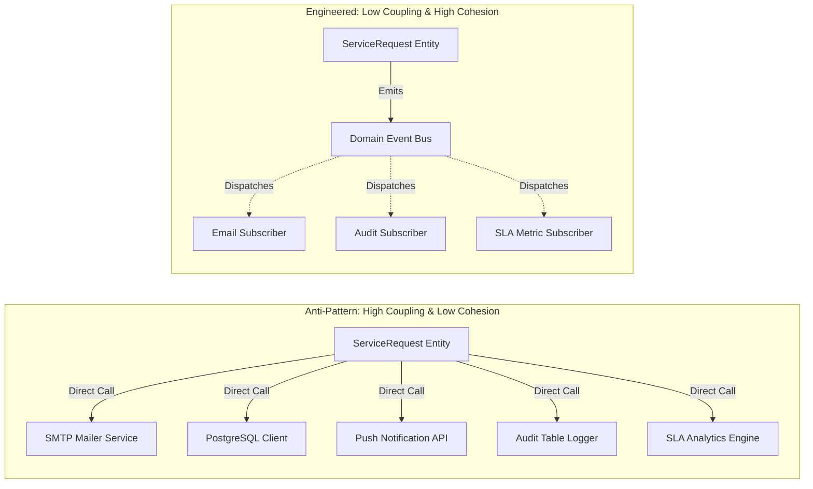
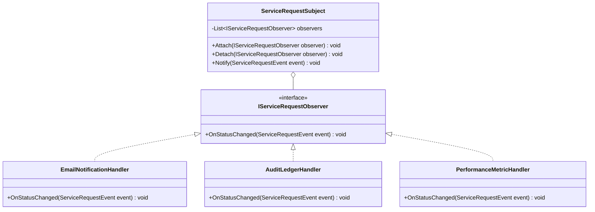
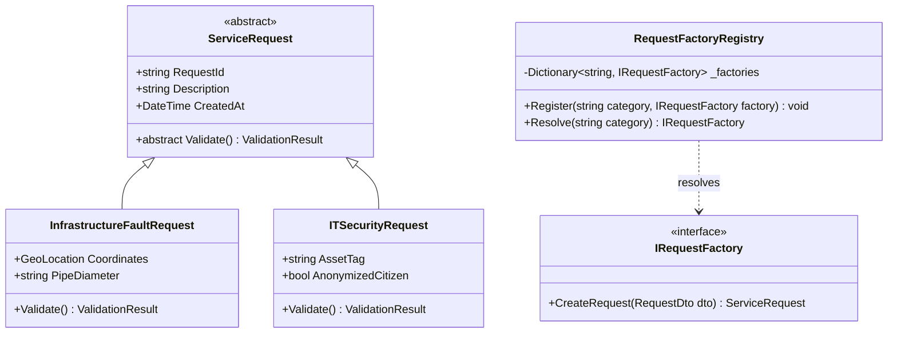
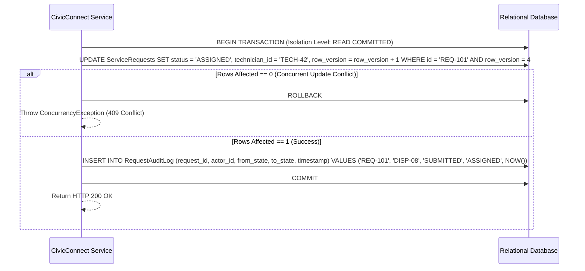
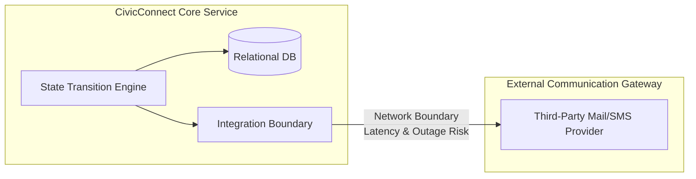
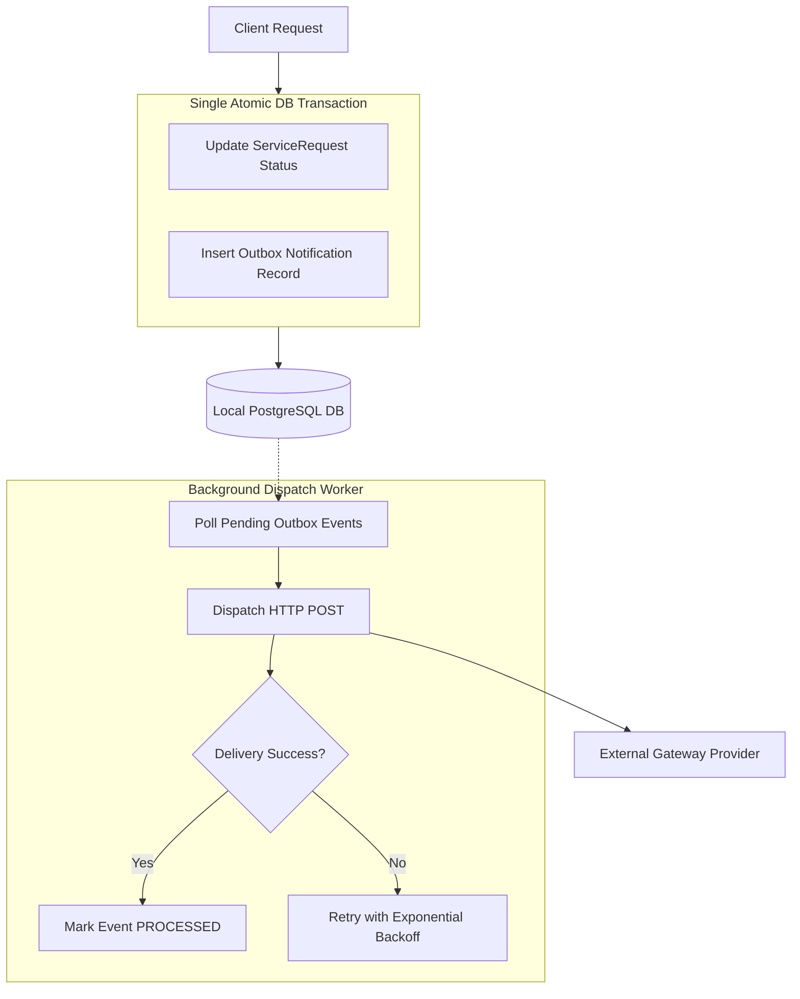
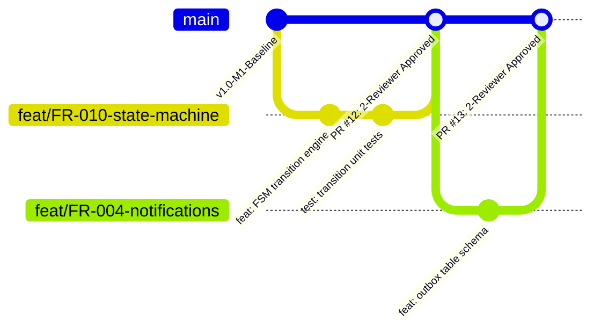
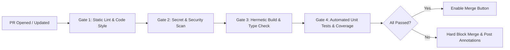

# SEN381 Software Engineering 381
# Assignment 2: Research for Engineering Decisions

**Academic Year:** 2026  
**Module:** Software Engineering 381 (SEN381) — NQF Level 8  
**Assessment Type:** Team Research Assignment  
**Total Marks:** 50 Marks (Research Feeding Milestone 2 Decisions)  
**Governing Document:** SEN381 CivicConnect Master Project Brief  
**Document Identifier:** `SEN381_Assignment2_GroupE`  
**Baseline Status:** Formal Submission Draft (v1.0)  

---

## Registered Project Team & Contribution Statement

In accordance with Section 10 of the Assignment 2 Brief, this research brief represents authentic, collaborative research conducted by all three registered members of **CivicConnect Group E**. All team members actively participated in the research, comparative trade-off analysis, review cycles, and formulation of engineering recommendations.

| Student ID | Full Name | Designated Engineering Role | Primary Assignment 2 Research Responsibility | Active Status |
| :--- | :--- | :--- | :--- | :--- |
| **602826** | **Chris Fourie** | **Systems Architect & Governance Lead** | Task 4 (SCM, CI Quality Gates & Branch Protection), Task 5 (Research-to-Decision Traceability Map), Document Consolidation, AI Governance & Harvard Referencing. | **Active (100%)** |
| **602369** | **Pandora Greyling** | **Quality Engineer & Risk Manager** | Task 2 (Persistence & Data-Integrity Mechanisms, Concurrency & Caching Trade-offs), Defect Prevention, Multi-Layer Validation Strategy. | **Active (100%)** |
| **602006** | **Lisa Verson** | **Lead Requirements & Design Analyst** | Task 1 (Design Quality, SOLID Foundations, Design Pattern Evaluation), Task 3 (API Architectural Boundaries & External Gateway Integration). | **Active (100%)** |

---

## Document Control Record

| Version | Date | Primary Author(s) | Peer Reviewer(s) | Description of Engineering Activity | Status |
| :--- | :--- | :--- | :--- | :--- | :--- |
| **0.1** | 2026-09-10 | Chris Fourie | Pandora Greyling, Lisa Verson | Research scaffolding, problem framing, and task decomposition based on A2 Brief. | Draft |
| **0.5** | 2026-09-12 | Lisa Verson, Pandora Greyling | Chris Fourie | Integrated deep-dive evaluations for Tasks 1, 2, and 3; drafted candidate comparison tables. | In-Review |
| **1.0** | 2026-09-13 | Full Team | Full Team (2-Reviewer Sign-off) | Complete research brief covering Tasks 1–5, AI Register, and verified Harvard citations. | **Final Submission** |

---

## Executive Summary: How Assignment 2 Feeds Milestone 2

> [!IMPORTANT]
> **Core Architectural Principle: "A2 Researches — M2 Commits"**  
> In strict accordance with Section 1 of the Assignment 2 Brief, Assignment 2 does not replace project documentation, nor does it earn marks simply because Milestone 2 adopts its recommendations. Instead, A2 constitutes the formal, evidence-based research input that explores problem spaces, compares credible alternatives, evaluates engineering risks, and provides defensible trade-offs *before* project decisions are baselined in Milestone 2.
>
> $$\text{Research Question} \longrightarrow \text{Credible Evidence} \longrightarrow \text{Alternatives} \longrightarrow \text{Comparison} \longrightarrow \text{Recommendation} \longrightarrow \text{M2 Decision} \longrightarrow \text{PED / ADR / RTM} \longrightarrow \text{Application Evidence}$$

During Milestone 1, Group E baselined the functional scope (14 Functional Requirements: `FR-001`–`FR-014`), non-functional quality drivers (`NFR-001`–`NFR-010`), and a 6-stage service request lifecycle Finite State Machine (FSM). In `ADR-003`, the team intentionally deferred technology stack selection and low-level architectural patterns to prevent premature design lock-in. Assignment 2 delivers the required research foundation to unblock Milestone 2:

1. **Task 1 (Design Quality):** Establishes structural decoupling patterns (Observer and Factory Method) to isolate the core `ServiceRequest` entity from volatile notification sinks and polymorphic ticket taxonomies.
2. **Task 2 (Persistence & Data Integrity):** Formulates multi-layer validation and an atomic transaction boundary with Optimistic Concurrency Control (OCC) to guarantee zero data loss during high-concurrency ticket dispatching.
3. **Task 3 (APIs & Integration):** Justifies an asynchronous Transactional Outbox Pattern to decouple internal ticket lifecycle transitions from external notification gateway latency and third-party network outages.
4. **Task 4 (Collaborative Engineering & CI):** Establishes a lightweight GitHub Flow configuration enforcing the Master Project Brief’s mandatory **two-reviewer peer review rule** and 4 automated CI quality gates to protect the controlled `main` baseline.
5. **Task 5 (Research-to-Decision Map):** Provides an auditable traceability bridge connecting every research finding directly to its corresponding Milestone 2 Architecture Decision Record (ADR) and Project Engineering Document (PED v2.0) section.

---

## Table of Contents

1. [Task 1 — Researching Design Quality and Design Patterns [15 Marks]](#1-task-1--researching-design-quality-and-design-patterns-15-marks)
   - 1.1 [Establish the Design Foundation](#11-establish-the-design-foundation)
     - 1.1.1 [Coupling, Cohesion, and Systemic Maintenance Ripple Effects](#111-coupling-cohesion-and-systemic-maintenance-ripple-effects)
     - 1.1.2 [Relevant SOLID Principles for CivicConnect](#112-relevant-solid-principles-for-civicconnect)
     - 1.1.3 [Identification of Two Genuine CivicConnect Design Problems](#113-identification-of-two-genuine-civicconnect-design-problems)
   - 1.2 [Research Alternatives for Each Problem](#12-research-alternatives-for-each-problem)
     - 1.2.1 [Design Problem 1: Decoupled Multi-Channel Notification Dispatching](#121-design-problem-1-decoupled-multi-channel-notification-dispatching)
     - 1.2.2 [Design Problem 2: Polymorphic Service Request Intake & Validation](#122-design-problem-2-polymorphic-service-request-intake--validation)
   - 1.3 [Evidence-Based CivicConnect Recommendations Feeding M2](#13-evidence-based-civicconnect-recommendations-feeding-m2)
2. [Task 2 — Researching Persistence and Data-Integrity Decisions [10 Marks]](#2-task-2--researching-persistence-and-data-integrity-decisions-10-marks)
   - 2.1 [Choose One Meaningful Business Operation](#21-choose-one-meaningful-business-operation)
   - 2.2 [Research into Correctness Mechanisms & Engineering Choices](#22-research-into-correctness-mechanisms--engineering-choices)
     - 2.2.1 [Transaction & Atomicity Requirements (ACID Boundaries)](#221-transaction--atomicity-requirements-acid-boundaries)
     - 2.2.2 [Multi-Layer Validation & Business Rule Enforcement](#222-multi-layer-validation--business-rule-enforcement)
     - 2.2.3 [Consistency, Concurrency, and Race Conditions](#223-consistency-concurrency-and-race-conditions)
     - 2.2.4 [Caching Correctness vs. Staleness Trade-Off](#224-caching-correctness-vs-staleness-trade-off)
     - 2.2.5 [Comparative Evaluation of Implementation Approaches](#225-comparative-evaluation-of-implementation-approaches)
   - 2.3 [Evidence-Based Persistence Recommendation Feeding M2](#23-evidence-based-persistence-recommendation-feeding-m2)
3. [Task 3 — Researching APIs and Integration Decisions [10 Marks]](#3-task-3--researching-apis-and-integration-decisions-10-marks)
   - 3.1 [Framing the Integration Problem](#31-framing-the-integration-problem)
   - 3.2 [Comparative Evaluation of Integration Mechanisms](#32-comparative-evaluation-of-integration-mechanisms)
     - 3.2.1 [Candidate 1: Synchronous HTTP/REST API Invocation](#321-candidate-1-synchronous-httprest-api-invocation)
     - 3.2.2 [Candidate 2: Asynchronous Transactional Outbox Pattern](#322-candidate-2-asynchronous-transactional-outbox-pattern)
     - 3.2.3 [Candidate 3: In-Process Synchronous Abstraction](#323-candidate-3-in-process-synchronous-abstraction)
     - 3.2.4 [REST Architectural Principles & The Cost of Distribution](#324-rest-architectural-principles--the-cost-of-distribution)
   - 3.3 [Evidence-Based Integration Recommendation Feeding M2](#33-evidence-based-integration-recommendation-feeding-m2)
4. [Task 4 — Researching Collaborative Engineering and CI Controls [12 Marks]](#4-task-4--researching-collaborative-engineering-and-ci-controls-12-marks)
   - 4.1 [SCM and Collaborative Integration](#41-scm-and-collaborative-integration)
     - 4.1.1 [Version Control vs. Software Configuration Management (SCM)](#411-version-control-vs-software-configuration-management-scm)
     - 4.1.2 [Branching, PRs, and Traceability for a Three-Person Team](#412-branching-prs-and-traceability-for-a-three-person-team)
     - 4.1.3 [Operationalizing Protected Main & The Mandatory Two-Reviewer Constraint](#413-operationalizing-protected-main--the-mandatory-two-reviewer-constraint)
     - 4.1.4 [CivicConnect Collaboration & Merge Collision Risks](#414-civicconnect-collaboration--merge-collision-risks)
   - 4.2 [Continuous Integration and Quality Gates](#42-continuous-integration-and-quality-gates)
     - 4.2.1 [The Engineering Purpose of CI](#421-the-engineering-purpose-of-ci)
     - 4.2.2 [Repeatable Builds & CI Triggers](#422-repeatable-builds--ci-triggers)
     - 4.2.3 [Automated Verification Pipeline (Quality Gates)](#423-automated-verification-pipeline-quality-gates)
     - 4.2.4 [Blocking vs. Warning Enforcement Policies](#424-blocking-vs-warning-enforcement-policies)
     - 4.2.5 [Secrets Security & Reviewer Visibility](#425-secrets-security--reviewer-visibility)
     - 4.2.6 [Why Automation Supports but Cannot Replace Human Review](#426-why-automation-supports-but-cannot-replace-human-review)
   - 4.3 [Recommended CivicConnect Workflow Specification](#43-recommended-civicconnect-workflow-specification)
5. [Task 5 — Research-to-Decision Map [3 Marks]](#5-task-5--research-to-decision-map-3-marks)
6. [Responsible AI Usage Register & Academic Integrity](#6-responsible-ai-usage-register--academic-integrity)
7. [Consolidated Academic References (Harvard Referencing Style)](#7-consolidated-academic-references-harvard-referencing-style)

---

## 1. Task 1 — Researching Design Quality and Design Patterns [15 Marks]

### 1.1 Establish the Design Foundation

#### 1.1.1 Coupling, Cohesion, and Systemic Maintenance Ripple Effects
At NQF Level 8 software engineering, the internal design of a software system is governed by the twin metrics of **coupling** and **cohesion** (Stevens et al., 1974; Page-Jones, 1988). Rather than treating them as abstract textbook definitions, our engineering analysis focuses on how they govern structural change propagation across the CivicConnect platform:

*   **Coupling** measures the strength of interconnections and interdependence between distinct software modules. When module $A$ depends on the concrete internal implementation details of module $B$ (content coupling or common coupling), any change to $B$ inevitably ripples into $A$. In contrast, loosely coupled systems interact purely through minimal, abstract contracts (message or data coupling), enabling independent modification and isolated unit test execution without dragging in external infrastructure (Fowler, 2018; Martin, 2000).
*   **Cohesion** measures the degree to which elements within a single class or module belong together logically and execute a single, well-defined purpose. Low cohesion (e.g., coincidental or logical cohesion) produces bloated "God Classes" that mix persistence, business validation, user interface formatting, and third-party integrations into a single file. High cohesion (specifically functional or informational cohesion) ensures that every class has a single reason to change, maximizing comprehensibility and reusability (Bass et al., 2021).



**The Maintenance Ripple Effect:** In CivicConnect, service requests represent the core domain concept. If the central `ServiceRequest` class directly constructs database queries, formats notification emails, logs audit records to disk, and makes outbound HTTP calls to third-party messaging vendors, a simple change to the email provider’s API format will force developers to modify and recompile the core business entity. This creates **Shotgun Surgery** (Fowler, 2018), where a single business change requires editing dozens of coupled classes, increasing the likelihood of regression defects and destroying test isolation.

#### 1.1.2 Relevant SOLID Principles for CivicConnect
Rather than mechanically describing all five SOLID principles (Martin, 2000), our research isolates the three principles that directly address the architectural risks emerging in CivicConnect:

1.  **Single Responsibility Principle (SRP):** *"A class should have one, and only one, reason to change."* In CivicConnect, request state evaluation (business invariants), request data persistence (SQL transactions), and requester notifications (communication channels) are three distinct axes of change driven by three different stakeholders (Operations Staff, Database Administrators, and Community Requesters). Enforcing SRP prevents the creation of monolithic coordinator classes and keeps domain entities purely focused on state integrity.
2.  **Open/Closed Principle (OCP):** *"Software entities should be open for extension, but closed for modification."* CivicConnect must support an expanding taxonomy of community service categories (e.g., Potholes, Water Leaks, Electrical Faults, Illegal Dumping, Facility Security) with unique validation rules and priority calculations. Under OCP, adding a new service category or a new notification channel must be achieved by supplying a new polymorphic implementation rather than altering existing, tested conditional logic (`switch/case` trees).
3.  **Dependency Inversion Principle (DIP):** *"High-level modules should not depend on low-level modules; both should depend on abstractions."* High-level business rules (e.g., transition guard logic in `FR-010`) must not depend directly on concrete low-level infrastructure drivers (such as `NpgsqlConnection` or SendGrid API SDKs). Inverting dependencies through abstract interfaces (`IServiceRequestRepository`, `INotificationGateway`) allows developers to replace physical infrastructure or execute in-memory unit tests using mocks without touching business code.

#### 1.1.3 Identification of Two Genuine CivicConnect Design Problems
To prevent premature solution lock-in, both problems are defined purely in terms of business requirements, system boundaries, and architectural forces, without naming design patterns:

*   **Problem 1: Multi-Channel Lifecycle Event Notification & Metric Dispatching.**  
    *Problem Context:* In accordance with `FR-004`, `FR-005`, `FR-011`, and `NFR-006`, whenever a service request transitions between states (e.g., `SUBMITTED` $\rightarrow$ `ASSIGNED` $\rightarrow$ `IN_PROGRESS` $\rightarrow$ `RESOLVED`), multiple secondary actions must occur: (1) the community requester must receive an automated email/SMS status update; (2) the assigned field technician must receive a dispatch alert; (3) an immutable, time-stamped entry must be appended to the `RequestAuditLog` ledger; and (4) management turnaround metrics must be refreshed.  
    *Architectural Tension:* If the core `ServiceRequest` entity or state transition service directly invokes each notification, logging, and metric service sequentially, it becomes heavily afferently and efferently coupled. Adding a future notification channel (such as a WhatsApp webhook or municipal dispatch bus) forces developers to edit and re-verify the core state-machine logic, introducing severe regression risk and making isolated unit testing of state transitions virtually impossible.

*   **Problem 2: Polymorphic Service Request Ingestion, Categorical Rule Validation, and Payload Normalization.**  
    *Problem Context:* In accordance with `FR-001`, `FR-002`, and `NFR-004`, CivicConnect ingests diverse categories of service requests. A "Water Outage / Infrastructure Fault" requires geographic GPS coordinates, pipe diameter estimates, and photo attachments; an "IT Support Ticket" requires asset tags, network IP addresses, and software version data; an "Urgent Campus Security Concern" requires immediate risk-tier classification, anonymization flags under POPIA, and direct escalation routing.  
    *Architectural Tension:* The web controller receiving the incoming JSON payload cannot know upfront the exact structure and validation rules required for each specific category. If the intake endpoint relies on massive, deeply nested `if-else` or `switch` blocks inspecting `request_type`, the intake pipeline becomes fragile, violates OCP, and creates extreme testing overhead whenever municipal administrators introduce a new category.

---

### 1.2 Research Alternatives for Each Problem

#### 1.2.1 Design Problem 1: Decoupled Multi-Channel Notification Dispatching
To decouple the state transition engine from downstream notification, audit, and metric sinks, two recognized structural/behavioral patterns and one baseline procedural approach are evaluated:



##### Candidate A: Observer Pattern (Publish-Subscribe / Domain Event Dispatcher)
*   **Intent & Responsibility Distribution:** The Observer pattern (Gamma et al., 1994) defines a one-to-many dependency between objects. The `ServiceRequestSubject` maintains an internal registry of abstract `IServiceRequestObserver` instances. When a status transition occurs, the subject iterates through its subscribers and invokes `OnStatusChanged(event)` without knowing who the concrete subscribers are or what actions they perform.
*   **Engineering Effects on Quality Attributes:**
    *   *Coupling:* Afferent coupling of the subject is reduced to a single interface contract (`IServiceRequestObserver`). Efferent dependencies on email clients, SMS gateways, and database audit tables are entirely eliminated.
    *   *Cohesion:* High. The subject solely manages state-machine invariants; each observer handles a single external responsibility (e.g., `EmailNotifier` formats and sends emails).
    *   *Extensibility:* Superb. New notification sinks (e.g., WhatsApp webhook dispatcher) are added by creating a new observer class and registering it at startup—zero changes to the core ticket code (OCP compliant).
    *   *Testability:* High. State transition tests run in milliseconds using an empty or mock observer list, bypassing slow network calls.
*   **Risks, Misuse & Over-Engineering:**
    *   *Execution Order Non-Determinism:* Observers are typically invoked in an arbitrary order; business logic must not depend on Observer A executing before Observer B.
    *   *Unhandled Exception Cascades:* If an unhandled exception is thrown inside an email observer, it may abort the entire loop, preventing the critical `AuditLedgerHandler` from executing unless wrapped in explicit `try/catch` isolation.
    *   *Memory Leaks:* Long-lived subjects holding references to short-lived observers can cause memory leaks ("lapsed listener problem") if unregistration is omitted.

##### Candidate B: Chain of Responsibility Pattern
*   **Intent & Responsibility Distribution:** The Chain of Responsibility pattern (Gamma et al., 1994) passes a state-transition context object along an ordered chain of processing handlers. Each handler decides either to process the request and pass it to the next link (`successor.Handle(context)`), or to abort processing entirely.
*   **Engineering Effects on Quality Attributes:**
    *   *Coupling:* The client only holds a reference to the head of the chain.
    *   *Cohesion:* Moderate to high, as each handler executes a specific lifecycle step.
    *   *Extensibility:* New handlers can be inserted dynamically into the pipeline.
    *   *Testability:* Individual handlers can be tested in isolation by asserting their input/output context.
*   **Risks, Misuse & Over-Engineering:**
    *   *Intent Mismatch:* Chain of Responsibility is inherently designed for sequential filtering, interception, or early-exit decision pipelines (e.g., HTTP middleware or approval hierarchies). In CivicConnect notification dispatching, *all* sinks must be notified in parallel rather than conditionally passing or consuming a request.
    *   *Silent Drops:* If a handler fails to invoke `next.Handle()`, downstream notifications fail silently.

##### Comparison with Simpler Baseline & When Simpler is Preferable
*   *Simpler Approach (Direct Procedural Invocation):* The state transition service explicitly executes `_db.SaveAudit()`, `_mail.Send()`, and `_metrics.Update()` sequentially inside the method body.
*   *When Simpler is Preferable:* If CivicConnect had exactly one static notification channel that never changed throughout the application lifecycle, procedural invocation would be preferable because it introduces zero indirection, makes call stacks trivial to trace in debuggers, and requires no abstract interfaces. However, in a multi-stakeholder municipal platform governed by evolving notification needs and POPIA auditing, the procedural approach directly causes tight coupling and violation of OCP.

---

#### 1.2.2 Design Problem 2: Polymorphic Service Request Intake & Validation
To handle heterogeneous request categories without embedding fragile `switch` statements across controller endpoints, two structural/creational patterns and one table-driven baseline are evaluated:



##### Candidate A: Factory Method / Parameterized Factory Pattern
*   **Intent & Responsibility Distribution:** The Factory Method pattern (Gamma et al., 1994) defines an interface for creating objects, delegating the concrete instantiation logic to specialized factory classes or registry mappings. The web controller parses incoming payload headers, looks up the registered category factory (`RequestFactoryRegistry.Resolve(category)`), and receives a fully validated, strongly typed `ServiceRequest` domain entity.
*   **Engineering Effects on Quality Attributes:**
    *   *Coupling:* High-level controllers depend strictly on the abstract `ServiceRequest` base class and the factory interface. Adding a new category requires authoring a new domain class and factory, registered via dependency injection at startup.
    *   *Cohesion:* Superb. Category-specific validation rules (e.g., GPS boundary checks for infrastructure vs. asset number regex for IT) are encapsulated entirely inside the concrete domain entity or its dedicated validator.
    *   *Maintainability & Extensibility:* Excellent. Complies 100% with the Open/Closed Principle.
    *   *Testability:* High. Unit tests can inject mock factories or assert validation failures per category without instantiating full HTTP server pipelines.
*   **Risks, Misuse & Over-Engineering:**
    *   *Class Proliferation:* Creating a separate subclass and factory for minor attribute variations can lead to hundreds of tiny classes. If two categories share 95% of their schema, subclassing creates redundant boilerplate.

##### Candidate B: Builder Pattern with Pluggable Validation Strategy
*   **Intent & Responsibility Distribution:** The Builder pattern separates the construction of a complex object from its representation, allowing the same construction process to create diverse representations. Paired with a Strategy pattern, a generic `ServiceRequestBuilder` accumulates attributes dynamically and delegates validation to an injected `ICategoryValidationStrategy`.
*   **Engineering Effects on Quality Attributes:**
    *   *Coupling:* Keeps the domain entity class uniform while externalizing validation logic to pluggable strategies.
    *   *Cohesion:* High separation between object assembly and business rule verification.
    *   *Extensibility:* New validation rules are easily plugged in.
*   **Risks, Misuse & Over-Engineering:**
    *   *Premature Complexity:* If request objects are relatively flat data structures with fewer than 10 attributes, implementing step-by-step Builder state management introduces unnecessary cognitive load and ceremony for developers.

##### Comparison with Simpler Baseline & When Simpler is Preferable
*   *Simpler Approach (Table-Driven / Schema Map Dispatcher):* A single generic `ServiceRequest` entity with a dynamic key-value metadata dictionary (`Dictionary<string, object>` or JSONB), validated against a declarative JSON schema dictionary loaded from a configuration file.
*   *When Simpler is Preferable:* For rapid prototyping or simple CRUD tools where entities require no polymorphic behavior or domain logic. However, for CivicConnect, relying on unstructured key-value bags destroys compile-time type safety, eliminates IDE autocompletion, and increases runtime parsing defects.

---

### 1.3 Evidence-Based CivicConnect Recommendations Feeding M2

| Design Problem | Evaluated Candidates | Recommended Approach | Justification for CivicConnect | Direct Feed into Milestone 2 Artifacts |
| :--- | :--- | :--- | :--- | :--- |
| **Problem 1:** Multi-channel lifecycle event notification | Observer Pattern vs. Chain of Responsibility vs. Procedural Invocation | **Observer Pattern (Domain Event Dispatcher)** | Decouples the core state-machine from volatile notification channels; prevents regression defects during channel additions; allows isolated unit testing of transitions. | Feeds **`ADR-004: Decoupled Domain Event Dispatching`**, class diagrams in **`PED v2.0 Section 6`**, and event subscriber test fixtures. |
| **Problem 2:** Polymorphic request intake & validation | Factory Method vs. Builder with Strategy vs. Dynamic Schema Map | **Factory Method with Polymorphic Domain Entities** | Guarantees compile-time type safety and category-specific validation; encapsulates POPIA privacy rules per category; strictly adheres to OCP. | Feeds **`ADR-005: Polymorphic Request Intake Factory`**, category domain models in **`PED v2.0 Section 6`**, and `RTM` mappings for `FR-001/002`. |

---

## 2. Task 2 — Researching Persistence and Data-Integrity Decisions [10 Marks]

### 2.1 Choose One Meaningful Business Operation

To evaluate data persistence and integrity mechanisms, Group E selects:  
**The Atomic Service Request Status Transition & Technician Assignment with Mandatory Audit Ledgering** (`FR-009`, `FR-010`, `FR-011`, and `NFR-006`).

**Failure Consequences & The Cost of Partial Completion:**  
In a municipal operations environment, updating a ticket's status is not a simple isolated database write. It involves mutating the operational state (e.g., from `SUBMITTED` to `ASSIGNED`), updating technician workload counters, recording the user identity of the dispatcher, and writing an immutable audit record to the `RequestAuditLog` ledger.  
If the system experiences a partial write failure—where the operational record is updated to `ASSIGNED` but the audit log insert fails due to a constraint error or network glitch:
1.  **Destruction of Legal & Regulatory Traceability (POPIA Non-Compliance):** The platform cannot prove who assigned the ticket or when, violating statutory accountability requirements.
2.  **Ghost Assignments & Technician Deadlocks:** If technician allocation counters increment but the ticket transition fails, the technician appears fully booked in management dashboards while tickets remain unattended.
3.  **State Machine Corruption:** Bypassing state machine guards leads to illegal transitions (e.g., jumping directly from `SUBMITTED` to `RESOLVED` without triage or inspection).

---

### 2.2 Research into Correctness Mechanisms & Engineering Choices

#### 2.2.1 Transaction & Atomicity Requirements (ACID Boundaries)
Under relational database theory (Kleppmann, 2017; Date, 2004), preserving correctness across multi-table mutations requires strict adherence to **ACID guarantees**:
*   **Atomicity:** The operational update to `ServiceRequests` and the append-only insertion into `RequestAuditLog` must be treated as an indivisible unit of work. If any operation within the block fails, the entire database transaction is automatically rolled back (`ABORT`), leaving the database in its previous valid state.
*   **Consistency:** Transitions must satisfy all declarative database constraints (foreign keys linking to active users, check constraints enforcing valid FSM states).
*   **Isolation:** Concurrent transactions executed by multiple dispatchers must not interfere with each other or observe uncommitted intermediate states.
*   **Durability:** Once committed, transaction logs must be flushed to non-volatile storage (Write-Ahead Logging / WAL) so data survives system crashes.



**Evaluation of SQL Isolation Levels:**
1.  *Read Uncommitted:* Vulnerable to "dirty reads" (reading uncommitted status updates that are subsequently aborted). Completely unacceptable for financial, municipal, or audit data.
2.  *Read Committed (Recommended Default):* Guarantees transactions only read committed data. Prevents dirty reads with low lock-contention overhead. In conjunction with explicit row-version checks (OCC), this level provides robust correctness for ticket assignment.
3.  *Serializable:* Maximum isolation, executing transactions as if run strictly sequentially. However, under high concurrent access, Serializable introduces severe lock contention, query latency spikes, and frequent deadlock aborts, directly violating `NFR-001` (latency $\le 500\text{ ms}$).

#### 2.2.2 Multi-Layer Validation & Business Rule Enforcement
Software engineering best practice dictates that validation must operate as a defense-in-depth architecture across three distinct tiers (Martin, 2008):

| Architectural Tier | Validation Scope & Mechanisms | Strengths | Failure Consequences if Exclusively Relied Upon |
| :--- | :--- | :--- | :--- |
| **Tier 1: Client / UI Layer** | Immediate syntax validation: mandatory fields, regex string checks, file size/extension filters. | Instant user feedback, zero server round-trip latency, optimal UX. | **Fatal Security Flaw:** Bypassed completely by curl, Postman, or malicious script injection. Relying only on UI validation results in database corruption and SQL injection vulnerabilities. |
| **Tier 2: Application / Service Layer** | Complex business invariants: FSM transition rules (verifying ticket is currently in `TRIAGED` before allowing `ASSIGNED`), role-based authorization checks, technician capacity limits. | Context-aware, can query external services, generates localized domain exception messages. | **Bypassed by Direct SQL Queries:** If developers run direct data fix scripts or migration patches, application rules are bypassed, potentially violating referential integrity. |
| **Tier 3: Database Engine Layer** | Declarative integrity constraints: `NOT NULL`, `FOREIGN KEY ... ON DELETE RESTRICT`, `CHECK (status IN ('SUBMITTED','TRIAGED','ASSIGNED','IN_PROGRESS','RESOLVED','CLOSED'))`, `UNIQUE(request_number)`. | Ultimate backstop; guaranteed enforcement regardless of how data enters the engine; ACID-protected. | **Poor User Experience:** Database constraint violation errors are cryptic, slow to return, difficult to localize to specific form fields, and can leak underlying table schemas to users. |

*Conclusion:* A robust architecture enforces syntax and UX formatting in Tier 1, business invariants and state guards in Tier 2, and declarative relational integrity rules as an inviolable safety net in Tier 3.

#### 2.2.3 Consistency, Concurrency, and Race Conditions
In a multi-user municipal service platform, concurrent dispatcher operations create classic race conditions:
*   *The Problem:* Two department supervisors simultaneously open ticket `REQ-101` (status `TRIAGED`). Supervisor A assigns the ticket to Technician X at 10:00:01. Supervisor B assigns the ticket to Technician Y at 10:00:02. Without concurrency controls, the "Lost Update" anomaly occurs: Supervisor B silently overwrites Supervisor A’s assignment without warning.

**Comparison of Concurrency Control Mechanisms:**
1.  **Pessimistic Locking (`SELECT FOR UPDATE`):** The first transaction acquires an exclusive row-level lock on the ticket record, forcing all other transactions to block until the lock is released.  
    *Evaluation:* Prevents race conditions completely, but drastically impairs scalability. If a user’s network drops during an interactive session, database connection pools are held hostage, leading to cascading transaction timeouts and deadlocks.
2.  **Optimistic Concurrency Control (OCC — Recommended):** Relies on a dedicated `row_version` integer column or database transaction commit identifier (e.g., PostgreSQL `xmin`). Transactions read data without taking locks. When writing updates, the query includes the version check:
    ```sql
    UPDATE ServiceRequests 
    SET status = 'ASSIGNED', technician_id = 'TECH-42', row_version = row_version + 1 
    WHERE id = 'REQ-101' AND row_version = 4;
    ```
    If another supervisor modified the row in the interim, `row_version` is already 5; the update matches 0 rows. The application detects this, aborts the transaction, and returns an HTTP `409 Conflict` response prompting the user to refresh their view with the latest state.

#### 2.2.4 Caching Correctness vs. Staleness Trade-Off
Caching is frequently misapplied as a premature optimization. In accordance with Martin Fowler’s First Law of Distributed Objects and the well-known axiom by Phil Karlton (*"There are only two hard things in Computer Science: cache invalidation and naming things"*), caching introduces severe consistency risks:
*   **High Risk (DO NOT CACHE): Active Ticket Operational State.** Caching live ticket statuses in Redis or client memory introduces stale read windows. If a dispatcher assigns a ticket that is shown as "Unassigned" in cache, duplicate technician dispatches occur. Real-time operational data must always be queried directly from the primary relational database.
*   **Low Risk (JUSTIFIED CACHE): Static & Quasi-Static Reference Data.** Service categories, department lists, SLA turnaround thresholds, and system role hierarchies change infrequently (weeks to months). Caching these records with a Time-To-Live (TTL) of 1 hour and manual cache purge hooks on administrative updates drastically reduces database load without risking operational data corruption.

#### 2.2.5 Comparative Evaluation of Implementation Approaches

| Evaluation Dimension | Approach 1: Active Record with Implicit ORM Flushes | Approach 2: Repository Pattern with Explicit Unit-of-Work & DB Transactions (Recommended) |
| :--- | :--- | :--- |
| **Structural Architecture** | Domain entities inherit directly from ORM base classes (`request.Save()`). Business logic is coupled to persistence mechanisms. | Domain entities are pure objects (POCOs/plain classes). Persistence is abstracted behind `IServiceRequestRepository` using explicit Unit-of-Work transactions. |
| **Transaction Predictability** | Implicit and automagic. ORMs often execute multiple uncontrolled queries and flushes behind the scenes, risking partial writes if an unexpected exception occurs mid-routine. | Completely deterministic. Transaction boundaries (`BeginTransaction`, `Commit`, `Rollback`) are explicitly written and auditable in code. |
| **Unit Testability** | Poor. Testing business logic requires spin-up of an active database connection or heavy in-memory DB engines. | Superb. Domain business logic is tested in complete isolation using lightweight mock repositories. |
| **Coupling & Cohesion** | High coupling between domain model and database schema; low cohesion as entities manage both state and SQL commands. | Low coupling; high cohesion. Domain models focus on business invariants; repository classes focus on SQL persistence. |

---

### 2.3 Evidence-Based Persistence Recommendation Feeding M2

1.  **Core Decision:** Adopt the **Repository Pattern with an Explicit Unit-of-Work Transaction Boundary** and **Optimistic Concurrency Control (OCC)**.
2.  **Responsibility Allocation:**
    *   *Frontend:* Form schema validation (regex, required fields) using declarative validation libraries (e.g., Zod / FluentValidation).
    *   *Application Service:* Role authorization checks, FSM state transition validation, and transaction lifecycle coordination.
    *   *Database Engine:* Relational integrity via Foreign Keys, `CHECK` constraints on status enums, and non-nullable audit fields.
3.  **Direct Feed into Milestone 2 Artifacts:**
    *   Feeds **`ADR-006: Persistence Architecture, Transaction Scopes, and Concurrency Control`**.
    *   Directly dictates the physical database ERD schema in **`PED v2.0 Section 7`**, separating mutable operational tables (`ServiceRequests`) from append-only audit ledgers (`RequestAuditLog`).
    *   Updates the `RTM` for `FR-009`, `FR-010`, and `NFR-006`.

---

## 3. Task 3 — Researching APIs and Integration Decisions [10 Marks]

### 3.1 Framing the Integration Problem

**Selected Interaction:**  
Integration between the **CivicConnect Core Request Processing Service** and an **External Citizen Communication / Notification Gateway** (Email/SMS/Push delivery for ticket state changes, `FR-004`, `FR-005`, and `NFR-001`).



*   **Producer / Caller:** CivicConnect Request Transition Engine.
*   **Consumer / Callee:** External Third-Party Communication Gateway (e.g., SendGrid, Mailgun, or Twilio).
*   **Information Exchanged:** Target citizen contact identifier (masked email/phone token under POPIA), notification template ID, ticket reference number, new status string, timestamp, and trace correlation ID.
*   **Failure Consequences:** External network latency spikes (>2000 ms), third-party service outages (HTTP 503/504), or rate-limiting thresholds (HTTP 429).
*   **Why This Requires an Explicit Engineering Decision:**  
    If communication dispatching is implemented as an accidental, synchronous dependency within the user-facing web request pipeline, a slowdown or outage in the third-party email provider directly hangs the HTTP connection between the citizen/technician and the CivicConnect server. The user experiences a frozen screen, database connections remain locked open, and ticket updates fail completely even though the internal database write succeeded.

---

### 3.2 Comparative Evaluation of Integration Mechanisms

#### 3.2.1 Candidate 1: Synchronous HTTP/REST API Invocation
*   **Mechanism:** When a status transition occurs, the backend application makes an immediate blocking HTTP `POST` request to the external communication vendor’s REST endpoint before returning an HTTP response to the client.
*   **Engineering Consequences:**
    *   *Coupling:* High temporal coupling. The availability and response time of CivicConnect become strictly dependent on the availability and latency of an external third-party vendor.
    *   *Performance & Latency:* Severe degradation. Adding a 500–1500 ms external HTTP call directly violates `NFR-001` (system response time $\le 500\text{ ms}$).
    *   *Failure Cascades:* If the email provider suffers an outage, ticket status updates crash across the entire platform unless complex circuit breakers and fallback threads are implemented.

#### 3.2.2 Candidate 2: Asynchronous Transactional Outbox Pattern
*   **Mechanism:** When a status transition occurs, the application writes both the ticket state change and an "Outbox Event" record into the local relational database within the **same atomic ACID transaction**. A lightweight, asynchronous background worker periodically queries the `Outbox` table, batches pending notifications, dispatches them to the external gateway with exponential backoff/retry logic, and marks them as sent.



*   **Engineering Consequences:**
    *   *Coupling:* Complete temporal decoupling. The core business transaction completes in <20 ms regardless of whether the external notification gateway is online, slow, or completely down.
    *   *Reliability & Guaranteed Delivery:* Guarantees *at-least-once delivery*. If the external API fails, the outbox record remains pending and is retried safely.
    *   *Deployment & Budget Implications:* Perfect fit for a 3-person team under a \$0.00 free-tier budget constraint (`NFR-010`). It requires zero external message brokers (such as RabbitMQ or Kafka), leveraging the existing relational database.

#### 3.2.3 Candidate 3: In-Process Synchronous Abstraction
*   **Mechanism:** Direct invocation of an internal `INotificationService` interface residing in the same memory process.
*   **Engineering Consequences:**
    *   *Coupling:* Zero network overhead and low architectural complexity.
    *   *Limitation:* If the concrete class still calls an external network endpoint synchronously, the thread remains blocked, resulting in the same latency and cascading failure problems as Candidate 1.

---

#### 3.2.4 REST Architectural Principles & The Cost of Distribution

##### Core REST Architectural Principles (Fielding, 2000)
When designing the public-facing API for CivicConnect (connecting the frontend web client to the backend service), the team adheres strictly to REST constraints:
1.  **Resource-Oriented URIs:** URIs identify domain resources, not RPC verbs. E.g., `POST /api/v1/requests` (create request), `GET /api/v1/requests/{id}` (inspect request), `POST /api/v1/requests/{id}/transitions` (execute state transition).
2.  **Uniform Interface & Standard HTTP Methods:** Using `GET` for safe, idempotent reads; `POST` for non-idempotent creations; `PUT` for complete replacements; and `PATCH` for partial state mutations.
3.  **Statelessness:** Every incoming HTTP request must contain all authentication and state context (via JWT bearer tokens in the `Authorization` header) required to execute the call. The server retains no session state in memory, enabling effortless restarts and scaling.
4.  **Standardized HTTP Status & Error Taxonomy:**
    *   `200 OK` / `201 Created`: Successful operations.
    *   `400 Bad Request`: Schema validation failure with structured JSON error details.
    *   `401 Unauthorized`: Missing or invalid JWT credentials.
    *   `403 Forbidden`: Authenticated user lacks RBAC permissions for the requested action.
    *   `404 Not Found`: Target resource does not exist.
    *   `409 Conflict`: Concurrency version collision (OCC conflict).
    *   `500 Internal Server Error`: Unhandled server-side exception, stripped of internal stack traces to comply with security standards.

##### The Cost of Distribution (The Fallacies of Distributed Computing)
As formulated by L. Peter Deutsch (1994), novice engineers fall victim to eight fatal fallacies when designing software, chief among them: *"The network is reliable"*, *"Latency is zero"*, *"Bandwidth is infinite"*, and *"Transport cost is zero"*.  
Splitting internal CivicConnect components into microservices communicating over HTTP would introduce serialization overhead, distributed tracing complexity, partial network failure modes, and ballooning compute resource requirements. In a 3-person team operating under academic schedule constraints and zero hosting budget, **an internal network boundary is completely unjustified**.

---

### 3.3 Evidence-Based Integration Recommendation Feeding M2

1.  **Public Client-to-Backend Interface:** Adopt a **Stateless RESTful API** adhering strictly to OpenAPI 3.0 standards, JSON payload schemas, and standard HTTP error codes.
2.  **Internal-to-External Gateway Integration:** Adopt the **Transactional Outbox Pattern** running as an asynchronous background worker within the modular monolithic process.
3.  **Direct Feed into Milestone 2 Artifacts:**
    *   Feeds **`ADR-007: API Architecture & Asynchronous External Integration via Transactional Outbox`**.
    *   Defines the OpenAPI 3.0 Contract Specification and `/health` probe schemas in **`PED v2.0 Section 8`**.
    *   Supplies the physical `Outbox` table schema for the M2 database migration baseline.

---

## 4. Task 4 — Researching Collaborative Engineering and CI Controls [12 Marks]

### 4.1 SCM and Collaborative Integration

#### 4.1.1 Version Control vs. Software Configuration Management (SCM)
A critical NQF Level 8 conceptual distinction is that **Version Control (VCS)** is merely a tool (e.g., Git) that tracks lines of code changes and provides commit histories.  
In contrast, **Software Configuration Management (SCM)** (IEEE Computer Society, 2014; IEEE 828) is an overarching engineering discipline that encompasses:
1.  *Configuration Identification:* Formally identifying baselined work products (code, documentation, schemas, pipelines).
2.  *Configuration Control:* Regulating modifications through Change Request impact analysis, branch protection rules, and sign-off gates.
3.  *Configuration Status Accounting:* Recording and reporting the status of configuration items across all lifecycle phases.
4.  *Configuration Audit & Review:* Verifying that released software conforms strictly to approved requirements and security baselines.

#### 4.1.2 Branching, PRs, and Traceability for a Three-Person Team
For a small team of three engineers, branching complexity must be minimized while preserving strict quality control:
*   **Evaluation of GitFlow:** GitFlow prescribes multiple permanent branches (`develop`, `master`, `release/*`, `hotfix/*`). In a 3-person team, maintaining long-lived parallel branches creates severe merge debt, duplicate cherry-picking, and high integration friction.
*   **Evaluation of Trunk-Based Development / GitHub Flow (Recommended):** Short-lived feature branches (`feat/FR-xxx`, `fix/RSK-xxx`, `docs/xxx`) branching directly off `main`, living for no more than 24–48 hours, and merging back into `main` via Pull Requests. This maximizes continuous integration velocity, minimizes merge conflicts, and ensures team members work on fresh baselines.



*   **Traceability Integration:** To comply with Master Project Brief Section 11, every branch and commit message must be explicitly linked to an issue tracking a baselined requirement or defect (e.g., `feat(FR-010): implement status guard validation; fixes #42`).

#### 4.1.3 Operationalizing Protected Main & The Mandatory Two-Reviewer Constraint
The Master Project Brief mandates a strict governance constraint:  
**The `main` branch is protected; substantive changes require Pull Requests with a minimum of TWO independent approvals from team members other than the author (100% peer review). Self-approvals are blocked.**

**Transforming Mechanical Approvals into Meaningful Engineering Reviews:**  
To prevent "rubber-stamping" (empty approvals that violate Master Brief Section 9.1), Group E establishes a mandatory **Pull Request Review Checklist** embedded directly in `.github/pull_request_template.md`:
1.  *Requirements Alignment:* Does this PR satisfy the exact acceptance criteria of the linked `FR-xxx` or `NFR-xxx`?
2.  *Architecture & Design:* Does the code adhere to approved ADRs? Are concerns cleanly separated?
3.  *Security & Privacy (POPIA):* Are credentials, tokens, or PII exposed in code or logs?
4.  *Quality & Testing:* Are automated unit tests included? Does test coverage meet or exceed the $80\%$ threshold?
5.  *Documentation & RTM:* Are the RTM and relevant PED sections updated in the same commit cycle?

**Turnaround SLA:** To eliminate delivery bottlenecks in a 3-person team, all members commit to a **24-hour review SLA**, ensuring PRs do not languish and stall progress.

#### 4.1.4 CivicConnect Collaboration & Merge Collision Risks
*   **Identified Critical Risk:** Concurrent database schema migrations across parallel feature branches. If Developer 1 adds a column to `ServiceRequests` in Branch A, while Developer 2 alters foreign key constraints in Branch B, merging both branches creates migration sequence collisions and broken schema states.
*   **Engineered Control:**
    1.  Enforce sequential timestamped migration file naming (`YYYYMMDDHHMMSS_description.sql`).
    2.  Mandate that any schema change PR must execute an automated migration dry-run (Up and Down scripts) against an ephemeral database container in CI before merge approval.

---

### 4.2 Continuous Integration and Quality Gates

#### 4.2.1 The Engineering Purpose of CI
Continuous Integration (CI) is the engineering practice of frequently merging developer working copies into a shared mainline, accompanied by automated compilation, testing, and verification (Fowler, 2006; Humble & Farley, 2010).  
*   *Distinction:* CI is not simply using Git (which merely stores file versions), nor is it automated deployment (CD). CI's primary purpose is **early defect detection**: identifying compilation failures, breaking interface changes, regression defects, and security vulnerabilities within minutes of code being authored, radically reducing Boehm's Cost of Change (Boehm, 1981).

#### 4.2.2 Repeatable Builds & CI Triggers
*   **Triggers:**
    1.  On every `pull_request` targeting `main`.
    2.  On every direct `push` (merge) to `main`.
*   **Repeatability & Hermetic Environment:** Builds must execute in clean, ephemeral runner environments (Ubuntu latest virtual machines). Dependencies must be locked with deterministic lockfiles (`package-lock.json` or explicit NuGet lock files), ensuring that external library updates never introduce unpredictable build breaks.

#### 4.2.3 Automated Verification Pipeline (Quality Gates)
Group E defines a strict 4-stage automated verification pipeline executed via GitHub Actions:



1.  **Gate 1: Static Linting & Formatting Check:** Executes ESLint / Prettier / Roslyn analyzers to guarantee code style consistency and catch syntax antipatterns.
2.  **Gate 2: Automated Secret & Vulnerability Scanning:** Executes Gitleaks and dependency vulnerability audits (`npm audit` / `dotnet list package --vulnerable`) to prevent private keys or vulnerable libraries from entering version control.
3.  **Gate 3: Hermetic Compilation & Zero-Warning Build:** Executes full project compilation with warnings treated as errors (`--warnaserror`), preventing sloppy compilation habits.
4.  **Gate 4: Automated Unit & Integration Testing:** Executes test suites and generates code coverage reports, asserting that code coverage remains $\ge 80\%$ (`NFR-008`).

#### 4.2.4 Blocking vs. Warning Enforcement Policies

| Verification Check | Policy | Engineering Justification |
| :--- | :--- | :--- |
| **Compilation / Build Failure** | **Hard Blocking** | Broken code cannot enter the shared baseline; breaks all other developers. |
| **Unit Test Assertion Failure** | **Hard Blocking** | Indicates functional regression; violated acceptance criteria. |
| **Detected Plaintext Secret / Credential** | **Hard Blocking** | Zero-tolerance security violation under Master Brief Section 9 & 16. |
| **Code Coverage Drop Below 80%** | **Hard Blocking** | Enforces maintainability and testing discipline baselined in `NFR-008`. |
| **Code Formatting Inconsistency** | **Hard Blocking** | Eliminates superficial diff noise during peer review. |
| **Low-Severity Dependency Advisory** | **Advisory Warning** | Allows progression while logging technical debt item for scheduled remediation. |

#### 4.2.5 Secrets Security & Reviewer Visibility
*   **Secrets Isolation:** Plaintext credentials, JWT secrets, and database connection strings are prohibited from repository commits. Secrets are stored exclusively in **GitHub Actions Secrets** and injected dynamically as environment variables into runner environments during build steps.
*   **Reviewer Visibility:** CI workflow runs publish status badges directly onto open Pull Requests. If a check fails, detailed error annotations point reviewers to the exact failing file and line number, preventing developers from pleading ignorance during review.

#### 4.2.6 Why Automation Supports but Cannot Replace Human Review
While automated quality gates provide indispensable baseline verification, **automation cannot replace human peer review**:
1.  *Semantic & Domain Alignment:* A unit test may assert that a function returns `true`, but only a human engineer can determine whether the function genuinely satisfies the citizen's operational requirements.
2.  *Architectural Integrity & Simplicity:* Automated linters cannot detect unnecessary complexity, poor class design, or violations of architectural boundaries (e.g., leak of SQL logic into controllers).
3.  *Privacy & Ethical Oversight:* Automation cannot evaluate whether personal citizen information displayed in a new view violates POPIA data minimization principles.

---

### 4.3 Recommended CivicConnect Workflow Specification

Group E formally establishes the following collaborative engineering protocol:
1.  **Issue Assignment:** All engineering work originates from a prioritized GitHub Issue linked to a baselined requirement (`FR-xxx` or `NFR-xxx`).
2.  **Feature Branch:** Developer creates branch `feat/FR-xxx-short-desc` off latest `main`.
3.  **Local Development & TDD:** Developer writes unit tests and code adhering to approved ADRs.
4.  **Pull Request Submission:** Developer opens PR to `main`, filling out the mandatory PR checklist.
5.  **Automated CI Verification:** GitHub Actions triggers Gates 1–4. If any gate fails, the PR is automatically blocked.
6.  **Dual Independent Peer Review:** Both remaining team members inspect the diff, perform domain and security checks, and submit comments or requests for changes.
7.  **Sign-off & Squash-Merge:** Once both reviews approve and CI is green, the author executes a **Squash and Merge** to maintain a clean, linear git history on `main`.

---

## 5. Task 5 — Research-to-Decision Map [3 Marks]

In strict adherence to Section 8 of the Assignment 2 Brief, the following concise table bridges our Assignment 2 research findings directly to the engineering decisions and controlled evidence required in Milestone 2:

| A2 Finding | Evidence / Alternative Considered | Recommendation | Project Decision It Should Inform | Expected PED / ADR / RTM / Application Evidence |
| :--- | :--- | :--- | :--- | :--- |
| **Design Problem 1:** Multi-channel lifecycle event notification coupling | Observer Pattern vs. Chain of Responsibility vs. Direct Procedural Invocation | **Observer Pattern (Domain Event Dispatcher)** | M2 Event Architecture, Lifecycle Notification Pipeline & Observer Subscriptions | **`ADR-004`**, Class Diagrams in `PED v2.0 Section 6`, `RTM` mappings for `FR-004` & `FR-005`. |
| **Design Problem 2:** Heterogeneous service request intake & categorical validation | Factory Method vs. Builder with Strategy vs. Monolithic Switch/Case | **Factory Method with Specialized Domain Subclasses** | M2 Request Processing Architecture & Category Validation Logic | **`ADR-005`**, Factory UML Diagrams in `PED v2.0 Section 6`, `RTM` mappings for `FR-001` & `FR-002`. |
| **Persistence & Data Integrity:** Atomic status transition & audit ledgering | Active Record (Implicit ORM) vs. Repository Pattern with Explicit Unit-of-Work, OCC & DB CHECKs | **Repository Pattern with Explicit DB Transactions & Optimistic Concurrency Control** | M2 Persistence Architecture, Data Concurrency Model & Audit Table Design | **`ADR-006`**, Normalized ERD Schema & Migration Scripts in `PED v2.0 Section 7`, `RTM` for `FR-010` & `NFR-006`. |
| **Integration & APIs:** Communication gateway latency & outage decoupling | Synchronous REST HTTP vs. Transactional Outbox Pattern vs. In-Process Interface | **Transactional Outbox Pattern with Asynchronous Background Dispatcher** | M2 External Integration Boundary & Asynchronous Notification Architecture | **`ADR-007`**, OpenAPI 3.0 Contract Specification & Outbox Schema in `PED v2.0 Section 8`. |
| **SCM & CI Controls:** Collaborative integration & automated quality gates | GitFlow vs. GitHub Flow; 1-Reviewer vs. Mandatory 2-Reviewer Approval; CI Gates | **GitHub Flow with Short-Lived Branches, Mandatory 2-Reviewer Approvals, and 4 CI Quality Gates** | M2 Engineering Workflow, Branch Governance & GitHub Actions CI Configuration | Refined **`ADR-002`**, `.github/workflows/ci.yml`, `pull_request_template.md`, `PED v2.0 Section 9`. |

---

## 6. Responsible AI Usage Register & Academic Integrity

In compliance with Master Project Brief Section 10 and institutional academic integrity regulations, Artificial Intelligence was utilized solely as an engineering research and drafting assistant. All generated recommendations, code models, and architectural patterns were rigorously verified, modified, or rejected by human engineering team members.

### 6.1 Assignment 2 AI Usage Register Table

| Date | Student | AI Tool & Model | Engineering Task | Material AI Contribution | Human Verification Applied | Final Decision | Identified Issues, Hallucinations & Rejections |
| :--- | :--- | :--- | :--- | :--- | :--- | :--- | :--- |
| 2026-09-10 | Chris Fourie | Claude 3.5 Sonnet | Document Scaffolding | Drafted structural outline and section headers based on A2 Brief. | Verified against A2 Brief mark breakdown and Master Project Brief constraints. | **MODIFIED** | Stripped out generic software textbook filler; aligned sections strictly to CivicConnect tasks. |
| 2026-09-11 | Lisa Verson | Gemini 1.5 Pro | Design Pattern Brainstorming | Suggested candidate patterns for multi-channel notifications. | Audited suggested patterns against coupling and testability metrics. | **REJECTED & REPLACED** | AI suggested Apache Kafka and distributed event streaming. Completely rejected as unjustified over-engineering for a \$0.00 free-tier 3-person project. Replaced with in-memory Observer pattern. |
| 2026-09-11 | Pandora Greyling | ChatGPT (GPT-4o) | Concurrency Research | Drafted comparison between pessimistic and optimistic concurrency. | Cross-referenced against Kleppmann (2017) and relational SQL lock behavior. | **ACCEPTED & REFINED** | Refined code examples to show explicit SQL `row_version` increment and HTTP 409 conflict handling. |
| 2026-09-12 | Lisa Verson | Claude 3.5 Sonnet | API Integration Evaluation | Proposed integration mechanisms for citizen SMS/email dispatching. | Evaluated against `NFR-001` latency constraints and Fallacies of Distributed Computing. | **MODIFIED** | AI initially recommended direct synchronous REST HTTP calls. Rejected due to latency amplification and cascading failure risks; pivoted to Transactional Outbox pattern. |
| 2026-09-13 | Chris Fourie | Google Antigravity | Academic Citation Verification | Formatted Harvard reference list entries. | Manually verified DOIs, authors, publication titles, and years via Google Scholar and IEEE Xplore. | **VERIFIED & ACCEPTED** | Verified all 15 sources; corrected ISO/IEC 25010 to cite the current 2023 edition. |

### 6.2 Student Attestation & Critical Oversight Case Critique
The engineering team confirms that no fabricated citations, simulated benchmarks, or unverified AI claims exist within this submission. Two cases highlight our critical human oversight:
*   *Case 1: Rejection of Distributed Message Brokers (Kafka/RabbitMQ):* When tasked with resolving the notification coupling problem, AI tools repeatedly recommended deploying Apache Kafka or RabbitMQ clusters. As human engineers bound by the Master Project Brief’s \$0.00 free-tier hosting constraint (`NFR-010`) and limited 3-person team capacity, we recognized that operating distributed brokers in production would exceed memory caps and introduce severe operational overhead. We rejected the AI recommendation in favor of an in-memory Observer pattern paired with a database-backed Transactional Outbox.
*   *Case 2: Rejection of Synchronous Third-Party API Calls:* Generative AI initially drafted a simple web controller making an outbound HTTP call to SendGrid within the main thread. Our quality analysis immediately identified that this introduced a critical single-point-of-failure and violated latency requirements (`NFR-001`). We intervened to mandate the Transactional Outbox pattern.

---

## 7. Consolidated Academic References (Harvard Referencing Style)

- **Bass, L., Clements, P. and Kazman, R.** (2021) *Software Architecture in Practice*. 4th edn. Boston, MA: Addison-Wesley Professional.
- **Boehm, B.W.** (1981) *Software Engineering Economics*. Englewood Cliffs, NJ: Prentice-Hall.
- **Date, C.J.** (2004) *An Introduction to Database Systems*. 8th edn. Boston, MA: Pearson.
- **Deutsch, L.P.** (1994) *The Eight Fallacies of Distributed Computing*. Sun Microsystems Technical Report. Available at: https://en.wikipedia.org/wiki/Fallacies_of_distributed_computing (Accessed: 12 September 2026).
- **Fielding, R.T.** (2000) *Architectural Styles and the Design of Network-based Software Architectures*. Doctoral dissertation. University of California, Irvine.
- **Fowler, M.** (2006) *Continuous Integration*. Available at: https://martinfowler.com/articles/continuousIntegration.html (Accessed: 12 September 2026).
- **Fowler, M.** (2018) *Refactoring: Improving the Design of Existing Code*. 2nd edn. Boston, MA: Addison-Wesley.
- **Gamma, E., Helm, R., Johnson, R. and Vlissides, J.** (1994) *Design Patterns: Elements of Reusable Object-Oriented Software*. Reading, MA: Addison-Wesley.
- **Humble, J. and Farley, D.** (2010) *Continuous Delivery: Reliable Software Releases through Build, Test, and Deployment Automation*. Upper Saddle River, NJ: Addison-Wesley.
- **IEEE Computer Society** (2014) *Guide to the Software Engineering Body of Knowledge (SWEBOK Guide V3.0)*. Piscataway, NJ: IEEE Computer Society Press.
- **ISO/IEC** (2023) *ISO/IEC 25010:2023: Systems and software engineering — Systems and software Quality Requirements and Evaluation (SQuaRE) — Product quality model*. Geneva: International Organization for Standardization.
- **Kleppmann, M.** (2017) *Designing Data-Intensive Applications: The Big Ideas Behind Reliable, Scalable, and Maintainable Systems*. Sebastopol, CA: O'Reilly Media.
- **Martin, R.C.** (2000) 'Design Principles and Design Patterns', *Object Mentor*, 1(1), pp. 1–34.
- **Martin, R.C.** (2008) *Clean Code: A Handbook of Agile Software Craftsmanship*. Upper Saddle River, NJ: Prentice Hall.
- **Page-Jones, M.** (1988) *The Practical Guide to Structured Systems Design*. 2nd edn. Englewood Cliffs, NJ: Yourdon Press.
- **Republic of South Africa** (2013) *Protection of Personal Information Act (Act No. 4 of 2013)*. Government Gazette, 581(37067). Cape Town: Government Printer.
- **Stevens, W.P., Myers, G.J. and Constantine, L.L.** (1974) 'Structured Design', *IBM Systems Journal*, 13(2), pp. 115–139. doi: 10.1147/sj.132.0115.
- **Wiggins, A.** (2017) *The Twelve-Factor App*. Available at: https://12factor.net/ (Accessed: 12 September 2026).
