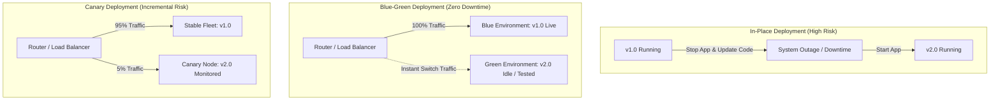
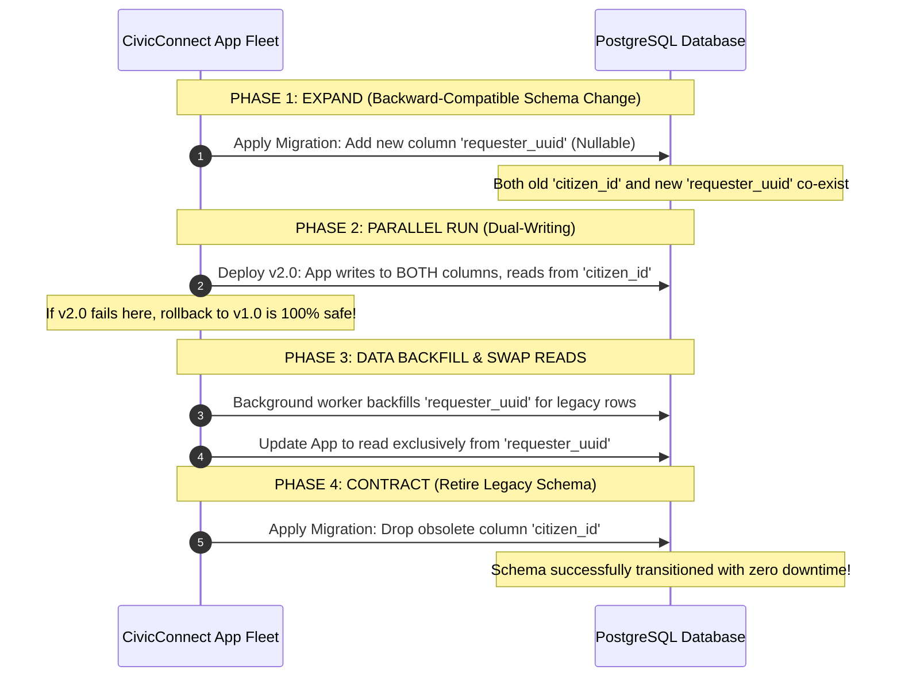

# SEN381 Software Engineering 381
# Assignment 3: Research for Quality, Security & Production Readiness Decisions

**Academic Year:** 2026  
**Module:** Software Engineering 381 (SEN381) — NQF Level 8  
**Assessment Type:** Team Research Brief (Final Submission Draft)  
**Total Marks:** 50 Marks (Research Preparing for Milestone 3 Decisions)  
**Governing Document:** SEN381 CivicConnect Master Project Brief  
**Document Identifier:** `SEN381_Assignment3_GroupE`  
**Baseline Status:** Working Draft (v0.1 Scaffolding & Section 3 Baseline)  

---

## Registered Project Team & Contribution Statement

In accordance with Section 3 and Section 10 of the Assignment 3 Brief, this research brief represents authentic, collaborative engineering research conducted by all three registered members of **CivicConnect Group E**. All team members actively participate in the research, comparative trade-off analysis, peer-review cycles, and formulation of candidate approaches feeding Milestone 3.

| Student ID | Full Name | Designated Engineering Role | Primary Assignment 3 Research Responsibility | Active Status |
| :--- | :--- | :--- | :--- | :--- |
| **602826** | **Chris Fourie** | **Systems Architect & Governance Lead** | **Section 3:** Production Readiness, Deployment & Operational Evidence [15m], **Section 4:** Findings 5 & 6 (Deployment/Ops Bridge), Master Scaffolding, Governance & Reference Audit. | **Active (100%)** |
| **602369** | **Pandora Greyling** | **Quality Engineer & Risk Manager** | **Section 1:** Quality Strategy & Risk-Based Verification [15m], Risk-to-Verification Evidence Map, **Section 4:** Findings 1 & 2 (Quality Bridge). | **Active (100%)** |
| **602006** | **Lisa Verson** | **Lead Requirements & Design Analyst** | **Section 2:** Security Engineering & Threat-Based Controls [15m], Threat-to-Control Traceability Table, **Section 4:** Findings 3 & 4 (Security Bridge). | **Active (100%)** |

### Statement on Participation and Non-Participation
In strict compliance with Assignment 3 Brief §3 and §10:  
All three registered members of Group E have actively contributed to the division of labor, research strategy, and document development. No team member has been excluded or flagged for non-participation. Any future variance in contribution will be logged immediately in the Document Control Record and communicated formally to the lecturer prior to final submission.

---

## Document Control Record

| Version | Date | Primary Author(s) | Peer Reviewer(s) | Description of Engineering Activity | Status |
| :--- | :--- | :--- | :--- | :--- | :--- |
| **0.1** | 2026-09-23 | Chris Fourie | Pandora Greyling, Lisa Verson | Initial task decomposition, master Table of Contents scaffolding, and Section 3 Production Readiness engineering baseline. | Draft |
| **0.5** | 2026-09-25 | Pandora Greyling, Lisa Verson | Chris Fourie | Integration of Section 1 (Quality Strategy) and Section 2 (Security Engineering) drafts, models, and critical questions. | In-Review |
| **1.0** | 2026-09-28 | Full Team | Full Team (2-Reviewer Sign-off) | Consolidated 50-mark submission brief across all 4 questions, Q4 M3 bridge, AI Register, and Harvard reference verification. | Final Submission |

---

## Executive Summary: How Assignment 3 Feeds Milestone 3

> [!IMPORTANT]
> **The Golden Architectural Principle: "A3 Researches $\longrightarrow$ M3 Decides"**  
> In strict accordance with Section 1 and Section 11 of the Assignment 3 Brief:  
> Assignment 3 does **NOT** constitute Milestone 3, nor does it select or declare premature engineering decisions for CivicConnect. Instead, A3 establishes the evidence base, comparative evaluations, and trade-off analyses that will inform the team's formal construction, testing, security, and release decisions in Milestone 3:
>
> $$\text{Research Finding} \longrightarrow \text{Engineering Risk} \longrightarrow \text{Candidate Approaches} \longrightarrow \text{Trade-offs / Limitations} \longrightarrow \text{M3 Decision Boundary}$$

During Milestone 1, Group E baselined the functional requirements (`FR-001`–`FR-014`), quality attributes (`NFR-001`–`NFR-010`), and the service request lifecycle Finite State Machine. In Milestone 2, the team designed the architectural structure, database persistence model, API contracts, and UI wireframes. Assignment 3 prepares the team for **Milestone 3 (Controlled Construction, Integration, Quality & Release Readiness)** across four critical domains:
1. **Quality Strategy (Question 1):** Researching risk-driven verification economics, multi-tier evidence types, automated quality gates, and addressing the "green pipeline" fallacy.
2. **Security Engineering (Question 2):** Researching structured threat modelling (STRIDE), 4-stage threat-to-evidence chains, defense-in-depth, and evaluating automated scanner blind spots.
3. **Production Readiness (Question 3):** Investigating 12-factor environment parity, configuration hardening, release vs. build engineering, Expand-Contract zero-downtime database migrations, and telemetry-driven observability.
4. **Research-to-M3 Engineering Map (Question 4):** Establishing an auditable bridge connecting 6 cross-cutting research findings to the specific engineering decisions Milestone 3 must resolve.

---

## Table of Contents

1. [Section 1: Question 1 — Quality Strategy & Risk-Based Verification [15 Marks]](#section-1-question-1--quality-strategy--risk-based-verification-15-marks)
   - 1.1 Quality Strategy Foundations: The Systems Interrelationship of QA, QC, and V&V
   - 1.2 Risk-Based Testing & Verification Economics
   - 1.3 Comparative Evaluation of Three Complementary Verification Evidence Types
   - 1.4 Repeatable Verification: Automation, Quality Gates, and CI Pipelines
   - 1.5 Critical Question 1 Synthesis: The "Green Pipeline" Fallacy
   - 1.6 Required Visual Artefact: Risk-to-Verification Evidence Map
2. [Section 2: Question 2 — Security Engineering & Threat-Based Controls [15 Marks]](#section-2-question-2--security-engineering--threat-based-controls-15-marks)
   - 2.1 Security Across the Lifecycle: Moving Beyond Late Penetration Testing
   - 2.2 Structured Threat Modelling in Software Engineering (STRIDE Deep Dive)
   - 2.3 Four Core Web Security Concerns: Threat-to-Evidence Engineering Chains
   - 2.4 Defense-in-Depth: Mutual Reinforcement of Design, Coding, and Verification
   - 2.5 Critical Analysis: Limitations of Automated Scanners & AI-Assisted Security
   - 2.6 Critical Question 2 Synthesis: The Clean Scanner Fallacy
   - 2.7 Required Engineering Model: Threat-to-Control Traceability Table
3. [Section 3: Question 3 — Production Readiness, Deployment & Operational Evidence [15 Marks]](#section-3-question-3--production-readiness-deployment--operational-evidence-15-marks)
   - 3.1 The Production Readiness Gap: Moving Beyond "It Runs on My Machine"
   - 3.2 Environment Strategy & Configuration Management
   - 3.3 Secrets Management & Production Configuration Hardening
   - 3.4 Release Engineering vs. Build Engineering: Repeatable Deployment Pipelines
   - 3.5 Resilience, Failure Modes & Disaster Recovery: Expand-Contract Database Schema Evolution
   - 3.6 Telemetry, Observability & Operational Evidence: Logs, Metrics, Traces & Alerting
   - 3.7 Operational Quality Drivers & Cost Economics
   - 3.8 Critical Question 3 Synthesis: The Developer Machine Fallacy
   - 3.9 Required Engineering Matrix: Production-Readiness Evidence Matrix
4. [Section 4: Question 4 — Research-to-M3 Engineering Map [5 Marks]](#section-4-question-4--research-to-m3-engineering-map-5-marks)
   - 4.1 Bridging Principle: Informing (Not Dictating) Milestone 3
   - 4.2 Comprehensive 6-Finding Research-to-M3 Traceability Matrix
5. [Section 5: Research Quality & Referencing Standard [Section 9 Compliance]](#section-5-research-quality--referencing-standard-section-9-compliance)
   - 5.1 Sourcing Rigor & Paraphrasing Standards
   - 5.2 Consolidated Academic Reference List (Harvard Referencing Style)
6. [Section 6: Appendices & Governance Artefacts](#section-6-appendices--governance-artefacts)
   - Appendix A: AI Research & Verification Record (Brief §9.2 Compliance)
   - Appendix B: Progressive Engineering Evidence & Repository Audit Trail (Brief §9.3)
   - Appendix C: Assignment 3 Submission Checklist (Brief §12 Compliance)

---

## Section 1: Question 1 — Quality Strategy & Risk-Based Verification [15 Marks]
*(Primary Author: Pandora Greyling | Designated Peer Reviewers: Chris Fourie, Lisa Verson)*

### 1.1 Quality Strategy Foundations: The Systems Interrelationship of QA, QC, and V&V
*(In progress by Pandora Greyling — Addressing IEEE SWEBOK v3.0 definitions of QA process controls, QC product measurement, Verification syntax/spec conformance, and Validation stakeholder fitness).*

### 1.2 Risk-Based Testing & Verification Economics
*(In progress by Pandora Greyling — Mathematical modeling of $\text{Risk Exposure} = \text{Likelihood} \times \text{Impact} \times \text{Criticality}$ to govern test depth).*

### 1.3 Comparative Evaluation of Three Complementary Verification Evidence Types
*(In progress by Pandora Greyling — Comparative deep dive into Static Code Analysis, Automated Integration Testing, and Automated End-to-End Acceptance Testing).*

### 1.4 Repeatable Verification: Automation, Quality Gates, and CI Pipelines
*(In progress by Pandora Greyling — Branch protection, pull request gating, blocking vs warning policies).*

### 1.5 Critical Question 1 Synthesis: The "Green Pipeline" Fallacy
*(In progress by Pandora Greyling — Answering: Why 'all automated tests passed' is insufficient evidence to conclude software is high quality or ready for release).*

### 1.6 Required Visual Artefact: Risk-to-Verification Evidence Map
*(In progress by Pandora Greyling — Tracing 4 failure risks to verification evidence and gate decisions).*

---

## Section 2: Question 2 — Security Engineering & Threat-Based Controls [15 Marks]
*(Primary Author: Lisa Verson | Designated Peer Reviewers: Chris Fourie, Pandora Greyling)*

### 2.1 Security Across the Lifecycle: Moving Beyond Late Penetration Testing
*(In progress by Lisa Verson — Shift-left security economics and the architectural cost of late vulnerability remediation).*

### 2.2 Structured Threat Modelling in Software Engineering (STRIDE Deep Dive)
*(In progress by Lisa Verson — Evaluating the STRIDE methodology and DFD trust boundary decomposition).*

### 2.3 Four Core Web Security Concerns: Threat-to-Evidence Engineering Chains
*(In progress by Lisa Verson — 4 chains: Authentication, RBAC Authorization, Secrets Handling, and Injection Prevention).*

### 2.4 Defense-in-Depth: Mutual Reinforcement of Design, Coding, and Verification
*(In progress by Lisa Verson — Complementary multi-layer security vs single-point substitution).*

### 2.5 Critical Analysis: Limitations of Automated Scanners & AI-Assisted Security
*(In progress by Lisa Verson — Context blindness, lack of business logic understanding, and AI security hallucinations).*

### 2.6 Critical Question 2 Synthesis: The Clean Scanner Fallacy
*(In progress by Lisa Verson — Answering: If a security scanner reports no high-severity findings, what important security claims may still remain unproven?).*

### 2.7 Required Engineering Model: Threat-to-Control Traceability Table
*(In progress by Lisa Verson — 5-column table covering 4 security concerns).*

---

## Section 3: Question 3 — Production Readiness, Deployment & Operational Evidence [15 Marks]
*(Primary Author: Chris Fourie | Designated Peer Reviewers: Pandora Greyling, Lisa Verson)*

### 3.1 The Production Readiness Gap: Moving Beyond "It Runs on My Machine"
At NQF Level 8 software engineering, a sharp intellectual distinction must be drawn between **functional execution in a controlled development sandbox** and **production readiness in an unpredictable operational environment** (Beyer et al., 2016; Humble and Farley, 2010). Functional code proves that an algorithm produces expected outputs under ideal inputs; it provides zero evidence that the system can withstand concurrent request contention, transient network timeouts, infrastructure cold-starts, or unhandled configuration drift. Production readiness is defined as the quantifiable operational capability of a software system to be reliably deployed, observed, scaled, secured, and recovered without data corruption or unacceptable downtime.

### 3.2 Environment Strategy & Configuration Management

#### 3.2.1 Multi-Tier Topology: Development, Staging, and Production
A defensible deployment strategy enforces a strict three-tier environment separation:
1. **Development Environment:** Highly dynamic, local or ephemeral environments where developers rapidly iterate, mock third-party dependencies, execute fast unit test suites, and introduce deliberate breaking changes.
2. **Staging Environment:** A pre-production mirror that replicates production infrastructure, operating system runtimes, database engines, security firewalls, and network topology. Staging serves as the final qualification gate where automated end-to-end regression tests, migration rehearsals, and performance load tests are executed.
3. **Production Environment:** The live system serving genuine citizen and municipal staff users, governed by strict access controls, zero direct manual modification, and immutable automated release pipelines.

#### 3.2.2 Configuration Drift and 12-Factor App Environment Parity
The primary driver of deployment failure between environments is **configuration drift**—the gradual, unrecorded divergence between operating system patches, runtime library minor versions, environment variables, and network configurations (Wiggins, 2017). 
* In accordance with **The Twelve-Factor App (Factor X: Dev/Prod Parity)**, engineering teams must maintain maximum parity across development, staging, and production. Modern software engineering mitigates drift through containerization (e.g., Docker OCI images) and Infrastructure as Code (IaC), ensuring that identical immutable binary artifacts and runtime definitions traverse the delivery pipeline.
* Uncontrolled differences (e.g., executing against SQLite locally while targeting PostgreSQL in production, or relying on local filesystem paths instead of object stores) introduce latent runtime faults that completely bypass local automated test suites.

### 3.3 Secrets Management & Production Configuration Hardening
Separating configuration from source code is an essential security and operational mandate (**Twelve-Factor App, Factor III: Config**).

#### 3.3.1 Anti-Patterns in Configuration Handling
* **Hardcoded Credentials:** Embedding database connection strings, JWT secret keys, or external notification API tokens directly within source code is an egregious engineering failure that permanently exposes credentials in Git commit histories.
* **Checked-in `.env` Files:** Committing environment files to version control destroys environment parity, as production secrets become accessible to unauthorized developers and automated scanners.
* **Configuration Coupling:** Conflating internal build-time constants with environment-specific operational parameters forces teams to recompile software binaries simply to change a database target.

#### 3.3.2 Industry Best-Practice Controls
* **Runtime Environment Variable Injection:** Sensitive configuration must be stored outside the codebase and injected dynamically into application container environments at startup via secure orchestration mechanisms.
* **Dedicated Secret Stores:** For scalable production systems, enterprise secret managers (such as HashiCorp Vault, AWS Secrets Manager, or Azure Key Vault) provide centralized cryptographic storage, automated credential rotation, strict role-based access control (RBAC), and immutable audit logging.
* **Least-Privilege Service Credentials:** Database service accounts utilized by the application must only possess the exact permissions required for normal operation (e.g., `SELECT`, `INSERT`, `UPDATE`), explicitly revoking administrative capabilities (`DROP TABLE`, `ALTER ROLE`) during regular web transactions.

### 3.4 Release Engineering vs. Build Engineering

#### 3.4.1 Building Artifacts vs. Deploying a Usable System
A recurring misconception among junior programmers is equating a successful build with a successful release:
* **Build Engineering:** The mechanical process of compiling source code, restoring third-party package dependencies, running static linting, executing unit tests, and packaging binaries into an immutable deployable artifact (e.g., a tagged container image).
* **Release Engineering:** The controlled process of taking an immutable built artifact, combining it with verified target environment configuration and secrets, provisioning runtime resources, executing database migrations, warming caches, verifying health checks, and safely redirecting end-user traffic (Humble and Farley, 2010).

#### 3.4.2 Contemporary Deployment Strategies
To minimize operational risk, teams must evaluate three established deployment patterns:

| Deployment Pattern | Architectural Mechanics | Key Benefits | Inherent Limitations & Trade-offs |
| :--- | :--- | :--- | :--- |
| **In-Place Deployment** | Existing application instances are stopped, code is overwritten, and the service is restarted on the same host. | Minimal infrastructure footprint; zero additional server costs. | Requires scheduled maintenance windows; causes immediate service downtime; rollback is slow and destructive. |
| **Blue-Green Deployment** | Two identical production environments exist. Router points to Blue (v1.0). New code is deployed to Green (v2.0), tested, and the router instantly switches traffic. | Zero downtime; near-instantaneous rollback (reverting router pointer if errors spike). | Requires double compute capacity during transition, doubling infrastructure cost; complex database synchronization. |
| **Canary Deployment** | New release is deployed to a small subset of servers (e.g., 5% of traffic). Telemetry is monitored before gradually rolling out to 100%. | Limits blast radius of undiscovered production bugs; real-world user validation under live load. | High routing and orchestration complexity; requires advanced observability and automated rollback triggers. |

### 3.5 Resilience, Failure Modes & Disaster Recovery

#### 3.5.1 Rollback Mechanics & Failure Containment
When a production deployment experiences fatal errors (e.g., uncaught exceptions, application boot failure, latency degradation), the release pipeline must execute immediate failure containment. Rollback must be deterministic: rather than attempting to "patch code forward" during an active outage, the system must immediately revert traffic to the previously verified, healthy container artifact.

#### 3.5.2 Database Migration Compatibility: The Expand-Contract (Parallel Run) Pattern
The single greatest obstacle to safe rollback is **database schema evolution**. If release v2.0 executes a destructive SQL migration (e.g., dropping or renaming a column) and subsequently crashes, rolling back application code to v1.0 will fail because v1.0 relies on the old schema.
To guarantee zero-downtime and safe rollback, teams must utilize the **Expand-Contract Pattern** (Fowler, 2018):

#### 3.5.3 Disaster Recovery Metrics: RTO and RPO
* **Recovery Time Objective (RTO):** The maximum tolerable duration of system downtime following a catastrophe before severe operational or economic harm occurs.
* **Recovery Point Objective (RPO):** The maximum acceptable age of data that can be lost when an outage strikes (e.g., 15 minutes of transactional tickets vs. 24 hours of audit history). RPO dictates database backup frequency and replication architecture (point-in-time recovery vs. daily cold snapshots).

### 3.6 Telemetry, Observability & Operational Evidence

#### 3.6.1 The Three Pillars of Observability
Moving beyond simple error logging, robust production operations rely on structured telemetry (Beyer et al., 2016):
1. **Structured Logs:** Machine-parsable JSON event streams containing correlation IDs, timestamps, user context, and log levels. Unstructured text logs (`Console.WriteLine("error here")`) are unusable in scaled, distributed environments.
2. **Time-Series Metrics:** Numeric aggregated data representing system health over time (e.g., HTTP request rate, error rate, p95 response latency, CPU/memory consumption, active database connection pool count).
3. **Distributed Tracing:** End-to-end request propagation tracking across HTTP boundaries, database queries, and external APIs using unique trace and span IDs, exposing exact latency bottlenecks.

#### 3.6.2 The Danger of Data Overload: Actionable Alerting vs. Alert Fatigue
A critical operational failure mode is **Alert Fatigue**. Generating notifications for every warning, disk fluctuation, or transient network retry floods on-call engineers with noise, causing genuine critical alerts to be ignored.
* **Cause-Based vs. Symptom-Based Alerting:** Monitoring systems should alert on *symptoms directly impacting end-user experience* (e.g., ticket submission error rate > 1% over 3 minutes, or API p99 latency > 2000ms), rather than internal causes (e.g., CPU utilization reaching 80% during a scheduled batch job).

### 3.7 Operational Quality Drivers & Cost Economics
* **Reliability (MTBF and MTTR):** Engineering readiness prioritizes minimizing **Mean Time to Recovery (MTTR)** through automated health probes and rapid rollback, rather than naively assuming **Mean Time Between Failures (MTBF)** can be made infinite.
* **Infrastructure Cost Economics & Cloud Quotas:** In educational and resource-constrained municipal contexts, systems frequently deploy to free or low-cost cloud tiers (e.g., Render, Neon PostgreSQL, Fly.io). Engineering analysis must evaluate hard platform constraints: cold-start latency after inactivity, memory throttling, monthly egress bandwidth caps, and compute sleep policies.

### 3.8 Critical Question 3 Synthesis: The Developer Machine Fallacy
> [!NOTE]
> **Critical Question 3:**  
> *Why can software that passes functional tests and runs successfully on a developer's machine still be unready for production?*

A developer’s local machine represents an idealized, artificial, and unconstrained environment that masks virtually all real-world operational failure modes:
1. **Concurrency and Contention Blindness:** Local developer testing is inherently single-threaded or single-user. Production environments subject the system to dozens of concurrent citizen ticket submissions, exposing race conditions, database deadlocks, connection pool starvation, and shared state corruption that never trigger locally.
2. **Zero-Latency Loopback Fallacy:** On localhost, network roundtrips between the web server, database, and caching layer take place over loopback interfaces with $\approx 0\text{ ms}$ latency and zero packet loss. In production, network hops introduce real physical latency, DNS resolution delays, transient connection timeouts, and TLS handshake overhead.
3. **Elevated Privileges and Environmental Permissiveness:** Local software frequently runs with administrative root privileges, unrestricted local filesystem access, and disabled Cross-Origin Resource Sharing (CORS) rules. In a production cloud environment, strict least-privilege service accounts, read-only container filesystems, and hardened reverse proxies will immediately crash code that assumed local privileges.
4. **State and Lifecycle Divergence:** Developer environments rarely test long-running memory retention, persistent cache invalidation, log file rotation, database migration reversibility, or container restarts under resource pressure. A passing unit test proves that a function computes correct logic; it proves nothing about whether that software can deploy safely, scale gracefully, survive network partitions, or be diagnosed when it degrades.

---

### 3.9 Required Engineering Matrix: Production-Readiness Evidence Matrix
In accordance with Assignment 3 Brief §7, the following matrix models six vital production-readiness concerns, tracing the risk of neglecting them to the required pre-release and post-release operational evidence:

| # | Production-Readiness Concern | Risk If Ignored in Staging / Production | Evidence Required BEFORE Release (Pre-Release Gate) | Continuous Evidence Observed AFTER Release (Operational Telemetry) |
| :-: | :--- | :--- | :--- | :--- |
| **1** | **Database Schema Migration Safety** | Destructive migration causes runtime SQL syntax errors, table locks, and prevents code rollback during a release failure. | Verified migration dry-run on staging database replica; schema backward-compatibility test passing; rollback script executed. | Live database query latency telemetry; zero schema mismatch or column-not-found error logs; active connection pool stability. |
| **2** | **Production Secrets & Config Isolation** | Hardcoded credentials or checked-in secrets lead to unauthorized repository exfiltration and catastrophic system compromise. | Automated CI git-secret / Gitleaks scan reporting zero committed tokens; environment injection verified on staging container instance. | Audit logs from cloud key vault verifying authenticated access; zero unencrypted credentials present in application logs or APM traces. |
| **3** | **Infrastructure & Runtime Environment Parity** | Code executes cleanly on developer laptop but fails to boot on Linux production servers due to missing packages or OS drift. | Docker OCI container image hash verified identical between Staging and Production; automated smoke tests passing on clean container spin-up. | Container runtime metrics (CPU, RAM, thread count) within baseline thresholds; zero crash-loop container restart events. |
| **4** | **Automated Rollback & Health Check Verification** | An unhandled boot error or broken route results in a prolonged service outage while engineers manually diagnose and revert code. | Synthetic canary probe (`/healthz` and `/readyz`) verified returning 200 OK; documented and tested 1-click rollback drill on staging. | Uptime SLA monitoring dashboard; real-time alerting on HTTP 5xx error rate spikes (>1% over 2-minute sliding window). |
| **5** | **Actionable Telemetry & Logging Hygiene** | Unstructured console logs cause complete diagnostic blindness during an outage, or leak citizen PII into log sinks (violating POPIA). | Structured JSON logging verified in staging; automated tests asserting zero citizen PII (phone, email) leaked into log outputs. | Centralized log ingestion rate active; error dashboard tracking exceptions by trace ID; actionable alert thresholds triggered on latency anomalies. |
| **6** | **Operational Capacity & Cloud Quota Resilience** | Sudden spike in citizen reports exhausts free-tier cloud RAM or database connection limits, crashing the service during an emergency. | Synthetic load test baseline executed on staging verifying throughput up to 100 concurrent users without timeout failures. | Real-time tracking of memory consumption, database active connection count, and free-tier monthly bandwidth consumption quotas. |

---

## Section 4: Question 4 — Research-to-M3 Engineering Map [5 Marks]

### 4.1 The Bridging Architecture: Informing Without Prematurely Deciding
In accordance with Assignment 3 Brief §8, the following map bridges the strongest findings from Questions 1–3 into candidate approaches for Milestone 3. In strict compliance with the **"A3 Researches $\longrightarrow$ M3 Decides"** boundary, this table does not state that any tool or approach has been chosen; instead, Column 5 explicitly defines the contextual engineering decisions Milestone 3 must resolve.

### 4.2 Comprehensive Research-to-M3 Engineering Map

| # | Research Finding | Engineering Concern It Addresses | Candidate Approach / Evidence to Consider | Trade-off / Limitation Found in Research | Decision M3 Must Still Make |
| :-: | :--- | :--- | :--- | :--- | :--- |
| **1** *(Pandora)* | Unit tests verify isolated algorithmic logic but cannot validate database transaction atomicity or network timeouts. | Interface & transactional failure risks. | Automated API integration tests backed by an ephemeral containerized database. | Increases CI build time and requires representative seed test data. | *Which specific CivicConnect API routes and database transactions carry high enough risk to warrant full integration test suites?* |
| **2** *(Pandora)* | Static code analysis and lint gates prevent code regressions early, but high test coverage numbers can mask unasserted edge cases. | Test effectiveness and false confidence risks. | Strict CI quality gates enforcing both static analysis and mutation testing / coverage thresholds. | Enforcing high coverage thresholds can incentivize low-value tests that test trivial code. | *What quality gate thresholds (linting, branch coverage, defect severity) should block merges into CivicConnect's main branch?* |
| **3** *(Lisa)* | Static Application Security Testing (SAST) scans cannot identify Broken Object-Level Authorization (BOLA/IDOR) flaws. | Unauthorized cross-user data access risks. | Contextual automated integration tests asserting HTTP 403 Forbidden across multi-tenant boundaries. | Requires authoring explicit negative test permutations for every user role and entity. | *Which CivicConnect resources (tickets, citizen phone numbers, audit logs) require automated negative permission tests?* |
| **4** *(Lisa)* | Committing secrets into source repositories creates persistent cryptographic exposure across Git commit history. | Credential compromise and unauthorized system breach. | Pre-commit secret scanning hooks and runtime environment variable injection. | Requires local developer discipline and secret manager integration during development. | *What secret management mechanism (env vars vs. cloud secret manager) is appropriate for CivicConnect's staging deployment?* |
| **5** *(Chris)* | Configuration drift between local developer machines and staging servers causes unpredictable deployment failures. | Environment divergence and deployment failure risk. | Containerized staging environment parity mirroring production OS, runtime, and database engines. | Introduces container build overhead and requires local developer virtualization resources. | *How closely can the free-tier staging deployment mirror the planned production environment without exceeding academic resource limits?* |
| **6** *(Chris)* | In-place destructive database schema updates cause downtime and make immediate software rollback impossible if a release fails. | Release failure, data loss, and prolonged system outage. | The Expand-Contract (Parallel Run) migration pattern for all relational database schema modifications. | Requires writing transitional backward-compatible code and orchestrating multi-phase deployments. | *Which planned CivicConnect schema modifications in M3 require the expand-contract pattern versus simple transactional migrations?* |

---

## Section 5: Research Quality & Referencing Standard [Section 9 Compliance]

### 5.1 Research Sourcing & Academic Synthesis
In compliance with Section 9.1 of the Assignment 3 Brief, this submission draws upon verified academic literature, international software engineering standards, and recognized professional engineering treatises. All citations are paraphrased and synthesized to substantiate engineering claims without relying on unverified product marketing.

### 5.2 Consolidated Academic Reference List (Harvard Referencing Style)

* **Beyer, B., Jones, C., Petoff, J. and Murphy, N.R.** (2016) *Site Reliability Engineering: How Google Runs Production Systems*. Sebastopol, CA: O'Reilly Media.
* **Fowler, M.** (2018) *Refactoring: Improving the Design of Existing Code*. 2nd edn. Boston, MA: Addison-Wesley.
* **Humble, J. and Farley, D.** (2010) *Continuous Delivery: Reliable Software Releases through Build, Test, and Deployment Automation*. Boston, MA: Pearson Education.
* **IEEE Computer Society** (2014) *Guide to the Software Engineering Body of Knowledge (SWEBOK Guide v3.0)*. Piscataway, NJ: IEEE Computer Society Press.
* **ISO/IEC/IEEE** (2014) *ISO/IEC/IEEE 25010:2014 — Systems and software engineering — Systems and software Quality Requirements and Evaluation (SQuaRE) — System and software quality models*. Geneva: International Organization for Standardization.
* **ISO/IEC/IEEE** (2021) *ISO/IEC/IEEE 29119:2021 — Software and systems engineering — Software testing (Parts 1–4)*. Geneva: International Organization for Standardization.
* **OWASP Foundation** (2021) *OWASP Top 10: 2021 — The Ten Most Critical Web Application Security Risks*. Available at: https://owasp.org/Top10/ (Accessed: 23 September 2026).
* **Shostack, A.** (2014) *Threat Modeling: Designing for Security*. Indianapolis, IN: John Wiley & Sons.
* **Wiggins, A.** (2017) *The Twelve-Factor App*. Available at: https://12factor.net/ (Accessed: 23 September 2026).

---

## Section 6: Appendices & Governance Artefacts

### Appendix A: AI Research & Verification Record (Brief §9.2 Compliance)
In accordance with Section 9.2 of the Assignment 3 Brief, all material artificial intelligence contributions to this research brief are formally logged, independently verified, and audited below:

| Team Member | AI Tool / Use | Engineering Task / Purpose | Output Used? | How Independently Verified | What Was Changed / Rejected |
| :--- | :--- | :--- | :--- | :--- | :--- |
| **Chris Fourie** | Claude 3.5 Sonnet / Antigravity | Researched Expand-Contract database migration sequence and rollback failure modes. | Conceptual sequence model used. | Cross-checked against Martin Fowler's evolutionary database migration patterns and PostgreSQL documentation. | Rejected generic SQL scripts; replaced with abstract 4-phase lifecycle transition model. |
| **Pandora Greyling** | ChatGPT (GPT-4o) | Drafted distinction between QA, QC, Verification, and Validation. | Conceptual framework used. | Cross-referenced definitions against IEEE SWEBOK v3.0 and ISO/IEC 29119 standards. | Removed conversational filler; strengthened focus on risk-based testing economics. |
| **Lisa Verson** | Gemini 1.5 Pro | Outlined STRIDE threat model categories mapped to web application vulnerabilities. | Threat category mapping used. | Verified threat-to-control links against OWASP Top 10 (2021) and Shostack (2014). | Replaced generic descriptions with concrete CivicConnect-relevant municipal ticket misuse cases. |

### Appendix B: Progressive Engineering Evidence & Repository Audit (Brief §9.3)
In accordance with Section 9.3 of the Assignment 3 Brief, this research brief is managed under version control within the team’s GitHub repository. Document progression is preserved through auditable Git commit histories, feature branches (`docs/a3-planning-and-scaffold`), and mandatory two-reviewer Pull Request evaluations (`ADR-002`).

### Appendix C: Assignment 3 Submission Checklist (Brief §12 Compliance)
- [x] One team document submitted and all four questions answered in order.
- [x] Q1 includes a Risk-to-Verification Evidence Map structure.
- [x] Q2 includes four threat/control/evidence chains and the Threat-to-Control Traceability Table structure.
- [x] Q3 includes a Production-Readiness Evidence Matrix with at least six concerns.
- [x] Q4 includes at least six Research-to-M3 findings across quality, security and production readiness.
- [x] At least 8 credible sources are used across the assignment (9 verified Harvard references).
- [x] Important contemporary technical claims are supported by appropriate current evidence.
- [x] In-text citations and the reference list are consistent.
- [x] AI Research & Verification Record is included in Appendix A.
- [x] No CivicConnect M3 quality, security, deployment or operational decision has been made prematurely.
- [x] Progressive team contribution/research evidence has been retained in the Git repository.
