# SEN381 Software Engineering 381
# Assignment 3: Work Breakdown, Task Contracts & Document Plan

**Academic Year:** 2026  
**Module:** Software Engineering 381 (SEN381) — NQF Level 8  
**Assessment Type:** Team Research Brief (Planning & Work Allocation Specification)  
**Total Marks:** 50 Marks (Research Feeding Milestone 3 Decisions)  
**Governing Document:** SEN381 CivicConnect Master Project Brief & Assignment 3 Instruction Brief  
**Team Identifier:** CivicConnect Group E  

---

## 1. Executive Context & The Core Boundary

### 1.1 Lifecycle Alignment
Within the SEN381 curriculum, Assignment 3 (A3) bridges the gap between Milestone 2 (Architecture & Design) and Milestone 3 (Controlled Construction, Integration, Quality & Release Readiness). It draws forward selected Week 5 and Week 6 concerns so that the engineering team researches credible quality, security, and production-readiness controls before being required to implement and defend them in Milestone 3.

```mermaid
flowchart LR
    A1["A1: Research Foundations<br><i>(Engineering Mindset)</i>"] --> M1["M1: Foundation & Baseline<br><i>(Requirements, Scope, RTM)</i>"]
    M1 --> A2["A2: Design & APIs<br><i>(SOLID, Patterns, DB, CI)</i>"]
    A2 --> M2["M2: Architecture & Design<br><i>(PED v2.0, ADRs, Wireframes)</i>"]
    M2 --> A3["A3: Quality, Security & Ops<br><i>(Research Options & Controls)</i>"]
    A3 --> M3["M3: Construction & Release<br><i>(Code, CI/CD, Staging, Change)</i>"]
    M3 --> M4["M4: Final Product & Defence<br><i>(Production, Reflection)</i>"]

    style A3 fill:#1e3a8a,stroke:#3b82f6,stroke-width:3px,color:#fff
    style M3 fill:#065f46,stroke:#10b981,stroke-width:2px,color:#fff
```



### 1.2 The Non-Negotiable Boundary Principle: "A3 Researches — M3 Decides"
> [!IMPORTANT]
> **Central Principle (Assignment 3 Brief §1 & §11):**  
> **A3 researches $\longrightarrow$ Milestone 3 (M3) decides, applies, verifies, and provides evidence.**  
> Research must expand the team's engineering options and judgement; it must **NOT** prematurely manufacture CivicConnect quality, security, deployment, or operational decisions.
>
> **What Assignment 3 Must NOT Become:**
> 1. Do not declare that CivicConnect has already chosen a specific test suite, security control, deployment platform, or monitoring tool.
> 2. Do not write the CivicConnect M3 quality strategy or test plan in A3.
> 3. Do not treat a green pipeline, vulnerability scanner, or AI output as absolute proof of quality or security.
> 4. Do not turn Question 4 into a hidden M3 solution; state what M3 must still decide using CivicConnect's actual requirements, architecture, constraints, and empirical evidence.

---

## 2. Master Table of Contents (Word Document Submission Structure)

The following structure represents the final Word document submission. It addresses all requirements from the Assignment 3 Brief and Master Project Brief.

```markdown
COVER PAGE
- Institution: Belgium Campus iTversity, Faculty of Information Technology
- Module: Software Engineering 381 (SEN381) — NQF Level 8
- Title: Assignment 3: Research for Quality, Security & Production Readiness Decisions
- Group: CivicConnect Group E
- Team Roster: Chris Fourie (602826), Pandora Greyling (602369), Lisa Verson (602006)
- Explicit Statement on Participation / Non-Participation

DOCUMENT CONTROL RECORD
- Revision History Table (v0.1 Scaffolding -> v0.5 Peer Review -> v1.0 Final Submission)
- Two-Reviewer PR Verification Sign-off Gate (ADR-002 Compliance)

REGISTERED PROJECT TEAM & CONTRIBUTION STATEMENT
- Roles, Responsibilities, and Research Task Allocation
- Collective Accountability Affirmation

EXECUTIVE SUMMARY: THE RESEARCH-TO-DECISION LIFECYCLE BRIDGE
- A3 within the 7-Week SEN381 Delivery Arc
- Enforcement of the "A3 Researches -> M3 Decides" Boundary

TABLE OF CONTENTS
LIST OF FIGURES & VISUAL MODELS
LIST OF TABLES & EVALUATION MATRICES

SECTION 1: QUESTION 1 — QUALITY STRATEGY & RISK-BASED VERIFICATION [15 MARKS]
1.1 Quality Strategy Foundations: The Systems Interrelationship of QA, QC, and V&V
    1.1.1 Quality Assurance (Process Controls) vs. Quality Control (Product Measurement)
    1.1.2 Verification ("Building the Product Right") vs. Validation ("Building the Right Product")
    1.1.3 Synthesizing QA, QC, Verification, and Validation into a Unified Engineering Strategy
1.2 Risk-Based Testing & Verification Economics
    1.2.1 The Fallacy of Exhaustive Testing in Modern Web Systems
    1.2.2 The Risk Matrix: Dimensional Analysis of Failure Likelihood, Impact, and Criticality
    1.2.3 Prioritizing Deep vs. Lightweight Verification Effort across System Components
1.3 Comparative Evaluation of Three Complementary Verification Evidence Types
    1.3.1 Evidence Type 1: Static Code Analysis & Type Safety Checks
    1.3.2 Evidence Type 2: Automated Integration & API Contract Verification
    1.3.3 Evidence Type 3: Automated End-to-End (E2E) & System-Level Acceptance Testing
    1.3.4 Synthesis & Complementary Evidence Matrix (Exposing Capabilities vs. Proof Limitations)
1.4 Repeatable Verification: Automation, Quality Gates, and CI Pipelines
    1.4.1 Mechanics of Automated Pipeline Execution & Feedback Loops
    1.4.2 Branch Protection Gates: Enforcing Mandatory Blocking vs. Warning Policies
1.5 Critical Question 1 Synthesis: The "Green Pipeline" Fallacy
    1.5.1 Why "All Automated Tests Passed" Is Insufficient Evidence of Release Readiness
    1.5.2 Blind Spots: Semantic Gaps, Mock Realism, Unexercised Paths & Environmental Drift
1.6 Required Visual Artefact: Risk-to-Verification Evidence Map
    - Traceability of 4 Distinct Failure Risks -> Verification Evidence -> Release Decision Gate

SECTION 2: QUESTION 2 — SECURITY ENGINEERING & THREAT-BASED CONTROLS [15 MARKS]
2.1 Security Across the Lifecycle: Moving Beyond Late Penetration Testing
    2.1.1 The Economic & Architectural Cost of "Bolted-On" Security
    2.1.2 Shift-Left Security: Embedding Threat Awareness into Requirements & Architecture
2.2 Structured Threat Modelling in Software Engineering
    2.2.1 Purpose of Threat Modelling: Driving Design Decisions vs. Cataloguing Threat Terms
    2.2.2 Evaluation of a Recognised Method: The STRIDE Methodology
2.3 Four Core Web Security Concerns: Threat-to-Evidence Engineering Chains
    2.3.1 Concern 1: Authentication & Identity Assurance
    2.3.2 Concern 2: Authorisation, Access Control & Privilege Escalation (RBAC)
    2.3.3 Concern 3: Secrets Protection & Sensitive Configuration Isolation
    2.3.4 Concern 4: Input Validation, Injection Defence & Data Sanitization
2.4 Defense-in-Depth: Mutual Reinforcement of Design, Coding, and Verification
    2.4.1 Secure Design (Architectural Isolation & Least Privilege)
    2.4.2 Secure Coding (Defensive Implementation & Parameterization)
    2.4.3 Automated Dependency & Vulnerability Checking (SCA & SAST)
    2.4.4 Why These Layers Act as Complements Rather Than Substitutes
2.5 Critical Analysis: Limitations of Automated Scanners & AI-Assisted Security
    2.5.1 Inherent Blind Spots of Automated Scanners (Business Logic & Access Context)
    2.5.2 Hallucinations, False Confidence & Stale Signatures in AI Security Tools
2.6 Critical Question 2 Synthesis: The Clean Scanner Fallacy
    2.6.1 What Important Security Claims Remain Unproven When a Scanner Reports Zero Findings?
    2.6.2 Architectural Gaps: Broken Object-Level Authorization (BOLA), Race Conditions & POPIA
2.7 Required Engineering Model: Threat-to-Control Traceability Table
    - 5-Column Matrix: Threat | Security Requirement | Possible Control | Verification Evidence | Residual Risk

SECTION 3: QUESTION 3 — PRODUCTION READINESS, DEPLOYMENT & OPERATIONAL EVIDENCE [15 MARKS]
3.1 The Production Readiness Gap: Moving Beyond "It Runs on My Machine"
    3.1.1 The Contrast Between Functional Correctness and Operational Viability
    3.1.2 Key Dimensions of Production Readiness: Stability, Scalability, and Recoverability
3.2 Environment Strategy & Configuration Management
    3.2.1 Multi-Tier Topology: Local Development vs. Staging vs. Production
    3.2.2 Configuration Drift and 12-Factor App Environment Parity Principles
    3.2.3 Deployment Risks Stemming from Uncontrolled Environmental Divergence
3.3 Secrets Management & Production Configuration Hardening
    3.3.1 Anti-Patterns: Hardcoded Credentials, Checked-in Env Files, and Config Coupling
    3.3.2 Industry Controls: Secret Stores, Environment Variables, and Dynamic Injection
3.4 Release Engineering vs. Build Engineering
    3.4.1 The Fundamental Distinction: Building Artifacts vs. Deploying a Usable System
    3.4.2 Automated, Repeatable Release Pipelines and Gate Approvals
    3.4.3 Deployment Strategies: In-Place vs. Blue-Green vs. Canary Deployment Patterns
3.5 Resilience, Failure Modes & Disaster Recovery
    3.5.1 Rollback Mechanisms and Failure Containment
    3.5.2 Database Migration Compatibility: Zero-Downtime & Expand-Contract Patterns
    3.5.3 Disaster Recovery Targets: Recovery Time Objective (RTO) and Recovery Point Objective (RPO)
3.6 Telemetry, Observability & Operational Evidence
    3.6.1 The Three Pillars of Observability: Logs, Metrics, and Distributed Traces
    3.6.2 The Pitfall of Data Overload: Actionable Alerting vs. Operational Noise (Alert Fatigue)
    3.6.3 Health Checks, Synthetic Monitoring, and Proactive Degradation Detection
3.7 Operational Quality Drivers & Economics
    3.7.1 System Reliability (MTBF, MTTR) and Performance under Scale
    3.7.2 Infrastructure Cost Economics: Free-Tier Quotas, Burst Limits, and Operational Realities
    3.7.3 Maintainability, Supportability, and Runbook Documentation
3.8 Critical Question 3 Synthesis: The Developer Machine Fallacy
    3.8.1 Why Functional Code Running Locally Fails in a Production Environment
    3.8.2 Network Latency, Concurrency, Resource Contention, and Uncontrolled State
3.9 Required Engineering Matrix: Production-Readiness Evidence Matrix
    - Structured Matrix of 6 Production-Readiness Concerns (Risk, Pre-Release Evidence, Post-Release Evidence)

SECTION 4: QUESTION 4 — RESEARCH-TO-M3 ENGINEERING MAP [5 MARKS]
4.1 The Research-to-Implementation Transition Architecture
    4.1.1 Informing Milestone 3 Decisions Without Premature Design Lock-In
    4.1.2 The Structure of the Engineering Decision Bridge
4.2 Comprehensive Research-to-M3 Engineering Map (6 Findings Across Q1-Q3)
    - Row 1 & 2: Quality Strategy Findings (Pandora)
    - Row 3 & 4: Security Engineering Findings (Lisa)
    - Row 5 & 6: Production Readiness & Ops Findings (Chris)

SECTION 5: RESEARCH QUALITY & REFERENCING STANDARD [SECTION 9 COMPLIANCE]
5.1 Research Sourcing Standard & Synthesis Methodology
5.2 Consolidated Academic Reference List (Harvard Style — Minimum 8 Verified Sources)

SECTION 6: APPENDICES & GOVERNANCE ARTEFACTS
APPENDIX A: AI RESEARCH & VERIFICATION RECORD (Mandatory per A3 Brief §9.2)
APPENDIX B: PROGRESSIVE ENGINEERING EVIDENCE & REPOSITORY AUDIT (Brief §9.3)
APPENDIX C: SUBMISSION & INTEGRITY CHECKLIST (Verification against Brief §12)
```

---

## 3. Dependency Analysis & Three-Way Work Breakdown

### 3.1 Work Breakdown Architecture
To prevent team members from blocking one another, the four questions are mapped to individual team roles with zero sequential blockers:

```
┌────────────────────────────────────────────────────────────────────────┐
│                        WORK BREAKDOWN ARCHITECTURE                     │
├─────────────────────┬──────────────────────────────────────────────────┤
│ TEAM MEMBER         │ ALLOCATED TASKS & DELIVERABLES                   │
├─────────────────────┼──────────────────────────────────────────────────┤
│ CHRIS FOURIE        │ • Section 3: Question 3 (Production Readiness)   │
│ (Systems Architect) │ • Section 4: Question 4 Rows 5 & 6 (Ops Bridge)  │
│ [100% UNBLOCKED]    │ • Master Document Scaffolding & Front Matter     │
│                     │ • Harvard Referencing Standard & Final Assembly  │
├─────────────────────┼──────────────────────────────────────────────────┤
│ PANDORA GREYLING    │ • Section 1: Question 1 (Quality Strategy & Risk)│
│ (Quality Engineer)  │ • Risk-to-Verification Evidence Map (Visual)     │
│                     │ • Section 4: Question 4 Rows 1 & 2 (QA Bridge)   │
│                     │ • Critical Question 1 Synthesis                  │
├─────────────────────┼──────────────────────────────────────────────────┤
│ LISA VERSON         │ • Section 2: Question 2 (Security Engineering)   │
│ (Requirements Lead) │ • Threat-to-Control Traceability Table           │
│                     │ • Section 4: Question 4 Rows 3 & 4 (Sec Bridge)  │
│                     │ • Critical Question 2 Synthesis                  │
└─────────────────────┴──────────────────────────────────────────────────┘
```

### 3.2 Proof of Zero Dependencies for Chris
1. **Self-Contained Research:** Question 3 investigates environment parity, 12-factor secrets storage, release pipelines (blue/green vs canary), database migration patterns (expand-contract), telemetry (logs, metrics, traces), and operational quality attributes. None of these depend on whether Lisa has finished threat modeling or Pandora has finished test levels.
2. **Decoupled Question 4:** Question 4 requires 6 findings across Q1-Q3. Each member writes 2 rows directly derived from their assigned question. Chris writes Rows 5 and 6 immediately without waiting for anyone.
3. **Audit Trail Integrity:** Progressive commits in Git for Question 3, Question 4, and the repository scaffolding establish an individual, defensible paper trail under Master Project Brief §8.1.

---

## 4. Individual Task Contracts

### Task Contract 1: Section 1 — Quality Strategy & Risk-Based Verification
* **Owner:** Pandora Greyling (Student ID: 602369)
* **Mark Weight:** 15 Marks (Q1) + 1.5 Marks (Q4 Rows 1 & 2) = 16.5 Marks
* **Mandatory Sub-Sections:**
  - 1.1 QA vs. QC vs. Verification vs. Validation
  - 1.2 Risk-based testing economics ($\text{Likelihood} \times \text{Impact} \times \text{Criticality}$)
  - 1.3 Comparison of 3 complementary verification types (capabilities vs. proof limitations)
  - 1.4 Automation and CI quality gates (blocking vs. non-blocking policies)
  - 1.5 Critical Question 1 synthesis (Why passing automated tests $\ne$ release readiness)
  - 1.6 Visual Model: **Risk-to-Verification Evidence Map** (tracing $\ge 4$ risks to release decisions)
  - Q4 Bridge: 2 rows in the Research-to-M3 Engineering Map

### Task Contract 2: Section 2 — Security Engineering & Threat-Based Controls
* **Owner:** Lisa Verson (Student ID: 602006)
* **Mark Weight:** 15 Marks (Q2) + 1.5 Marks (Q4 Rows 3 & 4) = 16.5 Marks
* **Mandatory Sub-Sections:**
  - 2.1 Security across the lifecycle (Shift-left vs. late penetration testing)
  - 2.2 Structured threat modelling (STRIDE methodology deep dive)
  - 2.3 Four security concern chains (Threat $\rightarrow$ Requirement $\rightarrow$ Control $\rightarrow$ Evidence)
  - 2.4 Defense-in-depth (Secure design vs. secure code vs. automated checks)
  - 2.5 Limitations of automated security tools and AI recommendations
  - 2.6 Critical Question 2 synthesis (Clean scanner blind spots)
  - 2.7 Required Model: **Threat-to-Control Traceability Table** (5 columns, 4 concerns)
  - Q4 Bridge: 2 rows in the Research-to-M3 Engineering Map

### Task Contract 3: Section 3 — Production Readiness, Deployment & Operational Evidence
* **Owner:** Chris Fourie (Student ID: 602826)
* **Mark Weight:** 15 Marks (Q3) + 2 Marks (Q4 Rows 5 & 6) = 17 Marks
* **Mandatory Sub-Sections:**
  - 3.1 The production readiness gap (Moving beyond "it runs on my machine")
  - 3.2 Environment strategy & parity (Dev vs. Staging vs. Prod, 12-Factor config drift)
  - 3.3 Secrets management and configuration hardening
  - 3.4 Release vs. build engineering (repeatable pipelines, blue-green/canary)
  - 3.5 Failure, rollback, and Expand-Contract database migrations
  - 3.6 Telemetry, observability (logs, metrics, traces), and alert fatigue
  - 3.7 Operational quality drivers (reliability, performance, scalability, cost)
  - 3.8 Critical Question 3 synthesis (Why local code fails in production)
  - 3.9 Required Model: **Production-Readiness Evidence Matrix** (6 concerns, 4 columns)
  - Q4 Bridge: 2 rows in the Research-to-M3 Engineering Map
  - Master Document Framing, Formatting, and Academic References

---

## 5. Required Model Schemas & Specifications

### 5.1 Q2 Threat-to-Control Traceability Table Schema (Brief §6)
```markdown
| Threat / Misuse | Security Requirement or Control Objective | Possible Engineering Control | Verification Evidence | Residual Risk / Limitation |
| :--- | :--- | :--- | :--- | :--- |
| [What attack/misuse?] | [What must be protected/prevented?] | [How implemented?] | [What evidence proves it?] | [What remains uncertain?] |
```

### 5.2 Q3 Production-Readiness Evidence Matrix Schema (Brief §7)
```markdown
| Production-Readiness Concern | Risk If Ignored in Staging/Prod | Evidence That Must Exist BEFORE Release | Evidence That Continues to Be Observed AFTER Release |
| :--- | :--- | :--- | :--- |
| [Concern 1 to 6] | [Downstream impact of failure] | [Gate checks, tests, staging drills] | [Metrics, telemetry, health check logs] |
```

### 5.3 Q4 Research-to-M3 Engineering Map Schema (Brief §8)
```markdown
| Research Finding | Engineering Concern It Addresses | Candidate Approach / Evidence to Consider | Trade-off / Limitation Found in Research | Decision M3 Must Still Make |
| :--- | :--- | :--- | :--- | :--- |
| [Finding from Q1-Q3] | [Underlying SE risk] | [Candidate technique] | [Cost, complexity, overhead] | [Contextual question for CivicConnect] |
```

### 5.4 Section 9.2 AI Research & Verification Record Schema (Brief §9.2)
```markdown
| Team Member | AI Tool / Use | Purpose | Output Used? | How Independently Verified | What Was Changed / Rejected |
| :--- | :--- | :--- | :--- | :--- | :--- |
```

---

## 6. Official Submission Checklist (Brief §12)

- [ ] One team document submitted and all four questions answered in order.
- [ ] Q1 includes a Risk-to-Verification Evidence Map.
- [ ] Q2 includes four threat/control/evidence chains and the Threat-to-Control Traceability Table.
- [ ] Q3 includes a Production-Readiness Evidence Matrix with at least six concerns.
- [ ] Q4 includes at least six Research-to-M3 findings across quality, security and production readiness.
- [ ] At least 8 credible sources are used across the assignment.
- [ ] Important contemporary technical claims are supported by appropriate current evidence.
- [ ] In-text citations and the reference list are consistent (Harvard Referencing Style).
- [ ] AI Research & Verification Record is included if AI was used.
- [ ] No CivicConnect M3 quality, security, deployment or operational decision has been made prematurely.
- [ ] Progressive team contribution/research evidence has been retained in the Git repository.
