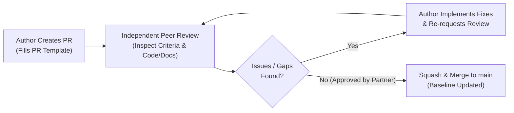

# CivicConnect Engineering Contribution & Governance Guidelines

## 1. Purpose & Standards Overview
This document defines the mandatory engineering controls, branching conventions, code/document review standards, and configuration management rules for the **CivicConnect** project.

All team members must strictly adhere to the standards outlined in the **SEN381 CivicConnect Master Project Brief (§8, §9, §10)**. Working code or documentation alone is insufficient; all work must be produced through an auditable, controlled engineering process.

---

## 2. Branching Model & Branch Naming Conventions

The CivicConnect repository utilizes a controlled **Trunk-Based / Feature-Branch Model** with protected `main`:

```
main (PROTECTED - Controlled Engineering Baseline)
 │
 ├── feat/FR-001-request-submission
 ├── fix/RSK-003-session-timeout-handling
 ├── docs/PED-v1.0-stakeholder-analysis
 └── chore/github-action-linting
```

### 2.1 Standard Branch Naming Prefixes
* `feat/FR-xxx-<short-description>`: New functional capabilities linked directly to an approved Functional Requirement.
* `fix/RSK-xxx-<short-description>` or `fix/DEF-xxx`: Defect resolutions or risk remediation tasks.
* `docs/PED-xxx-<short-description>`: Controlled engineering documentation updates.
* `refactor/<module>-<short-description>`: Internal code refactoring preserving external behavior.
* `test/<component>-<short-description>`: Unit, integration, or system automated test suites.
* `chore/<tooling>-<short-description>`: Build tooling, CI configuration, or environment scripts.

---

## 3. Mandatory Main Branch Protection Rules

In accordance with **Master Project Brief §9**, **`ADR-002`**, and **`ADR-009`**:
1. **Direct Commits Blocked:** Direct pushes to `main` are disabled via repository branch protection rules.
2. **Pull Request Required:** Every modification entering `main` must originate from a dedicated branch and be submitted via a Pull Request.
3. **Peer Review Approval Rule (ADR-009):** In accordance with ADR-009 (governing two-person team operation following Pandora Greyling's institutional withdrawal), every PR requires formal written approval from **100% of non-author team members (1 independent peer approval from the remaining partner)** plus automated CI gate passage. Author self-approval is strictly forbidden and receives zero academic credit. *(The original 3-person two-reviewer mandate is historically preserved in ADR-002).*
4. **No Rubber-Stamping:** Approvals consisting solely of "LGTM" or empty checks without technical feedback are considered non-compliant.

---

## 4. Pull Request Lifecycle & Review Standard

Every Pull Request must follow this evidence path:



### 4.1 Meaningful Review Checklist
Peer reviewers must evaluate:
- [ ] **Traceability:** Is the change linked to a valid Requirement ID (`FR-xxx`/`NFR-xxx`) or Risk ID (`RSK-xxx`)?
- [ ] **Acceptance Criteria Verification:** Does the implementation satisfy all corresponding Gherkin acceptance criteria?
- [ ] **Security & Data Privacy:** Are input sanitization, parameterization, and least-privilege boundaries preserved? Are there any exposed credentials?
- [ ] **Maintainability & Technical Debt:** Does the change introduce code smells, tight coupling, or unmanaged complexity?
- [ ] **Test Coverage:** Are unit/integration tests included where applicable?
- [ ] **Documentation Impact:** Is the PED, RTM, or Decision Log updated accordingly?

---

## 5. Responsible AI Engineering & Verification Policy

In accordance with **Master Project Brief §10**:
1. **AI as an Engineering Assistant:** AI tools (e.g. Gemini, Copilot, ChatGPT) may be utilized for analysis, brainstorming, syntax assistance, or test generation.
2. **Full Human Accountability:** The team is 100% accountable for all submitted code, design, and documentation. The defense *"the AI generated it"* is an automatic failure.
3. **Mandatory AI Usage Register:** Every material AI contribution must be logged in [`docs/governance/AI_Usage_Register_v1.0.md`](docs/governance/AI_Usage_Register_v1.0.md) with date, student ID, prompt/task, generated output, human verification method, decision, and issues/hallucinations identified.
4. **Confidentiality & Data Protection:** No student personal data, credentials, secrets, or institutional proprietary materials may be passed into public AI prompts.
