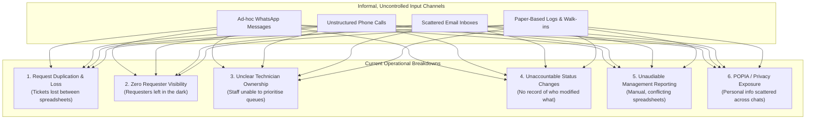
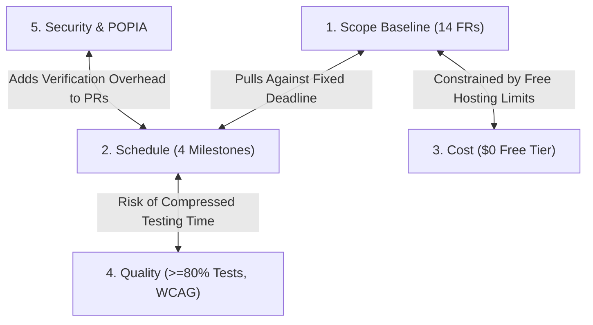

# Project Engineering Document (PED) v1.0
## CivicConnect: Community Service Request Management Platform
### Milestone 1 — Engineering Foundation & Requirements Baseline

**Academic Year:** 2026  
**Module:** Software Engineering 381 (SEN381) — NQF Level 8  
**Baseline Version:** 1.0 (Controlled Product State)  
**Governing Document:** SEN381 CivicConnect Master Project Brief  

---

## Document Control & Authorship Record

| Version | Date | Primary Author(s) | Verified / Approved By | Baseline Status | Milestone Scope |
| :--- | :--- | :--- | :--- | :--- | :--- |
| **0.1** | 2026-09-01 | Pandora Greyling | Lisa Verson, Chris Fourie | Initial Working Draft | Scaffolding, Table of Contents, and Problem Domain Framing. |
| **0.5** | 2026-09-05 | Lisa Verson, Chris Fourie | Pandora Greyling | Team Review Draft | Integrated Stakeholder Analysis, Scope Baseline, FRs, and NFRs. |
| **1.0** | 2026-09-09 | Chris Fourie, Pandora Greyling, Lisa Verson | Full Team (Two-Reviewer Sign-off) | **Controlled Baseline (APPROVED)** | Formal M1 Baseline: Problem Analysis, Scope, Requirements, Constraints, RTM, Risk Register, Decision Log, Forward Engineering, and Gate Sign-off. |

### Registered Project Team Roster

| Student ID | Full Name | Assigned Project Role | Primary Milestone Responsibility |
| :--- | :--- | :--- | :--- |
| `602006` | **Lisa Verson** | **Lead Requirements Analyst** | Problem Analysis, Stakeholder Conflict Analysis, Functional Requirements (`FR-001`–`FR-014`), Acceptance Criteria. |
| `602369` | **Pandora Greyling** | **Quality Engineer & Risk Manager** | Non-Functional Requirements (`NFR-001`–`NFR-010`), Constraints & Trade-offs, Project Risk Register, Testability Planning. |
| `602826` | **Chris Fourie** | **Systems Architect & Governance Lead** | GitHub Governance, Configuration Management, ADRs, RTM Architecture, AI Usage Register, Operational Planning. |

---

## Table of Contents

1. [Section 1: Relationship to Master Project Brief & Engineering Principles](#section-1-relationship-to-master-project-brief--engineering-principles)
2. [Section 2: CivicConnect Problem Analysis & Business Need](#section-2-civicconnect-problem-analysis--business-need)
   - 2.1 [Operational Breakdown in Existing Workflows](#21-operational-breakdown-in-existing-workflows)
   - 2.2 [Root Cause Analysis & Value Proposition](#22-root-cause-analysis--value-proposition)
3. [Section 3: Stakeholder Analysis & Conflict Resolution](#section-3-stakeholder-analysis--conflict-resolution)
   - 3.1 [Stakeholder Profiles & Power-Interest Grid](#31-stakeholder-profiles--power-interest-grid)
   - 3.2 [Inherent Conflict Surfaces & Engineering Trade-Offs](#32-inherent-conflict-surfaces--engineering-trade-offs)
4. [Section 4: Scope Baseline & Boundary Control](#section-4-scope-baseline--boundary-control)
   - 4.1 [Committed In-Scope Capabilities](#41-committed-in-scope-capabilities)
   - 4.2 [Deliberately Deferred Capabilities](#42-deliberately-deferred-capabilities)
   - 4.3 [Explicitly Out-of-Scope Exclusions](#43-explicitly-out-of-scope-exclusions)
5. [Section 5: Baselined Requirements & Acceptance Criteria](#section-5-baselined-requirements--acceptance-criteria)
   - 5.1 [Prioritised Functional Requirements (FR-001 to FR-014)](#51-prioritised-functional-requirements-fr-001-to-fr-014)
   - 5.2 [Measurable Non-Functional Requirements (NFR-001 to NFR-010)](#52-measurable-non-functional-requirements-nfr-001-to-nfr-010)
   - 5.3 [Observable Acceptance Criteria (Gherkin Scenarios)](#53-observable-acceptance-criteria-gherkin-scenarios)
6. [Section 6: Constraints & Systemic Trade-Off Analysis](#section-6-constraints--systemic-trade-off-analysis)
   - 6.1 [Explicit Project Constraints](#61-explicit-project-constraints)
   - 6.2 [Dynamic Ripple Effects & Interaction Analysis](#62-dynamic-ripple-effects--interaction-analysis)
7. [Section 7: Forward Engineering Considerations](#section-7-forward-engineering-considerations)
   - 7.1 [The 6 Strategic Lifecycle Concerns](#71-the-6-strategic-lifecycle-concerns)
   - 7.2 [Justified Decision Deferment Defense](#72-justified-decision-deferment-defense)
8. [Section 8: Engineering Decision Log & ADR Summary](#section-8-engineering-decision-log--adr-summary)
9. [Section 9: Deployment & Operational Readiness Concept](#section-9-deployment--operational-readiness-concept)
10. [Section 10: Baseline Sign-Off & Governance Gate (Appendix D)](#section-10-baseline-sign-off--governance-gate-appendix-d)
11. [Section 11: Academic References & Standards Citations](#section-11-academic-references--standards-citations)

---

## Section 1: Relationship to Master Project Brief & Engineering Principles

### 1.1 "Apply, Do Not Repeat" Compliance
In accordance with the **SEN381 Master Project Brief**, this Project Engineering Document (PED v1.0) constitutes the single evolving engineering record for CivicConnect across the entire software development lifecycle. Rather than mechanically restating generic academic definitions, PED v1.0 directly applies the governing standards to the CivicConnect problem domain.

### 1.2 NQF Level 8 Engineering Progression
At NQF Level 8, software engineering competence is distinguished from programming by the ability to establish an auditable, traceable, and defensible baseline. Working code is necessary, but working code alone is not sufficient evidence of competence. Every requirement, risk, constraint, and decision documented in PED v1.0 is engineered with clear rationale, evidence-based trade-offs, and an explicit understanding of downstream lifecycle consequences.

---

## Section 2: CivicConnect Problem Analysis & Business Need

### 2.1 Operational Breakdown in Existing Workflows
A community-focused organisation (such as a multi-facility municipal campus or educational precinct) currently manages diverse service requests—including facility faults, damaged equipment, security hazards, IT support, maintenance issues, and lost property—through a fragmented combination of informal channels:



### 2.2 Root Cause Analysis & Value Proposition
* **Root Cause 1: Absence of a Single Controlled Record:** Without a centralized transactional datastore, requests exist in ephemeral inboxes and unshared personal spreadsheets. This causes duplicate technician dispatches and lost work orders.
* **Root Cause 2: Lack of an Enforced State Machine:** Because status transitions are informal, there is no verification that a ticket was actually triaged, inspected, or resolved before being closed.
* **Root Cause 3: Inconsistent Data Privacy Controls:** Community members reporting sensitive incidents (e.g. security concerns or harassment) have their personal contact details exposed across shared WhatsApp groups without encryption or role-based access restrictions.

**The CivicConnect Engineering Value Proposition:**
CivicConnect provides a secure, role-governed digital platform that establishes a single source of truth for the entire request lifecycle. It guarantees end-to-end traceability from submission to closure, delivers automated status feedback to community requesters, equips operational staff with prioritized departmental queues, and provides executive management with real-time, auditable operational intelligence.

---

## Section 3: Stakeholder Analysis & Conflict Resolution

### 3.1 Stakeholder Profiles & Power-Interest Grid

```
       HIGH POWER
           │
           │  [Keep Satisfied]               [Manage Closely]
           │  • System Administrators        • Department Supervisors
           │  • Compliance & Privacy         • Senior Executive Management
           │
───────────┼───────────────────────────────────────────────────────────
           │  [Monitor - Minimal Effort]     [Keep Informed]
           │                                 • Community Requesters
           │                                 • Operational Field Staff
           │
           └───────────────────────────────────────────────────────────► HIGH INTEREST
```

| Stakeholder Persona | Core Operational Need | Primary Quality Driver | Inherent System Conflict |
| :--- | :--- | :--- | :--- |
| **Community Requesters** (Students, Staff, Residents) | Fast, friction-free submission and real-time visibility into ticket progress. | Usability, Accessibility (WCAG 2.1 AA), Response Time. | Friction-free reporting conflicts with mandatory data validation and triage depth. |
| **Operational Field Staff** (Technicians, Ground Staff) | Clear job tickets with exact location, attachments, and clear priorities. | Data Integrity, Mobile Responsiveness, Workflow Clarity. | Rich ticket context conflicts with requesters wanting quick 10-second submissions. |
| **Department Supervisors** | Work order assignment, queue load-balancing, and overdue ticket escalation. | Manageability, Auditability, Throughput. | Aggressive SLA targets conflict with technician capacity constraints. |
| **Senior Executive Management** | Aggregated service performance metrics, resolution turnaround analytics. | Reporting Accuracy, Observability, Aggregation Speed. | Real-time heavy reporting queries conflict with operational database transaction speed. |
| **Compliance & Privacy Officers** | Protection of personally identifiable information (PII) under POPIA. | Confidentiality, Auditability, Non-repudiation. | Immutable audit logging creates database storage scaling and query overhead. |

### 3.2 Inherent Conflict Surfaces & Engineering Trade-Offs

#### Conflict Surface A: Anonymous Submission vs Accountability & Fraud Prevention
* **Conflict:** Requesters want anonymous whistleblowing/reporting; staff need verifiable contact details to prevent frivolous spam and clarify fault locations.
* **Engineering Trade-Off Resolution:** CivicConnect mandates user authentication or verified email tokens, but implements an **"Anonymized Display" flag**. When selected, personal identity is cryptographically masked from field technicians but preserved in an access-restricted audit vault accessible only to compliance administrators (`NFR-004`).

#### Conflict Surface B: Instant Resolution Expectations vs Operational Triage Latency
* **Conflict:** Requesters expect immediate resolution, whereas technicians require structured inspection and parts procurement time.
* **Engineering Trade-Off Resolution:** Enforcing an explicit 6-stage **Finite State Machine (FSM)**: `SUBMITTED` $\rightarrow$ `TRIAGED` $\rightarrow$ `ASSIGNED` $\rightarrow$ `IN_PROGRESS` $\rightarrow$ `RESOLVED` $\rightarrow$ `CLOSED`. Automated notifications are dispatched at each transition (`FR-005`), managing requester expectations without imposing unrealistic turnaround demands on technicians.

---

## Section 4: Scope Baseline & Boundary Control

### 4.1 Committed In-Scope Capabilities (Milestones 1–4 Baseline)
The baseline scope comprises 14 functional requirements grouped into three core capability pillars:
1. **Requester Capabilities:** Multi-field request submission (`FR-001`), controlled taxonomy categorization (`FR-002`), live status tracking (`FR-003`), historical request audit log (`FR-004`), and automated email/in-app feedback notifications (`FR-005`).
2. **Staff Capabilities:** Role-partitioned departmental queue (`FR-006`), multi-criteria search, filtering, and sorting (`FR-007`), detailed ticket inspection with attachments (`FR-008`), technician assignment/self-assignment (`FR-009`), state-machine transition engine (`FR-010`), and mandatory resolution logging (`FR-011`).
3. **Management Capabilities:** Executive service activity dashboard (`FR-012`), SLA breach and resolution turnaround metrics (`FR-013`), and exportable operational audit reports in CSV/PDF (`FR-014`).

### 4.2 Deliberately Deferred Capabilities (Evaluated for Post-M1 / M3 Change)
* **Multi-Channel Webhook Ingestion (SMS / WhatsApp):** Deferred due to third-party commercial API cost risks and webhook security complexities.
* **Automated AI Ticket Classification & Triage:** Deferred due to hallucination risks and lack of domain training data in M1.
* **Native Mobile Offline Caching:** Deferred due to local SQLite synchronization complexity threatening the academic schedule.

### 4.3 Explicitly Out-of-Scope Exclusions (Non-Deliverables)
1. **Financial Billing & Payment Processing:** CivicConnect is a public community service platform; commercial invoicing adds unnecessary PCI-DSS compliance scope.
2. **Real-Time GPS Fleet / Vehicle Telematics:** Excluded due to prohibitive hardware and proprietary mapping API subscription costs.
3. **Multi-Tenant Enterprise SaaS Partitioning:** Engineered as a dedicated single-tenant instance to maintain architectural focus.

---

## Section 5: Baselined Requirements & Acceptance Criteria

### 5.1 Prioritised Functional Requirements (FR-001 to FR-014)

| Req ID | MoSCoW | Capability Pillar | Description | Stakeholder Source |
| :--- | :--- | :--- | :--- | :--- |
| **`FR-001`** | **Must** | Requester | Authenticated users can submit a service request with category, priority, description, location, and file attachments. | Community Requesters |
| **`FR-002`** | **Must** | Requester / Staff | Enforce a controlled category taxonomy (Facilities, IT Support, Damaged Equipment, Security, Maintenance, Lost Property). | Operational Staff |
| **`FR-003`** | **Must** | Requester | Requesters can track the live status, assigned department, and update timeline of their submitted requests. | Community Requesters |
| **`FR-004`** | **Must** | Requester | Requesters can view an auditable history list of all requests previously submitted by their account. | Community Requesters |
| **`FR-005`** | **Must** | Requester | System automatically triggers feedback notifications to the requester upon status transitions. | Community Requesters |
| **`FR-006`** | **Must** | Staff | Authorised staff can access a filtered queue containing requests relevant to their assigned department. | Field Technicians |
| **`FR-007`** | **Must** | Staff | Staff can search, filter, and sort requests by ID, keyword, status, priority, department, and submission date. | Field Technicians |
| **`FR-008`** | **Must** | Staff | Staff can inspect full request details including description, location, attachments, and past status timeline. | Field Technicians |
| **`FR-009`** | **Must** | Staff / Supervisor | Supervisors can assign requests to technicians; technicians can accept ownership of unassigned tickets. | Supervisors |
| **`FR-010`** | **Must** | Workflow | Status changes must follow a strictly validated state machine preventing invalid or unauthenticated state jumps. | Compliance & SysAdmins |
| **`FR-011`** | **Must** | Staff | Staff must record resolution details and action notes prior to transitioning a ticket to `RESOLVED` or `CLOSED`. | Supervisors |
| **`FR-012`** | **Should** | Management | Executive dashboard displays aggregated summary cards of open, in-progress, overdue, and resolved requests. | Senior Management |
| **`FR-013`** | **Should** | Management | System calculates SLA performance metrics (average triage time, resolution turnaround, overdue counts). | Senior Management |
| **`FR-014`** | **Could** | Management | Management can export filtered request records and performance summaries into CSV and PDF format. | Senior Management |

### 5.2 Measurable Non-Functional Requirements (NFR-001 to NFR-010)

| NFR ID | Quality Attribute | Measurable Metric / Quantitative Target Threshold | Verification Method |
| :--- | :--- | :--- | :--- |
| **`NFR-001`** | **Performance (Latency)** | 95% of standard CRUD requests complete with server response time $\le 500\text{ms}$ under 50 concurrent active users. | Automated Load Testing (k6). |
| **`NFR-002`** | **Availability & Uptime** | Platform achieves $\ge 99.0\%$ uptime during core operational hours (07:00–19:00 SAST). | Synthetic Uptime Monitoring. |
| **`NFR-003`** | **Usability & Accessibility** | UI conforms to WCAG 2.1 Level AA standards (contrast $\ge 4.5:1$, full keyboard navigation, screen reader ARIA tags). | Axe-core Automated Scanner. |
| **`NFR-004`** | **Security & Access Control** | Role-Based Access Control (RBAC) strictly segregates permissions across Requester, Staff, Supervisor, Admin roles. | Automated RBAC Unit/Integration Suite. |
| **`NFR-005`** | **Data Privacy (POPIA)** | All personal contact details and descriptions are encrypted in transit (TLS 1.3) and at rest (AES-256). | SSL Labs Scan & DB Encryption Audit. |
| **`NFR-006`** | **Auditability & Non-Repudiation** | 100% of status changes, reassignments, and resolution notes generate an immutable, timestamped audit log. | DB Trigger & Integration Test Suite. |
| **`NFR-007`** | **Scalability & Data Volume** | Database supports at least 20,000 requests and 100,000 audit records without query degradation ($< 1.0\text{s}$ query time). | DB Benchmark Script with Synthetic Data. |
| **`NFR-008`** | **Maintainability & Modularity** | Codebase maintains $\ge 80\%$ test coverage on core business logic; modular separation between domain logic and persistence. | CI Code Coverage Suite (Jest/Vitest). |
| **`NFR-009`** | **Fault Tolerance & Recovery** | System fails safely on transient network disconnections with informative user error feedback and zero data corruption. | Simulated DB Drop & Chaos Integration Test. |
| **`NFR-010`** | **Cost & Free-Tier Sustainability** | Complete development, staging, and educational deployment footprint operates within \$0.00/month free-tier limits. | Monthly Cloud Resource Usage Audit. |

### 5.3 Observable Acceptance Criteria (Gherkin Scenarios)

```gherkin
Feature: Service Request Submission (FR-001)
  Scenario: Authenticated user submits a valid maintenance request
    Given an authenticated user is on the "Create Service Request" page
    When the user selects category "Facility Faults"
    And enters title "Broken window in Lab 302"
    And enters description "Large crack on lower pane posing a safety hazard"
    And enters location "Building B, Floor 3, Room 302"
    And selects priority "High"
    And clicks "Submit Request"
    Then the system creates a new request record with status "SUBMITTED"
    And displays a confirmation message with a unique Tracking Reference (e.g., "REQ-2026-0104")
    And sends a confirmation notification to the requester's registered email

Feature: Controlled Status Transitions (FR-010)
  Scenario: System blocks illegal status transitions
    Given a request currently has status "SUBMITTED"
    When a staff member attempts an API call to set status directly to "RESOLVED" without being "ASSIGNED" or "IN_PROGRESS"
    Then the system rejects the request with HTTP 400 Bad Request
    And returns error message "Invalid state transition from SUBMITTED to RESOLVED"
    And no database change is committed
```

---

## Section 6: Constraints & Systemic Trade-Off Analysis

### 6.1 Explicit Project Constraints

```
┌─────────────────────────────────────────────────────────────────────────────┐
│                      PROJECT CONSTRAINT BOUNDARIES                          │
│                                                                             │
│   1. TEAM SIZE: Exactly 3 students (Fixed Capacity)                         │
│   2. SCHEDULE: 4 Fixed Milestones (Fixed Academic Calendar)                 │
│   3. COST / BUDGET: $0.00 / month (Free-Tier Cloud Infrastructure)          │
│   4. QUALITY: >=80% Test Coverage, WCAG 2.1 AA Accessibility                │
│   5. SECURITY & POPIA: Strict Least-Privilege RBAC & Immutable Auditing     │
└─────────────────────────────────────────────────────────────────────────────┘
```

### 6.2 Dynamic Ripple Effects & Interaction Analysis



* **Interaction 1 (Scope vs Schedule & Quality):** Adding complex unbudgeted features (e.g. WhatsApp chatbots) without extending the deadline directly forces the team to cut unit tests and security reviews, destroying quality marks. **Mitigation:** Strict scope freeze via `ADR-001`.
* **Interaction 2 (Security vs Free-Tier Performance):** Comprehensive encryption and audit logging introduce memory and query latency overhead on free-tier cloud databases. **Mitigation:** Asynchronous audit write queues and local Docker Compose test parity (`NFR-006`, `FEC-004`).

---

## Section 7: Forward Engineering Considerations

### 7.1 The 6 Strategic Lifecycle Concerns
In accordance with M1 Brief §4, the team has analyzed 6 high-consequence lifecycle concerns that must be anticipated now without racing ahead of the lifecycle:

1. **`FEC-001` (Security & RBAC Architecture):** Conceptual authorization boundaries modeled early to prevent monolithic data access models that leak PII.
2. **`FEC-002` (Automated Testing & Testability Architecture):** Formulating acceptance criteria in Gherkin syntax now to enable automated unit/integration suites in M3.
3. **`FEC-003` (Data Persistence & Audit Trail Evolution):** Modeling immutable audit requirements early to ensure relational schemas support append-only logging without performance degradation.
4. **`FEC-004` (Environment Parity & Deployment Target):** Designing for dual cloud free-tier deployment and offline local Docker Compose parity to guarantee 100% demonstration reliability.
5. **`FEC-005` (Observability, Logging & Error Telemetry):** Defining structured JSON error logging standards to detect backend failures prior to user complaints.
6. **`FEC-006` (Operational Cost & Free-Tier Sustainability):** Validating that all architectural components fit within free-tier resource quotas.

### 7.2 Justified Decision Deferment Defense
None of the above concerns are prematurely implemented in Milestone 1. The team has deliberately preserved architectural flexibility until formal weighted trade-off evaluations are conducted in Milestone 2 (`ADR-003`).

---

## Section 8: Engineering Decision Log & ADR Summary

| Decision ID | Subject | Final Decision & Outcome | Justification & Lifecycle Consequence |
| :--- | :--- | :--- | :--- |
| **`ADR-001`** | Scope Baseline & Change Governance | **ACCEPTED:** Locked 14 FR baseline with Appendix E formal change impact process. | Protects team velocity, ensures high test coverage, and prevents scope creep (`RSK-001`). |
| **`ADR-002`** | GitHub Governance & Peer Review | **ACCEPTED:** Protected `main` branch requiring 2 independent peer approvals per PR. | Enforces collective ownership, eliminates rubber-stamping, and satisfies Master Project Brief §9. |
| **`ADR-003`** | Technology Stack Deferment | **ACCEPTED (Deferred):** Postpone stack lock-in to Milestone 2. | Prevents premature technical bias and ensures stack selection is driven by evaluated NFRs and weighted matrices. |

---

## Section 9: Deployment & Operational Readiness Concept

```
┌─────────────────┐       ┌─────────────────┐       ┌─────────────────┐       ┌─────────────────┐
│ 1. DEVELOPMENT  │ ────► │ 2. AUTOMATED CI │ ────► │ 3. STAGING (PaaS│ ────► │ 4. PRODUCTION / │
│ Local Workstation│       │ GitHub Actions  │       │ Render/Vercel)  │       │ DEMONSTRATION   │
│ Docker Parity   │       │ Lint, Unit Tests│       │ Staging DB Neon │       │ Live System     │
└─────────────────┘       └─────────────────┘       └─────────────────┘       └─────────────────┘
```

* **Environment Parity:** The system will utilize containerized local environments (Docker Compose) matching cloud runtime configurations, eliminating "works on my machine" failures.
* **Secrets Management:** Zero plaintext credentials in Git. All secrets loaded via environment variables (`.env`).
* **Operational Monitoring:** A lightweight health endpoint (`/healthz`) and structured error logs will provide real-time runtime visibility.

---

## Section 10: Baseline Sign-Off & Governance Gate (Appendix D)

| Baseline Evaluation Criterion | Assessment Finding | Sign-Off Status |
| :--- | :--- | :--- |
| **Project** | CivicConnect: Community Service Request Management Platform | **CONFIRMED** |
| **Baseline Type** | Milestone 1 — Engineering Foundation & Requirements Baseline | **CONFIRMED** |
| **Version** | v1.0 (Controlled Baseline) | **CONFIRMED** |
| **Date** | 2026-09-03 | **CONFIRMED** |
| **Scope Reviewed** | YES — In-Scope (14 FRs), Exclusions, and Deferments verified. | **PASSED** |
| **Requirements / Traceability Checked** | YES — Bidirectional RTM v1.0 established with Gherkin acceptance criteria. | **PASSED** |
| **Risk Review Completed** | YES — 10 project risks evaluated; highest exposure risk (`RSK-001`) defended. | **PASSED** |
| **Repository & Governance Checked** | YES — Protected main, 2-reviewer PR model, and AI register operationalized. | **PASSED** |
| **MILESTONE GATE OUTCOME** | **ACCEPTED** | **ACCEPTED** |

---

## Section 11: Academic References & Standards Citations

1. **Bass, L., Clements, P., & Kazman, R.** (2021). *Software Architecture in Practice* (4th ed.). Addison-Wesley Professional.
2. **Boehm, B. W.** (1981). *Software Engineering Economics*. Prentice-Hall.
3. **IEEE Computer Society.** (2014). *Guide to the Software Engineering Body of Knowledge (SWEBOK Guide v3.0)*. IEEE.
4. **ISO/IEC/IEEE.** (2011). *Systems and software engineering — Requirements engineering* (ISO/IEC/IEEE 29148:2011). ISO/IEC.
5. **ISO/IEC.** (2014). *Systems and software engineering — Systems and software Quality Requirements and Evaluation (SQuaRE) — System and software quality models* (ISO/IEC 25010:2011). ISO/IEC.
6. **Republic of South Africa.** (2013). *Protection of Personal Information Act (Act No. 4 of 2013)*. Government Gazette, 581(37067).
7. **W3C.** (2018). *Web Content Accessibility Guidelines (WCAG) 2.1*. W3C Recommendation.
