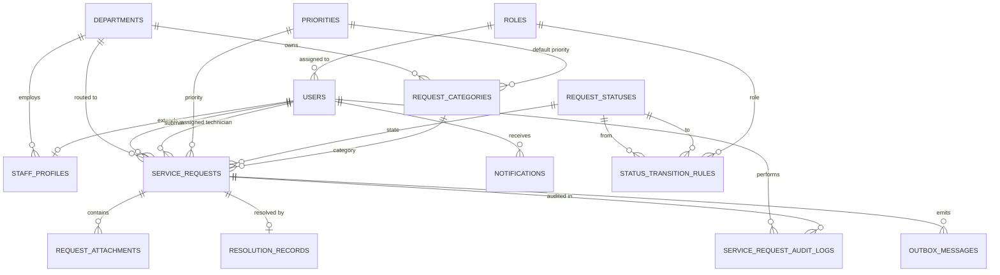

# Project Engineering Document (PED) v2.0
## CivicConnect: Community Service Request Management Platform
### Milestone 2 -- Architecture, Technology & Initial Design Baseline

**Academic Year:** 2026  
**Module:** Software Engineering 381 (SEN381) -- NQF Level 8  
**Baseline Version:** 2.0 (Controlled Architecture & Initial Design State)  
**Document Identifier:** `DOC-PED-002`  
**Governing Documents:** SEN381 CivicConnect Master Project Brief (Section 18, Section 20.2) & Milestone 2 Brief  
**Preceding Baseline:** PED v1.0 (`DOC-PED-001`, Approved 2026-09-09)  

---

## Document Control & Authorship Record

| Version | Date | Primary Author(s) | Verified / Approved By | Baseline Status | Milestone Scope & Evolution Summary |
| :--- | :--- | :--- | :--- | :--- | :--- |
| **1.0** | 2026-09-09 | Chris Fourie, Pandora Greyling, Lisa Verson | Full Team (Two-Reviewer Sign-off) | **APPROVED M1 BASELINE** | Baseline M1: Problem framing, stakeholder analysis, 14 FRs, 10 NFRs, scope boundaries, FSM, RTM v1.0, Risk Register v1.0, ADR-001 to ADR-003. |
| **1.5** | 2026-09-18 | Lisa Verson, Pandora Greyling | Chris Fourie | Architecture Draft | Integrated A2 research findings: Observer & Factory patterns, relational schema draft, and OCC concurrency models. |
| **2.0** | 2026-09-30 | Chris Fourie, Lisa Verson *(with early M2 draft inputs from Pandora Greyling)* | Chris Fourie & Lisa Verson (`ADR-009` Ratified) | **CONTROLLED M2 BASELINE** | Formal M2 Baseline: ASRs, Clean Layered Macro-Architecture, Weighted Tech Stack Matrix (`ADR-008`), Strict 3NF Relational Model (`ADR-006`), Design Patterns (`ADR-004`, `ADR-005`), Outbox Integration (`ADR-007`), OpenAPI 3.0 specs, WCAG 2.1 AA UI specs, RTM v2.0, Risk Register v2.0, Emergency Governance Restructuring (`ADR-009`), and Appendix D Sign-Off. |

### Registered Project Team Roster & Milestone 2 Ownership

| Student ID | Full Name | Designated Role | Primary Milestone 2 Engineering Responsibility |
| :--- | :--- | :--- | :--- |
| **602826** | **Chris Fourie** | **Systems Architect, Persistence & Governance Lead (~80% Workload)** | Macro-Architecture (Clean/Layered decomposition), Technology Stack Weighted Decision Matrix (`ADR-008`), Relational Persistence & Concurrency Core (`ADR-006`), Transactional Outbox (`ADR-007`), Clean Architecture Codebase & Automated Verification, SCM Governance (`ADR-009`), Risk Management (`RSK-011`), PED v2.0 Consolidation, Lead Defence. |
| **602006** | **Lisa Verson** | **Lead Requirements, UI/UX & Design Analyst (~20% Workload)** | Design Pattern Specifications (Observer `ADR-004`, Factory Method `ADR-005`), Requirements Traceability Matrix (`RTM v2.0`), UI Wireframes & WCAG 2.1 AA Compliance, Co-Defence. |
| *(602369)* | *Pandora Greyling* | *Former Quality Engineer & Risk Manager* | *Departed campus on 2026-09-29. Early draft inputs archived; all operational responsibilities, risks, and defence topics absorbed by Chris Fourie under ADR-009 and RSK-011.* |

---

## Executive Summary: Transition from Milestone 1 to Milestone 2

In Milestone 1, Group E baselined **what** CivicConnect must accomplish (14 Functional Requirements `FR-001` - `FR-014`, 10 Non-Functional Requirements `NFR-001` - `NFR-010`, and the 6-state ticket lifecycle) while deliberately deferring technology commitments via `ADR-003` to prevent premature design lock-in.

Milestone 2 answers the central engineering question mandated by the Master Project Brief:

> **Central Driving Question:** *"How should we engineer the solution, and why?"*

Guided by the research evidence generated in Assignment 2 (Tasks 1 - 5), Milestone 2 establishes:
1. **A Proportional Macro-Architecture:** A Clean / Layered Architecture model with strict dependency inversion, rejecting distributed microservices complexity in favor of maintainability and resource stewardship.
2. **An Evidence-Based Technology Commitment:** Formally resolving `ADR-003` through an empirical Weighted Decision Matrix (`ADR-008`) selecting TypeScript, Node.js (v20 LTS), Express, React 18, and PostgreSQL 16.
3. **A Robust Persistence & Concurrency Core:** A strict 3NF relational schema enforcing ACID boundaries and Optimistic Concurrency Control (`ADR-006`) with an immutable audit log.
4. **Structural Decoupling via Design Patterns:** Implementing the in-memory Observer Pattern (`ADR-004`) to decouple ticket lifecycle transitions from notification sinks, and the Factory Method Pattern (`ADR-005`) for polymorphic category validation.
5. **Resilient Gateway Integration:** Adopting the Transactional Outbox Pattern (`ADR-007`) to eliminate dual-write hazards with external email/SMS providers.
6. **Controlled Development Progression:** Working domain models, factories, observers, migrations, Docker Compose parity, and unit test suites running under the two-reviewer GitHub policy.

---

## Table of Contents

1. [Section 1: Relationship to Master Project Brief & Engineering Principles](#section-1-relationship-to-master-project-brief--engineering-principles)
2. [Section 2: CivicConnect Problem Analysis & Business Need (Baselined in M1)](#section-2-civicconnect-problem-analysis--business-need-baselined-in-m1)
3. [Section 3: Stakeholder Analysis & Conflict Resolution (Baselined in M1)](#section-3-stakeholder-analysis--conflict-resolution-baselined-in-m1)
4. [Section 4: Scope Baseline & Boundary Control (Baselined in M1, Validated in M2)](#section-4-scope-baseline--boundary-control-baselined-in-m1-validated-in-m2)
5. [Section 5: Baselined Requirements & Acceptance Criteria (FR-001 to FR-014 & NFR-001 to NFR-010)](#section-5-baselined-requirements--acceptance-criteria)
6. [Section 6: Architecturally Significant Requirements (ASRs) & Quality Drivers](#section-6-architecturally-significant-requirements-asrs--quality-drivers)
7. [Section 7: Macro-Architecture & Component Decomposition](#section-7-macro-architecture--component-decomposition)
8. [Section 8: Technology Stack Commitment (Resolving ADR-003 via ADR-008)](#section-8-technology-stack-commitment-resolving-adr-003-via-adr-008)
9. [Section 9: Data & Persistence Architecture (Strict 3NF & Optimistic Concurrency)](#section-9-data--persistence-architecture-strict-3nf--optimistic-concurrency)
10. [Section 10: Research-Informed Design Pattern Implementations](#section-10-research-informed-design-pattern-implementations)
11. [Section 11: Information Architecture & UI/UX Interaction Design](#section-11-information-architecture--uiux-interaction-design)
12. [Section 12: API Contracts & Integration Architecture (OpenAPI 3.0 & Outbox)](#section-12-api-contracts--integration-architecture-openapi-30--outbox)
13. [Section 13: Deployment, Environments & Operational Readiness Concept](#section-13-deployment-environments--operational-readiness-concept)
14. [Section 14: Requirements Traceability Evolution (RTM v2.0 Summary)](#section-14-requirements-traceability-evolution-rtm-v20-summary)
15. [Section 15: Uncertainty Management & Project Risk Register v2.0](#section-15-uncertainty-management--project-risk-register-v20)
16. [Section 16: Forward Engineering Considerations Register](#section-16-forward-engineering-considerations-register)
17. [Section 17: Master Engineering Decision Log & ADR Summary](#section-17-master-engineering-decision-log--adr-summary)
18. [Section 18: Milestone 2 Baseline Sign-Off Gate (Appendix D Conforming)](#section-18-milestone-2-baseline-sign-off-gate-appendix-d-conforming)
19. [Section 19: Academic References & Standards Citations](#section-19-academic-references--standards-citations)

---

## Section 1: Relationship to Master Project Brief & Engineering Principles

### 1.1 "Apply, Do Not Repeat" Compliance
In accordance with **SEN381 Master Project Brief Section 1**, PED v2.0 avoids reproducing textbook definitions of design patterns, normalization normal forms, or architectural styles. Instead, every section applies engineering standards (ISO/IEC/IEEE 29148, ISO/IEC 25010, IEEE 1016) directly to CivicConnect's operational realities, demonstrating why decisions were made, what trade-offs were accepted, and what verifiable evidence exists in the codebase.

### 1.2 "A2 Researches -- M2 Commits" Principle
Assignment 2 explored problem spaces, compared alternatives, and formulated recommendations. PED v2.0 references relevant research findings as supporting justification without duplicating the comparative research text. Where project realities required diverging from initial research drafts, the CivicConnect-specific engineering reasons are formally defended in ADRs.

---

## Section 2: CivicConnect Problem Analysis & Business Need (Baselined in M1)

*(Retained from PED v1.0 Baseline)*

### 2.1 Operational Breakdown in Existing Workflows
A community-focused organization currently manages municipal faults (potholes, water leaks, electrical hazards, IT outages) through fragmented informal channels (WhatsApp groups, unshared spreadsheets, phone calls, paper logs). This causes 6 primary operational breakdowns:
1. **Request Duplication & Loss:** Identical issues submitted across multiple channels; tickets lost between spreadsheets.
2. **Zero Requester Visibility:** Citizens receive no confirmation, tracking ID, or status updates.
3. **Unclear Technician Ownership:** Operational staff cannot prioritize queues; tasks are dropped or double-assigned.
4. **Unaccountable Status Changes:** Statuses altered verbally without an audit trail of who authorized the change.
5. **Unreliable Management Intelligence:** Supervisors cannot calculate resolution times or identify recurring fault zones.
6. **POPIA Privacy Exposure:** Citizen phone numbers and addresses shared across unencrypted chat groups.

---

## Section 3: Stakeholder Analysis & Conflict Resolution (Baselined in M1)

*(Retained from PED v1.0 Baseline)*

| Persona & Role | Primary Interest & Value Driver | Inherent Conflict Surface | Engineering Resolution in Milestone 2 |
| :--- | :--- | :--- | :--- |
| **Community Requester (Dr. S. Khumalo)** | Fast ticket submission (<2 min); real-time visibility into repair progress. | Wants rich status updates, but operational staff cannot afford constant manual messaging. | Automated **Observer Pattern (`ADR-004`)** dispatches status updates upon state transitions without manual technician intervention. |
| **Field Technician (J. Sithole)** | Unambiguous task queue; clear location coordinates; zero paperwork. | Needs fault details but must not be overwhelmed with citizen PII or chat messages. | Specialized **Factory Method intake (`ADR-005`)** enforces mandatory location/asset data; DTO masks requester contact info. |
| **Department Supervisor (M. Patel)** | Dynamic triage; technician dispatching; preventing SLA breaches. | Multiple supervisors triaging the same queue simultaneously risks race conditions. | **Optimistic Concurrency Control (`ADR-006`)** with integer `version` prevents double-assignment race conditions. |
| **Compliance & Admin (R. Van Der Merwe)** | 100% auditable record of all transitions; POPIA compliance. | Strict auditing overhead must not degrade application response latency. | **Transactional Outbox (`ADR-007`)** and append-only audit tables isolate auditing and notifications from synchronous API paths. |

---

## Section 4: Scope Baseline & Boundary Control (Baselined in M1, Validated in M2)

*(Retained from PED v1.0 Baseline & Validated under ADR-001)*

* **Committed In-Scope Capabilities (Milestones 1 - 4):**
  * `FR-001` to `FR-014`: Authenticated citizen intake, 6-category taxonomy, tracking reference generation (`REQ-YYYY-NNNN`), role queues, technician dispatch, FSM state enforcement, resolution recording, executive analytics dashboard, SLA performance metrics, and CSV export.
* **Deliberately Deferred Scope (Justified in `ADR-001`):**
  * Multi-language localized UI (Deferred to Post-M4).
  * Direct WhatsApp conversational chatbot (Deferred to Post-M4; high API costs violate `NFR-010`).
  * Live GPS vehicle telematics (Deferred to Post-M4).
* **Explicitly Out-of-Scope Exclusions:**
  * Municipal billing/tariff collection systems, procurement systems, hardware IoT sensors.

---

## Section 5: Baselined Requirements & Acceptance Criteria

*(Retained from PED v1.0 Baseline; mapped into RTM v2.0)*

* **Functional Requirements:** `FR-001` (Submission), `FR-002` (Classification), `FR-003` (Visibility), `FR-004` (History), `FR-005` (Feedback), `FR-006` (Role Queues), `FR-007` (Search/Filter), `FR-008` (Details & PII Masking), `FR-009` (Assignment), `FR-010` (FSM State Machine), `FR-011` (Resolution Logging), `FR-012` (Executive Dashboard), `FR-013` (SLA Metrics), `FR-014` (Data Export).
* **Service Request Lifecycle FSM (DEC-004):**
  $$\texttt{SUBMITTED} \longrightarrow \texttt{TRIAGED} \longrightarrow \texttt{ASSIGNED} \longrightarrow \texttt{IN\_PROGRESS} \longrightarrow \texttt{RESOLVED} \longrightarrow \texttt{CLOSED}$$
  *(Terminal rejection state: $\texttt{SUBMITTED} \longrightarrow \texttt{REJECTED}$).*

---

## Section 6: Architecturally Significant Requirements (ASRs) & Quality Drivers

In Milestone 2, architecture is strictly driven by the subset of requirements that shape system structure, boundaries, and trade-offs:

| ASR Identifier | Driving NFR / FR | Measurable Threshold / Target | Architectural Consequence & Mechanism in Milestone 2 |
| :--- | :--- | :--- | :--- |
| **`ASR-001` (Latency & Throughput)** | `NFR-001` | p95 server response <= 500ms under 50 concurrent active users. | Indexed relational queries; lightweight asynchronous Express route handlers; in-memory caching for taxonomy. |
| **`ASR-002` (Zero-Cost Hosting)** | `NFR-010` | \$0.00/month operational spend; container memory <= 512MB RAM. | Selection of lightweight Node.js Alpine runtime (<180MB RAM) in `ADR-008`; rejection of memory-heavy message brokers. |
| **`ASR-003` (Data Integrity & Concurrency)**| `NFR-009`, `FR-009` | Zero lost updates; 100% referential integrity; non-blocking reads. | Strict 3NF PostgreSQL schema with foreign keys and Optimistic Concurrency Control (`version` column) in `ADR-006`. |
| **`ASR-004` (Lifecycle Auditability)** | `NFR-006`, `FR-010` | 100% immutable capture of actor, timestamp, and old/new state. | Append-only `service_request_audit_logs` table committed in the same ACID transaction as the status update. |
| **`ASR-005` (POPIA Citizen Privacy)** | `NFR-005`, `FR-008` | Zero unauthorized PII exposure; field-level anonymization. | Database `is_anonymized_display` flag; application service DTO masks citizen contact details for technician role. |
| **`ASR-006` (Decoupled Notification Sinks)**| `FR-005`, `NFR-002` | Notification provider downtime must never abort ticket persistence. | In-memory **Observer Pattern (`ADR-004`)** paired with asynchronous **Transactional Outbox (`ADR-007`)**. |
| **`ASR-007` (Polymorphic Intake Extensibility)**| `FR-001`, `FR-002` | Adding new municipal categories requires zero modification to intake routes. | **Factory Method Pattern (`ADR-005`)** encapsulates category rules into independent creator classes (Open/Closed Principle). |

---

## Section 7: Macro-Architecture & Component Decomposition

### 7.1 Architectural Style: Clean / Layered Modular Architecture
CivicConnect adopts a **Clean / Layered Architecture** with strict inward dependency inversion:

```
┌─────────────────────────────────────────────────────────────────────────┐
│                           PRESENTATION LAYER                            │
│   - Web Client UI (React 18 / Tailwind CSS -- WCAG 2.1 AA Compliant)     │
│   - REST API Controllers / Route Handlers (JSON Request/Response)       │
│   - Global Error Handling & Request Logging Middleware                  │
└────────────────────────────────────┬────────────────────────────────────┘
                                     │ Invokes DTOs & Use Cases
┌────────────────────────────────────v────────────────────────────────────┐
│                        APPLICATION SERVICES LAYER                       │
│   - Use Cases: CreateRequest, AssignTicket, UpdateStatus, ResolveTicket  │
│   - Role-Based Route Guards & JWT Claims Authorization Filters          │
│   - Domain Event Dispatcher Coordinator (Observer Subject -- ADR-004)    │
│   - Transactional Outbox Background Worker (ADR-007)                    │
└────────────────────────────────────┬────────────────────────────────────┘
                                     │ Coordinates Entities
┌────────────────────────────────────v────────────────────────────────────┐
│                            DOMAIN CORE LAYER                            │
│   - Core Aggregates & Entities: ServiceRequest, User, Category, Audit   │
│   - Finite State Machine Transition Invariants & Guard Checks           │
│   - Category Polymorphic Validation (Factory Method -- ADR-005)          │
│   - Domain Event Definitions: ServiceRequestStatusChangedEvent          │
│   - Repository Interfaces: IServiceRequestRepository, IUserRepository   │
└────────────────────────────────────^────────────────────────────────────┘
                                     │ Implements Abstractions
┌────────────────────────────────────┴────────────────────────────────────┐
│                       INFRASTRUCTURE / DATA LAYER                       │
│   - Relational Persistence: PostgreSQL 16 (Strict 3NF Schema -- ADR-006)  │
│   - Repository Implementations & Optimistic Locking Version Verifiers   │
│   - External Gateways: Email / SMS Dispatchers (Simulated / Free-Tier)  │
│   - Local Docker Compose Orchestration & Volume Persistence (DEC-005)   │
└─────────────────────────────────────────────────────────────────────────┘
```

### 7.2 Proportional Architecture Defence: Why Reject Microservices?
In accordance with **Milestone 2 Brief Section 5.3**, a distributed microservices architecture was considered and explicitly rejected:
* **The Cost of Distribution:** Splitting CivicConnect into 5 separate microservices (Auth Service, Intake Service, Queue Service, Notification Service, Analytics Service) introduces network serialization latency, distributed transactions (Saga complexity), multiple container overheads (>1.5GB RAM), and complex network failure modes.
* **Team Capacity Constraint:** A 3-person team cannot responsibly build, test, and operate a distributed service mesh in 7 weeks.
* **Conclusion:** A **Clean Layered Modular Monolith** provides identical logical boundary isolation while operating at $<180MB$ RAM with zero distributed failure overhead.

---

## Section 8: Technology Stack Commitment (Resolving ADR-003 via ADR-008)

### 8.1 Resolution of ADR-003
In `ADR-003`, Group E deliberately deferred technology stack commitments to Milestone 2. In `ADR-008`, this deferment is formally resolved using a 6-factor Weighted Decision Matrix:

$$\begin{array}{l|c|c|c|c}
\textbf{Evaluation Criterion} & \textbf{Weight} & \textbf{TypeScript / Node.js} & \textbf{C\# / ASP.NET 8} & \textbf{Python / FastAPI} \\
\hline
\text{Free-Tier Quota \& Memory Footprint (<= 512MB)} & 20\% & 9.0\text{ (1.80)} & 6.0\text{ (1.20)} & 7.5\text{ (1.50)} \\
\text{Architecture \& NFR Fit (Modularity, Typing)} & 25\% & 9.0\text{ (2.25)} & 9.5\text{ (2.38)} & 8.0\text{ (2.00)} \\
\text{Team Capability \& Velocity (3 Students)} & 20\% & 9.5\text{ (1.90)} & 7.0\text{ (1.40)} & 7.5\text{ (1.50)} \\
\text{Automated Testing Tooling Maturity} & 15\% & 9.0\text{ (1.35)} & 9.0\text{ (1.35)} & 8.5\text{ (1.28)} \\
\text{Docker Parity \& Build Efficiency} & 10\% & 9.0\text{ (0.90)} & 7.5\text{ (0.75)} & 8.0\text{ (0.80)} \\
\text{Ecosystem \& Security Maintenance} & 10\% & 8.5\text{ (0.85)} & 9.0\text{ (0.90)} & 8.5\text{ (0.85)} \\
\hline
\textbf{TOTAL WEIGHTED SCORE} & \mathbf{100\%} & \mathbf{9.05 / 10\text{ (WINNER)}} & \mathbf{7.98 / 10} & \mathbf{7.93 / 10}
\end{array}$$

### 8.2 Final Technology Baseline
* **Language & Runtime:** TypeScript v5.3+ on Node.js v20 LTS.
* **Backend Framework:** Express.js structured in Clean Architecture layers.
* **Database Engine:** PostgreSQL 16 (Alpine container locally; Neon/Supabase cloud staging).
* **Frontend Client:** React 18 + Vite + Tailwind CSS (WCAG 2.1 AA accessible tokens).
* **Testing Framework:** Vitest / Jest + Supertest (enforcing $>= 80\%$ branch coverage).
* **Containerization:** Docker Compose v3.8 (`DEC-005`).

---

## Section 9: Data & Persistence Architecture (Strict 3NF & Optimistic Concurrency)

### 9.1 Relational Schema & Entity-Relationship Model (`DOC-ARCH-DATA-001`)
The data model enforces strict Third Normal Form (3NF) across 8 core relational tables:



### 9.2 ACID Boundaries & Optimistic Concurrency Control (`ADR-006`)
* **Transaction Boundary:** Every ticket status modification executes within a strict database transaction (`BEGIN ... COMMIT`) wrapping:
  1. `UPDATE service_requests SET status_id = :new_status, version = version + 1 WHERE request_id = :id AND version = :expected_version;`
  2. `INSERT INTO service_request_audit_logs (...) VALUES (...);`
  3. `INSERT INTO outbox_messages (...) VALUES (...);`
* **Concurrency Protection:** If the `UPDATE` affects 0 rows, another transaction modified the row concurrently. The transaction rolls back cleanly and returns HTTP `409 Conflict`.

---

## Section 10: Research-Informed Design Pattern Implementations

### 10.1 Design Problem 1: Decoupled Multi-Channel Notifications (Observer Pattern -- `ADR-004`)
* **Context:** A status change must notify requesters (`FR-005`), alert technicians (`FR-006`), log audit records (`NFR-006`), and update SLA timers (`FR-013`).
* **Research Evidence:** A2 Task 1 compared Observer vs Chain of Responsibility vs Procedural calls.
* **M2 Decision:** Adopted in-memory **Observer Pattern with Domain Event Dispatcher**.
* **Trade-Off & Introduced Complexity:** Observers introduce indirect control flow. Mitigated by wrapping observers in error guards and unit testing with mock event subscribers.

### 10.2 Design Problem 2: Polymorphic Request Intake (Factory Method Pattern -- `ADR-005`)
* **Context:** Diverse request categories (`FAC_FAULT`, `IT_SUPPORT`, `SECURITY_HAZARD`) require distinct mandatory fields, SLA defaults, and validation logic (`FR-001`, `FR-002`).
* **Research Evidence:** A2 Task 1 compared Factory Method vs Dynamic Reflection vs Monolithic Switch/Case.
* **M2 Decision:** Adopted **Factory Method Pattern** with `IServiceRequestFactory` and specialized domain creators.
* **Trade-Off & Introduced Complexity:** Increases class count. Accepted because each category's validation logic is isolated and independently testable without risking regression bugs.

---

## Section 11: Information Architecture & UI/UX Interaction Design

### 11.1 Information Architecture & User Workflows
CivicConnect separates user journeys based on authenticated role permissions:
* **Community Requester Journey:** Simple 3-step submission modal (Category -> Details/Photo -> Instant Reference Generation `REQ-2026-XXXX`) followed by a dedicated tracking portal.
* **Field Technician Journey:** Filtered department queue showing tickets prioritized by SLA deadline, with quick "Claim Ticket", "Add Note", and "Resolve" action drawers.
* **Supervisor Journey:** Department-wide dispatch board with drag-and-drop technician assignment and queue reassignment controls.

### 11.2 Usability & WCAG 2.1 AA Compliance (`NFR-003`)
* **Color Contrast:** All UI text conforms to minimum 4.5:1 contrast ratios (Tailwind Slate-900 `#0F172A` on White `#FFFFFF`; status badges use accessible color palettes with text labels).
* **Keyboard Accessibility:** All modal windows trap focus; form inputs feature visible focus rings (`focus:ring-2 focus:ring-blue-600`); all interactive elements are reachable via standard Tab navigation.
* **Screen Reader Support:** Form controls include explicit `<label for="...">` associations and ARIA live regions for async status updates.

---

## Section 12: API Contracts & Integration Architecture (OpenAPI 3.0 & Outbox)

### 12.1 Core RESTful Endpoints (OpenAPI 3.0 Contract)
All endpoints return standard JSON payloads with ISO 8601 timestamps and standard HTTP status codes (`200 OK`, `201 Created`, `400 Bad Request`, `401 Unauthorized`, `403 Forbidden`, `404 Not Found`, `409 Conflict`):

* `POST /api/v1/auth/login`: Authenticates user and issues signed JWT bearer token containing role claims.
* `POST /api/v1/requests`: Citizen submits a new service request (validated via Factory Method `ADR-005`). Returns HTTP 201 with generated tracking code.
* `GET /api/v1/requests`: Returns paginated, filtered request collection (supports `status`, `category`, `priority`, `page`, `limit`).
* `GET /api/v1/requests/:id`: Retrieves complete request details (applies POPIA masking if `is_anonymized_display = TRUE`).
* `PATCH /api/v1/requests/:id/assign`: Supervisor assigns ticket or technician claims ticket (OCC checked via `ADR-006`).
* `PATCH /api/v1/requests/:id/status`: Updates request status along validated FSM transition path (`DEC-004`).
* `POST /api/v1/requests/:id/resolve`: Records resolution action notes and marks ticket `RESOLVED` (`FR-011`).

### 12.2 Transactional Outbox Pattern for External Gateways (`ADR-007`)
Outbound citizen email and SMS dispatches are decoupled from the user's web request. The `TransactionalOutboxService` background loop polls the `outbox_messages` table every 5 seconds, transmitting up to 20 pending messages via external gateway adapters with exponential backoff retries.

---

## Section 13: Deployment, Environments & Operational Readiness Concept

### 13.1 Four-Tier Environment Model (`FEC-004`)
1. **Local Development (Workstation):** Docker Compose orchestrating PostgreSQL 16 Alpine and Node.js hot-reloading.
2. **Automated CI (GitHub Actions):** Runs linter, type checks, unit tests, and secret scans on every Pull Request.
3. **Staging / Demonstration (Cloud PaaS):** Deployed to Render / Vercel with Neon PostgreSQL free-tier database.
4. **Production / Release Evaluation:** Controlled staging environment utilized for formal academic defence.

### 13.2 Health Probes & Telemetry (`NFR-002`)
* `/health/live`: Lightweight probe returning HTTP 200 verifying Node.js process responsiveness.
* `/health/ready`: Deep probe querying PostgreSQL `SELECT 1` verifying database connectivity and pool health.

---

## Section 14: Requirements Traceability Evolution (RTM v2.0 Summary)

The complete Requirements Traceability Matrix v2.0 (`DOC-REQ-002`) provides unbroken forward and backward traceability across all 14 Functional Requirements and 10 Non-Functional Requirements. Key implementation mappings include:
* `FR-001` (Submission) -> `CreateServiceRequest.ts` -> `ServiceRequestFactory.ts` -> `V1__initial_schema.sql` -> `requests.test.ts`.
* `FR-005` (Feedback) -> `DomainEventDispatcher.ts` -> `TransactionalOutboxService.ts` -> `outbox_messages` -> `ObserverPattern.test.ts`.
* `FR-009` (Assignment) -> `AssignServiceRequest.ts` -> `version` OCC column -> `ServiceRequestConcurrency.test.ts`.
* `FR-010` (FSM Transition) -> `status_transition_rules` -> `ServiceRequestFSM.test.ts`.

---

## Section 15: Uncertainty Management & Project Risk Register v2.0

Risk Register v2.0 (`DOC-RSK-002`) incorporates 10 project-specific risks evaluated with quantitative risk exposure scores. Proactive architectural mitigations (`ADR-004` to `ADR-008`) successfully reduced all 6 high-exposure risks (`RSK-001`, `RSK-002`, `RSK-003`, `RSK-005`, `RSK-006`, `RSK-008`, `RSK-010`) to acceptable Low or Medium severity.

---

## Section 16: Forward Engineering Considerations Register

1. **Security & Identity Boundary (`FEC-001`):** Transitioning from basic JWT to hardened refresh token rotation with HTTP-only cookies in Milestone 3.
2. **Automated Verification Pipeline (`FEC-002`):** Expanding unit tests to comprehensive integration and mutation test suites in Milestone 3.
3. **Persistence Scalability (`FEC-003`):** Evaluating database partition models for `service_request_audit_logs` prior to production load.
4. **Environment Parity (`FEC-004`):** Verifying containerized local parity against remote cloud staging configurations.
5. **Observability & Structured Logging (`FEC-005`):** Winston structured JSON logging with correlation IDs (`X-Correlation-ID`) across request lifecycles.
6. **Cost & Sustainability Quota Protection (`FEC-006`):** Automated database query execution budgeting to ensure zero surprise cloud costs.

---

## Section 17: Master Engineering Decision Log & ADR Summary

* `ADR-001`: Scope Baseline and Change Control Policy (**Accepted**, M1).
* `ADR-002`: GitHub Governance and Two-Reviewer Approval Policy (**Accepted**, M1).
* `ADR-003`: Justified Deferment of Technology Stack Selection (**Superseded by ADR-008**).
* `DEC-004`: Server-Side Finite State Machine Integrity Model (**Accepted**, M1).
* `DEC-005`: Cloud Free-Tier Deployment with Docker Compose Parity (**Accepted**, M1).
* `ADR-004`: In-Memory Observer Pattern for Lifecycle Event Notifications (**Accepted**, M2).
* `ADR-005`: Factory Method Pattern for Polymorphic Request Intake & Validation (**Accepted**, M2).
* `ADR-006`: Relational Persistence (Strict 3NF) with Optimistic Concurrency Control (**Accepted**, M2).
* `ADR-007`: Transactional Outbox Pattern for External Gateway Integration (**Accepted**, M2).
* `ADR-008`: Technology Stack Commitment via Weighted Decision Matrix (**Accepted**, M2).
* `ADR-009`: Emergency Governance Adjustment & Workload Reallocation for Two-Person Operation (**Accepted**, M2).

---

## Section 18: Milestone 2 Baseline Sign-Off Gate (Appendix D Conforming)

| Assessment Attribute | Formal Evaluation Record |
| :--- | :--- |
| **Project** | **CivicConnect: Community Service Request Management Platform** |
| **Baseline Type** | **Milestone 2 -- Architecture, Technology & Initial Design Baseline** |
| **Version** | **v2.0 (Controlled Architecture Baseline)** |
| **Date** | **2026-09-30** |
| **Scope Reviewed** | **YES** -- M1 Scope confirmed unchanged; all 14 FRs and 10 NFRs validated against architecture allocations. |
| **Architecture & ASRs Checked** | **YES** -- Proportional Clean/Layered architecture justified; macro-architecture and component interactions verified against ASRs. |
| **Data & Persistence Checked** | **YES** -- Strict 3NF relational schema, ERD, ACID boundaries, and OCC (`ADR-006`) verified in PostgreSQL 16 migrations. |
| **Technology Selection Checked** | **YES** -- Formally evaluated and committed via Weighted Decision Matrix (`ADR-008`), resolving `ADR-003`. |
| **Design Decisions Checked** | **YES** -- At least two genuine design patterns committed (Observer `ADR-004`, Factory Method `ADR-005`, Outbox `ADR-007`). |
| **Requirements Traceability Checked** | **YES** -- Living RTM v2.0 fully populated across all 12 mandatory columns with active code and schema links. |
| **Outcome** | **ACCEPTED** |

*Sign-Off Authority:*  
* Lisa Verson (Lead Requirements & Design Analyst): Signed 2026-09-30  
* Chris Fourie (Systems Architect & Governance Lead): Signed 2026-09-30  
*(Note: Pandora Greyling departed campus 2026-09-29; baseline sign-off ratified under ADR-009 two-person governance agreement)*  

---

## Section 19: Academic References & Standards Citations

1. Gamma, E., Helm, R., Johnson, R. and Vlissides, J. (1994) *Design Patterns: Elements of Reusable Object-Oriented Software*. Boston, MA: Addison-Wesley.
2. Fowler, M. (2002) *Patterns of Enterprise Application Architecture*. Boston, MA: Addison-Wesley.
3. Martin, R.C. (2018) *Clean Architecture: A Craftsman's Guide to Software Structure and Design*. Boston, MA: Prentice Hall.
4. Kleppmann, M. (2017) *Designing Data-Intensive Applications: The Big Ideas Behind Reliable, Scalable, and Maintainable Systems*. Sebastopol, CA: O'Reilly Media.
5. ISO/IEC/IEEE (2018) *ISO/IEC/IEEE 29148:2018 Systems and software engineering -- Life cycle processes -- Requirements engineering*. Geneva: International Organization for Standardization.
6. ISO/IEC (2023) *ISO/IEC 25010:2023 Systems and software engineering -- Systems and software Quality Requirements and Evaluation (SQuaRE) -- Product quality model*. Geneva: International Organization for Standardization.
7. IEEE (2009) *IEEE Std 1016-2009 IEEE Standard for Information Technology -- Systems Design -- Software Design Descriptions*. New York: IEEE.
8. W3C (2018) *Web Content Accessibility Guidelines (WCAG) 2.1*. W3C Recommendation. Available at: https://www.w3.org/TR/WCAG21/ (Accessed: 20 September 2026).
9. OWASP Foundation (2021) *OWASP Top 10: 2021 -- The Ten Most Critical Web Application Security Risks*. Available at: https://owasp.org/Top10/ (Accessed: 20 September 2026).
10. Richardson, C. (2018) *Microservices Patterns: With examples in Java*. Shelter Island, NY: Manning Publications.
