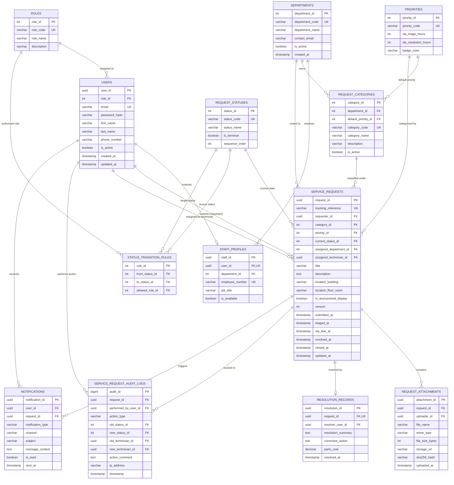
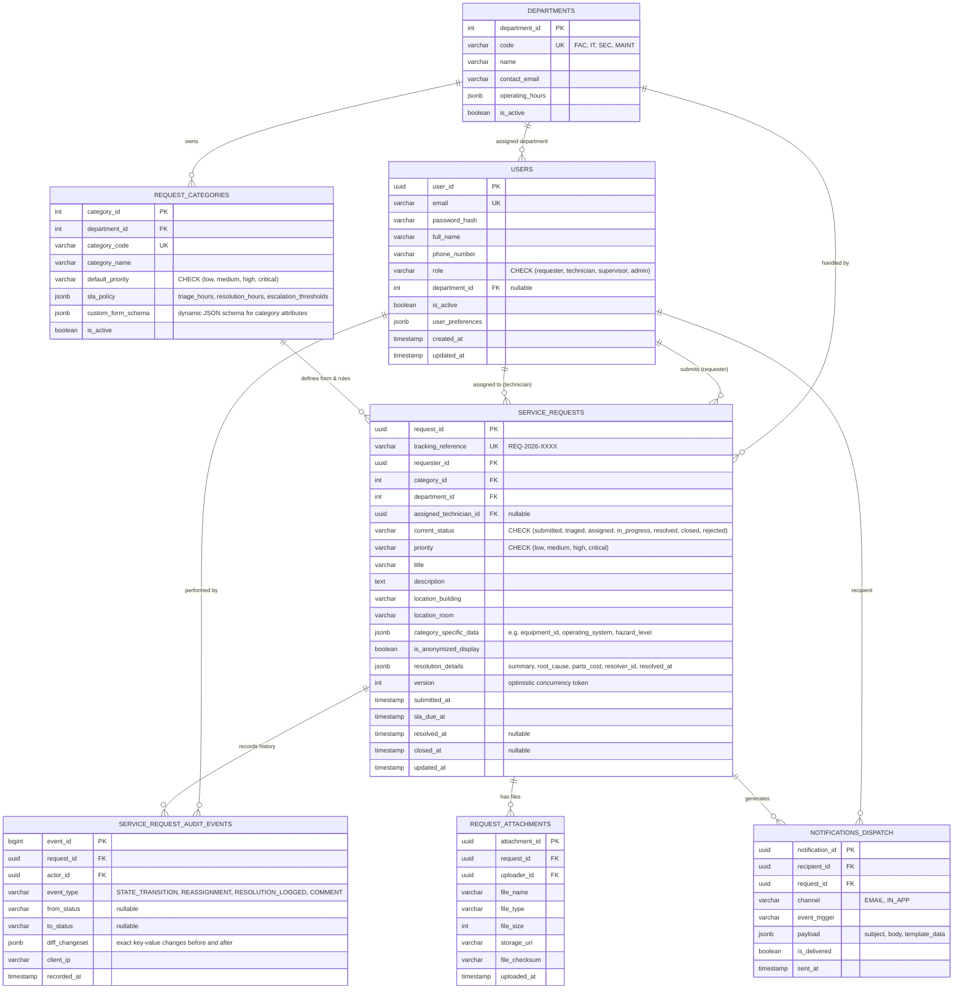

# CivicConnect: Database Architecture & Persistence Plan (v1.0)
**Document Reference:** `DOC-ARCH-DATA-001`  
**Milestone:** Milestone 2 — Architecture, Design & Engineering Decisions  
**Module:** SEN381 (Software Engineering 381) — NQF Level 8  
**Governing Documents:** SEN381 Master Project Brief (§3, §13, §16, §18.1), PED v1.0 (§5, §7), SO8 Data-Driven Architecture  
**Status:** WORKING ENGINEERING BASELINE (Under Review)

---

## 1. Project Context & Source Cross-Reference Register

This persistence plan consolidates and operationalizes all functional, non-functional, security, and governance baselines established in Milestone 1:

| Document / Artefact Source | Governed Section / Concern | Direct Impact on Database & Persistence Architecture |
| :--- | :--- | :--- |
| **SEN381 Master Project Brief** | §3 Minimum Capabilities | Persistence must support: Requester ticket submission, category routing, live status queries, role queues, technician assignment, mandatory resolution logging, executive summary reporting, and auditability. |
| **Master Project Brief** | §4 Constraints & §18.1 Stack Selection | \$0.00/month cloud hosting constraint (PostgreSQL on Neon/Supabase or Azure SQL/Render free tier) + 100% local Docker Compose parity. No commercial paid licenses. |
| **Master Project Brief** | §13 ADR Standard & §16 Security | Architecture Decision Records for persistence choices; security-by-design, least-privilege database user roles, and protection of PII. |
| **PED v1.0 (DOC-PED-001)** | Section 4 (Scope Baseline) | 14 Functional Requirements (`FR-001` to `FR-014`). In-scope ticket lifecycle, tracking reference generation (`REQ-YYYY-NNNN`), role partitioning. Out-of-scope: billing, GPS telematics. |
| **PED v1.0 (DOC-PED-001)** | Section 5.1 & RTM v1.0 | Explicit data fields: title, description, category, priority, location, attachments, assigned department, technician, resolution details, and feedback logs. |
| **PED v1.0 (DOC-PED-001)** | Section 5.2 (NFRs) | `NFR-001` (CRUD latency <= 500ms), `NFR-004` (RBAC), `NFR-005` (POPIA encryption/anonymization), `NFR-006` (Immutable audit logging), `NFR-007` (Scalability: 20,000 requests, 100,000 audit records), `NFR-009` (ACID fault tolerance), `NFR-010` (Zero-cost hosting). |
| **Engineering Decision Log** | `DEC-004` (State Machine Integrity) | Enforces deterministic Finite State Machine (FSM): `SUBMITTED` -> `TRIAGED` -> `ASSIGNED` -> `IN_PROGRESS` -> `RESOLVED` -> `CLOSED`. Transitions must be enforced at server/DB layer. |
| **Forward Engineering Register** | `FEC-001` & `FEC-003` | `FEC-001`: RBAC domain boundaries and row-level filtering. `FEC-003`: Relational schema design separating active transactional requests from append-only audit event tables. |
| **Study Guide SO8** | Data-Driven Architecture | Scenario Evidence -> Data Characteristics -> Persistence Model -> Trade-offs -> Justified Decision. Prevention of Database SPOF, Optimistic Concurrency Locking (`version`), Replication vs Backup separation, Multi-tier validation. |
| **Assignment 2 Brief** | Task 2 (Persistence & Data Integrity) | Transaction atomicity, multi-tier validation (DB CHECK/FK constraints as ultimate defense), concurrency controls, and caching trade-offs. |

---

## 2. Core Architectural & Persistence Engineering Principles

1. **ACID Transactional Core:** Service requests and their status transitions represent legally binding and accountable community interactions. Atomic transactions ensure that a request status update, assignment log, and audit event are committed together or rolled back entirely.
2. **Multi-Tier Defense-in-Depth:** While client-side UI and application services validate incoming input, the database schema acts as the non-bypassable final barrier of integrity using `FOREIGN KEY`, `NOT NULL`, `CHECK`, and `UNIQUE` constraints.
3. **Concurrency Control via Optimistic Locking:** High-concurrency operations (such as supervisors assigning tickets or technicians claiming tickets) use an incremental `version` column to prevent lost updates and double-booking race conditions without locking rows pessimistically.
4. **Append-Only Immutable Auditing:** In compliance with `NFR-006` and POPIA, audit records are strictly append-only. No `UPDATE` or `DELETE` permissions are granted on the audit log tables.
5. **POPIA Privacy & Anonymity by Design:** A requester can select an anonymized display flag (`is_anonymized_display = TRUE`). Ground technicians see only the fault description and location, while requester PII is segregated and restricted to supervisor/admin access roles.
6. **Polyglot Asset Handling:** Unstructured binary files (e.g. photographic evidence of damaged equipment) are stored in cloud object storage (e.g. AWS S3 / Supabase Storage / local volume) with cryptographic SHA-256 hashes and URIs maintained in the database table.

---

## 3. Database Architecture Version 1: Strict Normalized Relational Model (Enterprise 3NF)

### 3.1 Design Rationale & Quality Drivers
* **Target Philosophy:** Maximum relational purity, strict Third Normal Form (3NF), declarative referential integrity, and isolated lookup tables.
* **Best Suited For:** High-audit enterprise governance, relational consistency, strict foreign key enforcement, and explicit database-level state machine transitions via a dedicated transition rules matrix.
* **Key Quality Attributes Promoted:** Modularity (`NFR-008`), Auditability (`NFR-006`), Security/RBAC (`NFR-004`), Data Integrity (`NFR-009`).

### 3.2 Mermaid Entity-Relationship Diagram (ERD) — Version 1



### 3.3 Complete Relational Data Dictionary (Version 1)

| Table Name | Primary Purpose | Key Business Constraints & Invariants | Mapped Requirements |
| :--- | :--- | :--- | :--- |
| `roles` | System authorization tiers | Immutable codes (`REQUESTER`, `STAFF`, `SUPERVISOR`, `ADMIN`). | `NFR-004`, `FEC-001` |
| `users` | Authenticated principal identities | Unique email, hashed credentials (Argon2id/Bcrypt), active status flag. | `FR-001`, `NFR-004`, `NFR-005` |
| `departments` | Organizational dispatch boundaries | Fixed operational units (Facilities, IT, Maintenance, Security). | `FR-006`, `FR-007` |
| `staff_profiles` | Departmental workforce metadata | 1-to-1 extension of `users`; technician availability state. | `FR-006`, `FR-009` |
| `priorities` | SLA definitions & severity targets | Unique priority codes; dictates `sla_triage_hours` and `sla_resolution_hours`. | `FR-001`, `FR-013` |
| `request_categories` | Controlled service taxonomy | Pre-categorized request domains linked to owning default departments. | `FR-002` |
| `request_statuses` | Discrete state machine stages | Canonical states (`SUBMITTED` through `CLOSED`). | `FR-010`, `DEC-004` |
| `status_transition_rules` | Enforced FSM transition matrix | Defines valid `(from_status, to_status, allowed_role)` tuples. | `FR-010`, `DEC-004` |
| `service_requests` | Central transactional ticket entity | Unique human reference (`REQ-YYYY-NNNN`), FKs, optimistic lock `version`. | `FR-001`, `FR-003`, `FR-008` |
| `request_attachments` | File upload metadata & integrity | Remote storage pointer (S3/Volume), MIME validation, SHA-256 hash. | `FR-001`, `FR-008` |
| `resolution_records` | Mandatory closure evidence | 1-to-1 with resolved request; action notes and parts breakdown. | `FR-011` |
| `service_request_audit_logs` | Immutable non-repudiation store | Append-only event stream recording all lifecycle modifications and actors. | `FR-004`, `NFR-006`, `FEC-003` |
| `notifications` | Requester & staff alert ledger | In-app feedback and notification delivery audit. | `FR-005` |

---

## 4. Database Architecture Version 2: Pragmatic Hybrid-Relational Model (SQL + JSONB)

### 4.1 Design Rationale & Quality Drivers
* **Target Philosophy:** Modern relational-document hybrid. Core transactional backbones (`users`, `departments`, `service_requests`) retain strict foreign keys and ACID transactions, while category-specific custom forms, audit changesets, and operational SLA tracking utilize validated semi-structured document types (`JSONB` in PostgreSQL or structured `JSON` in SQL Server).
* **Best Suited For:** Rapid agile evolution, dynamic form fields per category without schema migrations, high-throughput audit logging with full state diffs, and reduced JOIN complexity for dashboard aggregations.
* **Key Quality Attributes Promoted:** Maintainability (`NFR-008`), Query Agility (`NFR-001`), Free-Tier Efficiency (`NFR-010`), Extensibility.

### 4.2 Mermaid Entity-Relationship Diagram (ERD) — Version 2



### 4.3 Key Engineering Differences & Trade-Off Comparison

| Evaluation Dimension | Version 1: Strict Normalized Relational (3NF) | Version 2: Hybrid Relational + JSONB |
| :--- | :--- | :--- |
| **Referential Integrity** | **Absolute (Maximum):** Every status, priority, role, and transition is governed by database FKs and lookup tables. | **High:** Core foreign keys enforced; statuses and roles governed by database `CHECK` constraints; category specifics inside JSONB. |
| **Schema Evolution** | **Rigid:** Adding category-specific fields (e.g. "Asset Serial Number" for IT, "Safety Hazard Severity" for Facilities) requires `ALTER TABLE` migrations or EAV tables. | **Flexible (High):** Category-specific form attributes are stored directly in `category_specific_data` JSONB conforming to category schemas. |
| **Query & Join Complexity** | **Higher Joins:** Fetching a request with status name, priority SLA, technician profile, and resolution notes requires 6 to 8 `JOIN` clauses. | **Low Joins:** Core request details, resolution summary, and custom fields fetched in 2 to 3 `JOIN` operations. |
| **Audit Trail Depth** | **Structured Columns:** Audit records store explicit FK references to old/new states. Complex data diffs require extra columns. | **Complete Snapshot Diff:** Stores full before/after JSONB diffs (`diff_changeset`), capturing all modified fields automatically. |
| **Database Engine Portability** | Universal: Runs identically on PostgreSQL, SQL Server, MySQL, SQLite. | Requires JSONB/JSON support (native to PostgreSQL and SQL Server 2016+). |
| **Storage Footprint** | Compact tabular storage; index sizes strictly bounded. | Slightly higher byte storage per record due to JSON keys; mitigated by PostgreSQL JSONB binary compression. |

---

## 5. Performance Indexing & Query Optimization Strategy

To satisfy `NFR-001` (<= 500ms response latency) and `NFR-007` (20,000+ requests and 100,000+ audit logs), the following composite B-Tree indexes must be applied:

```sql
-- 1. Accelerates Department Queue Filtering (FR-006, FR-007)
CREATE INDEX idx_requests_dept_status ON service_requests (assigned_department_id, current_status_id, submitted_at DESC);

-- 2. Accelerates Requester Live Tracking & Historical History (FR-003, FR-004)
CREATE INDEX idx_requests_requester ON service_requests (requester_id, submitted_at DESC);

-- 3. Accelerates Technician Active Job Queue (FR-008, FR-009)
CREATE INDEX idx_requests_technician ON service_requests (assigned_technician_id, current_status_id);

-- 4. Accelerates Executive SLA Monitoring & Overdue Calculation (FR-012, FR-013)
CREATE INDEX idx_requests_sla_breach ON service_requests (current_status_id, sla_due_at);

-- 5. Accelerates Audit Log Inspection by Request ID (NFR-006)
CREATE INDEX idx_audit_request_timeline ON service_request_audit_logs (request_id, timestamp ASC);

-- 6. Instant Lookup by Public Tracking Reference (FR-001, FR-003)
CREATE UNIQUE INDEX idx_requests_tracking_ref ON service_requests (tracking_reference);
```

---

## 6. Concurrency Control & State Transition Integrity

### 6.1 Race Condition Defense (Optimistic Concurrency Control)
In multi-user campus environments, two supervisors may attempt to reassign the same service request simultaneously, or a technician may attempt to claim a ticket while it is being triaged.

**Implementation Invariant:**
Every `service_requests` record maintains an integer column: `version INT NOT NULL DEFAULT 1`.
When updating a request:
```sql
UPDATE service_requests
SET assigned_technician_id = :new_technician_id,
    current_status_id = :assigned_status_id,
    version = version + 1,
    updated_at = CURRENT_TIMESTAMP
WHERE request_id = :target_request_id AND version = :expected_version;
```
If the affected row count is `0`, the application detects a concurrent collision, aborts the transaction, and prompts the user to refresh the latest ticket state.

### 6.2 Finite State Machine (FSM) Integrity Invariants
Under `DEC-004`, the request lifecycle is constrained to valid forward progressions:
$$\text{SUBMITTED} \longrightarrow \text{TRIAGED} \longrightarrow \text{ASSIGNED} \longrightarrow \text{IN\_PROGRESS} \longrightarrow \text{RESOLVED} \longrightarrow \text{CLOSED}$$
*(Alternative terminal transitions: `SUBMITTED` -> `REJECTED`, or `ASSIGNED` -> `CANCELLED`)*.

Any attempt to execute an illegal jump (e.g. `SUBMITTED` directly to `RESOLVED`) is blocked by application domain logic and verified against `status_transition_rules`.

---

## 7. POPIA Privacy, Data Protection & Anonymization

In strict adherence to the **Protection of Personal Information Act (POPIA)** and `NFR-005`:
1. **Separation of PII:** Sensitive requester personal data (phone numbers, full names) is stored exclusively in the `users` table and never replicated across tickets.
2. **Anonymized Display Enforcement:** When `is_anonymized_display = TRUE`:
   * Field technicians queries return `requester_id = NULL` or a pseudonymous identifier (`Anonymous Requester #A41`).
   * The actual identity remains accessible only to authorized compliance officers and supervisors.
3. **Audit Trail Immutability:** Audit records do not store plain passwords or sensitive authentication tokens; all identity actions record immutable `actor_id` and timestamps.

---

## 8. Alignment with Milestone 2 & Assignment 2 Deliverables

| Upcoming Milestone / Assignment Deliverable | How This Persistence Plan Feeds Evidence |
| :--- | :--- |
| **Assignment 2 (Task 2: Persistence Decisions)** | Provides concrete comparative evidence between 3NF Relational vs Hybrid JSONB models, transaction boundaries, and multi-tier validation. |
| **Milestone 2 (PED v2.0 Section 5: Data Design)** | The chosen version will be transcribed into PED v2.0 with formal DDL scripts and ORM schema definitions. |
| **Milestone 2 (ADR-004: Persistence Architecture)** | Documents the formal architectural decision between Version 1 and Version 2 based on weighted evaluation. |
| **Milestone 3 (Database Migrations & CI Test Seeds)** | Directly generates migration scripts and automated database integration tests verifying foreign keys and audit triggers. |
