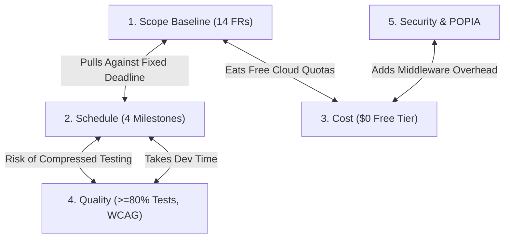

# CivicConnect: Option 2 Contingency Plan & Delivery Pack
## Quality, Constraints & Risk Management (Lisa Verson's Scope)

**Module:** Software Engineering 381 (SEN381) — NQF Level 8 (AY 2026)  
**Target Role:** Quality & Risk Manager (Option 2)  
**Governing Standard:** SEN381 Master Project Brief (AY 2026) & Milestone 1 Brief  
**Purpose:** Standalone contingency blueprint and production-ready text for all Section 4.4, 4.5, Section 5, Section 6 (RTM), Section 7 (Risk Register), and Slides 5–7 deliverables.

---

## 1. Executive Responsibility & Deliverables Map

Option 2 is responsible for establishing the quantitative quality foundation, testability criteria, constraint boundaries, bidirectional traceability, and proactive risk treatment for CivicConnect:

```
┌────────────────────────────────────────────────────────────────────────────────────────┐
│                               OPTION 2 DELIVERABLES MAP                                │
│                                                                                        │
│  [Section 4: Quality & Acceptance Criteria]                                            │
│  ├── 4.4 Measurable NFRs Baseline (10 NFRs under ISO/IEC 25010 Quality Model)          │
│  └── 4.5 Executable Acceptance Criteria (Gherkin BDD Scenarios for Core Workflows)     │
│                                                                                        │
│  [Section 5: Constraints & Trade-Off Analysis]                                         │
│  ├── 5.1 Explicit Project Constraints (The 6 Pillars: Team, Time, Cost, Quality, etc.) │
│  ├── 5.2 Constraint Priority Matrix (Constrain vs. Optimize vs. Accept)                │
│  └── 5.3 Dynamic Ripple Effects (3 Multi-Constraint Interaction Scenarios)             │
│                                                                                        │
│  [Section 6: Requirements Traceability Matrix (RTM v1.0)]                              │
│  ├── 6.1 Traceability Methodology (Intent to Evidence Lifecycle Chain)                 │
│  ├── 6.2 RTM Structural Schema (Stakeholder -> Req -> Design -> PR -> Code -> Test)    │
│  ├── 6.3 Live RTM Master Table (All 14 FRs and 10 NFRs mapped end-to-end)              │
│  └── 6.4 Deep Trace Demonstration Walkthrough (FR-010 Lifecycle State Machine)         │
│                                                                                        │
│  [Section 7: Project Risk Register & Assumptions Log]                                  │
│  ├── 7.1 Quantitative Exposure Formula (Risk Exposure = Probability x Impact)         │
│  ├── 7.2 Live Project Risk Register Table (10 Project-Specific Risks: RSK-001 to 010)  │
│  ├── 7.3 In-Depth Defence of Highest-Priority Critical Risk (RSK-001: Scope Creep)     │
│  └── 7.4 Engineering Assumptions Log (5 Technical & Operational Assumptions)           │
│                                                                                        │
│  [Presentation & Oral Defence Pack]                                                    │
│  ├── Presentation Slides 5, 6, and 7 (Timed Speaker Scripts & Visual Artefact Prompts) │
│  └── Defence Model Answers for Questions 3, 4, 5, 11, and 12                           │
└────────────────────────────────────────────────────────────────────────────────────────┘
```

---

## 2. Production-Ready Content for Section 4 (Quality Attributes & Acceptance Criteria)

### 4.4 Measurable Non-Functional Requirements Baseline (ISO/IEC 25010 Quality Model)

In strict accordance with Master Project Brief Section 15 and Milestone 1 Brief Section 3, all quality attributes must be defined through objectively measurable metrics rather than subjective claims (such as "the system is fast" or "the system is secure"). The CivicConnect quality baseline is categorized under the ISO/IEC 25010:2023 product quality standard:

#### 4.4.1 Performance Efficiency (NFR-001 & NFR-007)
* **NFR-001: API Endpoint Latency Budget**
  * *Quality Attribute:* Time Behavior (Performance Efficiency).
  * *Quantitative Metric:* 95% of standard CRUD API requests (e.g., ticket fetching, form submissions, status updates) must complete with a server response latency of $P_{95} \le 500\text{ms}$ under a baseline load of 50 concurrent active users. Time to First Byte (TTFB) for web assets must remain $\le 200\text{ms}$.
  * *Verification Method:* Automated load and performance testing executed via k6 scripts in clean-room staging environments during Milestone 3.
  * *Downstream Architectural Implication:* Mandates database query indexing on filtered foreign keys (`status_id`, `category_id`, `assigned_to`), payload pagination, and minimal serialisation overhead in Milestone 2 API controllers.
* **NFR-007: Database Volume Scalability & Query Performance**
  * *Quality Attribute:* Capacity & Scalability.
  * *Quantitative Metric:* The relational database schema must support at least 20,000 active service request records and 100,000 immutable audit trail rows without degradation of query execution time (index seek queries must complete in $< 1.0\text{s}$).
  * *Verification Method:* Automated synthetic data seeding script populating 100,000 rows, accompanied by `EXPLAIN ANALYZE` execution plan verification in Milestone 3.

#### 4.4.2 Reliability & Availability (NFR-002 & NFR-009)
* **NFR-002: Operational Availability & Uptime**
  * *Quality Attribute:* Availability (Reliability).
  * *Quantitative Metric:* The platform must maintain $\ge 99.0\%$ availability during defined core operational hours (Monday to Friday, 07:00–19:00 SAST), allowing a maximum unplanned downtime of no more than 7.2 hours across any calendar month.
  * *Verification Method:* Synthetic uptime monitoring executed via external health probe pinging the `/health` endpoint at 5-minute intervals.
  * *Downstream Architectural Implication:* Dictates cloud service provider selection that guarantees automatic process restarts upon crash, and graceful unhandled exception handling middleware.
* **NFR-009: Fault Tolerance & Safe Failure Recovery**
  * *Quality Attribute:* Fault Tolerance & Recoverability.
  * *Quantitative Metric:* In the event of an abrupt network disconnection, database timeout, or external cloud storage outage, the platform must fail safely: 0% data corruption, automated rollback of incomplete database transactions (ACID atomicity), and immediate display of an informative, user-friendly error message within 2.0 seconds.
  * *Verification Method:* Chaos engineering integration tests simulating database connection dropouts during active POST transactions.

#### 4.4.3 Usability & Accessibility (NFR-003: WCAG 2.1 Level AA)
* **NFR-003: Accessibility & Assistive Technology Compliance**
  * *Quality Attribute:* Accessibility (Usability).
  * *Quantitative Metric:* 100% of user interface views (citizen portal, staff queue, supervisor dashboard) must achieve full compliance with W3C Web Content Accessibility Guidelines (WCAG) 2.1 Level AA: minimum text color contrast ratio of $4.5:1$, 100% keyboard navigability without mouse trap, and valid ARIA attributes on all interactive form controls.
  * *Verification Method:* Automated accessibility scanning using Axe-core in CI/CD, paired with manual screen reader verification (NVDA / VoiceOver) across desktop and mobile viewports.

#### 4.4.4 Security, Confidentiality & Privacy (NFR-004: RBAC & NFR-005: POPIA)
* **NFR-004: Role-Based Access Control (RBAC) & Least Privilege Enforcement**
  * *Quality Attribute:* Security (Confidentiality & Authorization).
  * *Quantitative Metric:* 100% of API endpoints and database operations must enforce strict Role-Based Access Control across four tiers (Citizen/Requester, Field Technician, Department Supervisor, System Administrator). Zero cross-role data leaks or unauthenticated horizontal privilege escalations (Broken Object Level Authorization / BOLA).
  * *Verification Method:* Automated API security test suite asserting HTTP 401 Unauthorized for unauthenticated requests and HTTP 403 Forbidden for unprivileged role requests across every route.
* **NFR-005: Statutory Data Privacy & Cryptographic Protection (POPIA Act 4 of 2013)**
  * *Quality Attribute:* Security (Data Privacy & Compliance).
  * *Quantitative Metric:* All citizen Personally Identifiable Information (PII)—including names, email addresses, phone numbers, and physical coordinates—must be encrypted in transit using TLS 1.3 and encrypted at rest using AES-256. Zero plaintext PII may be logged to server standard output, terminal logs, or diagnostic files.
  * *Verification Method:* Network packet inspection via SSL Labs scan verifying TLS 1.3 ciphers, paired with log file inspection audits confirming automated regex sanitization of phone numbers and national IDs.

#### 4.4.5 Maintainability, Modularity & Testability (NFR-008: >=80% Coverage)
* **NFR-008: Automated Test Coverage & Modular Modifiability**
  * *Quality Attribute:* Testability & Modularity (Maintainability).
  * *Quantitative Metric:* Core business logic, status mutation validation, and calculation services must achieve $\ge 80\%$ statement and branch test coverage. Circular package dependencies must be 0, and coupling between domain models and persistence layers must remain strictly abstracted behind interfaces.
  * *Verification Method:* Automated CI test runner code coverage reporting (e.g., Jest / Vitest / Coverlet) configured as a blocking quality gate on pull requests entering `main`.

#### 4.4.6 Auditability & Cost Sustainability (NFR-006 & NFR-010: $0.00/Month)
* **NFR-006: Non-Repudiation & Immutable Audit Logging**
  * *Quality Attribute:* Accountability & Non-Repudiation.
  * *Quantitative Metric:* 100% of state transitions, ticket assignments, and resolution commentary must append an immutable audit log entry capturing: `Timestamp`, `ActorID`, `ActionType`, `PreviousState`, and `NewState`. Overwriting or modifying historical audit entries is cryptographically and relationally blocked.
  * *Verification Method:* Automated database trigger integration test verifying that executing an `UPDATE` or `DELETE` statement against `RequestAuditLog` throws a fatal database constraint violation.
* **NFR-010: Zero-Cost Operational Budget Sustainability**
  * *Quality Attribute:* Cost & Resource Efficiency.
  * *Quantitative Metric:* The full operational architecture across development, automated testing, staging, and final demonstration environments must operate at \$0.00/month recurring operating expenditure (OPEX), strictly adhering to cloud free-tier compute, RAM (512MB limit), and storage quotas.
  * *Verification Method:* Cloud provider resource usage dashboard inspection and static architecture audit against free-tier consumption limits.

---

### 4.5 Executable Acceptance Criteria (Gherkin BDD Scenarios)

Acceptance criteria are formulated using formal Gherkin syntax (`Given-When-Then`) to ensure direct testability and provide the exact specifications needed for automated integration testing in Milestone 3:

#### 4.5.1 AC-001: Multi-Field Request Submission & Boundary Validation (FR-001)
```gherkin
Feature: Service Request Submission Validation (FR-001)
  As an authenticated community citizen
  I want to submit a service request with complete fault details
  So that municipal staff can inspect and repair the issue

  Scenario: Successful submission with all required metadata
    Given an authenticated citizen is on the "Create Service Request" page
    When the citizen selects category "Facility Faults"
    And enters title "Broken window in Student Lab 302"
    And enters description "Large pane cracked on west side posing safety hazard"
    And enters physical location "Building B, Floor 3, Room 302"
    And attaches a valid JPEG image of size 2.4 MB
    And selects priority indicator "High"
    And clicks "Submit Service Request"
    Then the system creates a new record in the database with status "SUBMITTED"
    And returns a unique alphanumeric tracking reference formatted as "REQ-YYYY-XXXX"
    And the API responds with HTTP 201 Created within 500ms
    And dispatches an automated confirmation email to the citizen's address

  Scenario: Rejection of submission with missing required fields
    Given an authenticated citizen is on the "Create Service Request" page
    When the citizen leaves the "Description" and "Location" fields blank
    And clicks "Submit Service Request"
    Then the database transaction is NOT executed
    And the system returns HTTP 422 Unprocessable Entity
    And the UI displays field validation errors: "Description is required" and "Location is required"
    And no notification is dispatched

  Scenario: Rejection of oversized media attachment
    Given an authenticated citizen is on the "Create Service Request" page
    When the citizen attempts to attach a video file of size 45 MB (exceeding 5 MB limit)
    And clicks "Submit Service Request"
    Then the client-side validation immediately blocks the file upload
    And displays the error "Attachments must be JPEG/PNG images under 5 MB"
    And zero network bytes are transmitted to the backend API
```

#### 4.5.2 AC-009: Work Order Assignment & Ownership Claiming (FR-009)
```gherkin
Feature: Ticket Assignment & Ownership Control (FR-009)
  As a department supervisor
  I want to assign incoming tickets to qualified field technicians
  So that operational work is distributed accountability

  Scenario: Supervisor assigns an unassigned ticket to a field technician
    Given an authenticated user with role "Department Supervisor" is viewing ticket "REQ-2026-0104"
    And the ticket currently has status "TRIAGED" and assigned technician is NULL
    When the supervisor selects technician "John Doe (Electrical)" from the staff directory
    And confirms the assignment
    Then the ticket status transitions to "ASSIGNED"
    And the "AssignedTechnicianID" field updates to "TECH-882"
    And an immutable audit event is appended with actor "SUPERVISOR-01" and timestamp
    And an automated push notification is dispatched to technician "John Doe"

  Scenario: Unauthorized technician attempts to assign ticket to another staff member
    Given an authenticated user with role "Field Technician" is viewing ticket "REQ-2026-0104"
    When the technician attempts an API POST request to reassign the ticket to another technician ID
    Then the server rejects the request with HTTP 403 Forbidden
    And logs a security authorization violation event
    And the ticket assignment remains unchanged in the database
```

#### 4.5.3 AC-010: State Machine Enforcement & Illegal Jump Rejection (FR-010)
```gherkin
Feature: Finite State Machine Transition Integrity (FR-010)
  As a compliance officer
  I want the system to strictly enforce valid lifecycle transitions
  So that tickets cannot bypass required operational phases

  Scenario: System blocks illegal status jump from SUBMITTED directly to RESOLVED
    Given a service request currently resides in state "SUBMITTED"
    When an actor executes an API PUT request attempting to update status directly to "RESOLVED"
    Then the state machine transition validator intercepts the command
    And rejects the transaction with HTTP 400 Bad Request
    And returns error payload: "Invalid state transition from SUBMITTED to RESOLVED. Required intermediate state: ASSIGNED."
    And the database state remains locked at "SUBMITTED"
    And an audit failure record is logged
```

#### 4.5.4 AC-NFR-004/005: Security, RBAC Authorization & POPIA Isolation (NFR-004 & NFR-005)
```gherkin
Feature: Privacy Protection & Cross-Role Data Redaction (NFR-004 & NFR-005)
  As a compliance and data privacy officer
  I want citizen contact details redacted from operational field views
  So that personal data is protected in compliance with POPIA Act 4 of 2013

  Scenario: Citizen selects anonymous reporting; technician views ticket
    Given a citizen submits a ticket with the "Anonymized Display" flag set to TRUE
    And the citizen's real name and phone number are stored encrypted in the database
    When a user with role "Field Technician" queries the ticket details via the API
    Then the API payload sets the "RequesterName" field to "ANONYMOUS RESIDENT"
    And redacts the citizen's personal phone number and personal email address
    And displays only the physical incident location, category, and technical description

  Scenario: Unauthenticated visitor attempts to access internal staff queue
    Given an unauthenticated visitor sends a GET request to "/api/v1/staff/queue"
    When the request headers contain zero Authorization bearer tokens
    Then the API security gateway intercepts the request
    And responds immediately with HTTP 401 Unauthorized
    And zero ticket metadata is returned in the response body
```

---

## 3. Production-Ready Content for Section 5 (Constraints & Systemic Trade-Off Analysis)

### 5.1 Explicit Project Constraint Boundaries (The 6 PMBOK Pillars)

In accordance with Master Project Brief Section 4 and Milestone 1 Brief Section 3, software engineering occurs under non-negotiable boundaries. The CivicConnect engineering team is governed by six explicit constraint pillars:

```
┌────────────────────────────────────────────────────────────────────────────────────────┐
│                          THE 6 PROJECT CONSTRAINT PILLARS                              │
│                                                                                        │
│  1. Team Size: Exactly 3 Students (Fixed engineering capacity)                         │
│  2. Schedule: 4 Fixed Milestones across academic delivery period                       │
│  3. Cost & Budget: $0.00 / month (Strict adherence to cloud free-tier quotas)           │
│  4. Quality: >=80% Automated Branch Test Coverage gate on core business logic          │
│  5. Security: Strict POPIA Act 4 of 2013 compliance & least-privilege RBAC             │
│  6. Technology Responsibility: System must operate within institutional desktop env    │
└────────────────────────────────────────────────────────────────────────────────────────┘
```

1. **Team Size Constraint (Capacity):** Hard constraint of exactly three registered students (`Student 1`, `Student 2`, `Student 3`). Team capacity is fixed at approximately 30–36 combined engineering hours per week. This prevents distributed microservice architectures; the architecture must remain simple, modular, and maintainable by a small team.
2. **Schedule Constraint (Time):** Fixed institutional milestone deadlines (Milestones 1 through 4) without extension. Delivery dates are immutable; therefore, scope must flex to accommodate fixed schedule gates.
3. **Cost & Budget Constraint (Resources):** Mandatory \$0.00/month recurring operational budget. The system must operate 100% within free-tier cloud quotas (512MB RAM compute, single-region managed PostgreSQL, 500MB database storage, zero paid third-party APIs).
4. **Quality & Testability Constraint:** Minimum 80% automated unit and integration test coverage on business logic (`NFR-008`). Code failing automated tests cannot be merged into `main`.
5. **Security & Regulatory Constraint:** Full compliance with the Protection of Personal Information Act (POPIA Act 4 of 2013). Encryption in transit and at rest is mandatory; immutable audit records must exist for every status change.
6. **Technology Environment Responsibility:** Belgium Campus cannot guarantee support for arbitrary libraries. The team bears 100% engineering responsibility for verifying that selected technologies run reliably within the BC Desktop environment and target deployment environments.

### 5.2 Constraint Priority Matrix (Constrain vs. Optimize vs. Accept)

Using the classic Project Management / Systems Engineering Trade-off Framework:

| Project Dimension | Classification | Engineering Rationale |
| :--- | :--- | :--- |
| **Schedule** | **CONSTRAIN (Fixed)** | Institutional milestone deadlines are fixed and externally enforced. Cannot be negotiated. |
| **Team Size** | **CONSTRAIN (Fixed)** | Team size is legally and academically locked at exactly 3 students. |
| **Cost / Budget** | **CONSTRAIN (Fixed)** | Zero funding (\$0.00). Must operate permanently within cloud free tiers. |
| **Quality & Security** | **OPTIMIZE** | Maximize test coverage ($\ge 80\%$), sub-500ms latency, and robust POPIA privacy controls within available capacity. |
| **Scope (Features)** | **ACCEPT (Flex)** | Scope is the single degree of freedom. If schedule or capacity pressures arise, non-core "Could Have" features (e.g., CSV export, public map) are descheduled to protect the baseline. |

### 5.3 Dynamic Ripple Effects & Multi-Constraint Interaction Analysis

In software systems, constraints do not exist in isolation; altering one variable immediately creates systemic ripple effects across other dimensions:



#### 5.3.1 Interaction 1: Scope Expansion vs. Fixed Schedule & Test Compression
* **The Tension:** If the team attempts to add an unbudgeted feature mid-construction (e.g., WhatsApp chatbot integration or real-time vehicle GPS), the fixed schedule and 3-person team capacity force engineers to cut corners.
* **The Ripple Effect:** Developers reduce unit test authoring time to meet the feature deadline. Test coverage drops below 80%, CI quality gates fail, and regression bugs enter `main`, destroying quality marks during Milestone 3.
* **Engineering Resolution:** Strict scope freeze enacted via ADR-001. All post-baseline additions require formal Master Project Brief Appendix E Change Impact Analysis, and "Could Have" features are descheduled before testing time is compromised.

#### 5.3.2 Interaction 2: Comprehensive Auditing & Encryption vs. Free-Tier Database Write Latency
* **The Tension:** POPIA compliance mandates AES-256 encryption at rest and writing immutable audit log entries for every status mutation. However, free-tier cloud databases (such as Neon or Supabase free tier) possess limited CPU and I/O write operations per second.
* **The Ripple Effect:** Synchronously executing encryption and writing multiple audit records during a ticket submission increases database write latency, threatening the sub-500ms API response target (`NFR-001`).
* **Engineering Resolution:** Model audit logging with indexed foreign keys and lean data payloads. Utilize asynchronous write queues in the service layer to acknowledge the citizen immediately while persisting the audit ledger asynchronously in the background.

#### 5.3.3 Interaction 3: Technology Learning Curve vs. Milestone Delivery Velocity
* **The Tension:** Adopting an unfamiliar, hyped technology (e.g., Rust or complex microservices) requires substantial onboarding time for team members.
* **The Ripple Effect:** The learning curve consumes early sprint capacity, delaying the delivery of core functional requirements and compressing the time available for integration testing in Milestone 3.
* **Engineering Resolution:** In ADR-003, the team explicitly defers technology selection to Milestone 2, mandating that the candidate stack be evaluated against realistic 3-student learning curves and availability on the BC Desktop environment.

---

## 4. Production-Ready Content for Section 6 (Requirements Traceability Matrix - RTM v1.0)

### 6.1 Traceability Methodology & The Lifecycle Chain (Intent $\rightarrow$ Evidence)

In accordance with Master Project Brief Section 11, traceability is the mechanism that preserves engineering intent from stakeholder identification through construction to final release evidence:

$$\text{Stakeholder Need} \longleftrightarrow \text{Requirement (FR/NFR)} \longleftrightarrow \text{Acceptance Criteria} \longleftrightarrow \text{Architecture (M2)} \longleftrightarrow \text{PR/Code (M3)} \longleftrightarrow \text{Test Suite (M3)} \longleftrightarrow \text{Release Evidence (M4)}$$

### 6.2 Master Requirements Traceability Matrix Table (RTM v1.0)

| Req ID | Category | MoSCoW | Stakeholder / Source | Functional Requirement Description | Acceptance Criteria ID | Architecture Ref (M2) | Issue/PR Ref (M3) | Code Module (M3) | Test Case (M3) | Verification Status (M4) |
| :--- | :--- | :--- | :--- | :--- | :--- | :--- | :--- | :--- | :--- | :--- |
| **`FR-001`** | Submission | **Must** | Community Requesters | Authenticated users can submit a service request with category, priority, description, location, and file attachments. | `AC-001.1`<br>`AC-001.2`<br>`AC-001.3` | *TBD (M2)* | *TBD (M3)* | *TBD (M3)* | *TBD (M3)* | *TBD (M4)* |
| **`FR-002`** | Classification | **Must** | Operational Staff & Supervisors | System enforces a controlled categorization taxonomy (Facilities, IT, Security, Maintenance, Grounds, Lost Property). | `AC-002.1`<br>`AC-002.2` | *TBD (M2)* | *TBD (M3)* | *TBD (M3)* | *TBD (M3)* | *TBD (M4)* |
| **`FR-003`** | Visibility | **Must** | Community Requesters | Requesters can view the live status, assigned department, and update timeline of their submitted requests. | `AC-003.1`<br>`AC-003.2` | *TBD (M2)* | *TBD (M3)* | *TBD (M3)* | *TBD (M3)* | *TBD (M4)* |
| **`FR-004`** | History | **Must** | Community Requesters | Requesters can view an auditable historical list of all requests previously submitted by their account. | `AC-004.1`<br>`AC-004.2` | *TBD (M2)* | *TBD (M3)* | *TBD (M3)* | *TBD (M3)* | *TBD (M4)* |
| **`FR-005`** | Feedback | **Must** | Community Requesters | System automatically triggers feedback notifications to the requester upon status transitions (Accepted, Assigned, In-Progress, Resolved, Rejected). | `AC-005.1`<br>`AC-005.2` | *TBD (M2)* | *TBD (M3)* | *TBD (M3)* | *TBD (M3)* | *TBD (M4)* |
| **`FR-006`** | Operations | **Must** | Field Technicians & Staff | Authorised operational staff can access a filtered queue containing requests relevant to their assigned department. | `AC-006.1`<br>`AC-006.2` | *TBD (M2)* | *TBD (M3)* | *TBD (M3)* | *TBD (M3)* | *TBD (M4)* |
| **`FR-007`** | Operations | **Must** | Field Technicians & Supervisors | Staff can search, filter, and sort requests by ID, keyword, status, priority, department, and submission date. | `AC-007.1`<br>`AC-007.2` | *TBD (M2)* | *TBD (M3)* | *TBD (M3)* | *TBD (M3)* | *TBD (M4)* |
| **`FR-008`** | Operations | **Must** | Field Technicians & Staff | Staff can view full request details including description, location, attachments, requester contact info, and status history. | `AC-008.1`<br>`AC-008.2` | *TBD (M2)* | *TBD (M3)* | *TBD (M3)* | *TBD (M3)* | *TBD (M4)* |
| **`FR-009`** | Workflow | **Must** | Department Supervisors & Staff | Supervisors can assign requests to specific technicians; technicians can accept ownership of unassigned tickets. | `AC-009.1`<br>`AC-009.2` | *TBD (M2)* | *TBD (M3)* | *TBD (M3)* | *TBD (M3)* | *TBD (M4)* |
| **`FR-010`** | Workflow | **Must** | Compliance & System Admins | Status changes must follow a strictly validated state machine preventing invalid or unauthenticated state jumps. | `AC-010.1`<br>`AC-010.2` | *TBD (M2)* | *TBD (M3)* | *TBD (M3)* | *TBD (M3)* | *TBD (M4)* |
| **`FR-011`** | Auditability | **Must** | Field Technicians & Supervisors | Staff must record resolution details and action notes prior to marking a ticket `RESOLVED` or `CLOSED`. | `AC-011.1`<br>`AC-011.2` | *TBD (M2)* | *TBD (M3)* | *TBD (M3)* | *TBD (M3)* | *TBD (M4)* |
| **`FR-012`** | Analytics | **Should** | Senior Management | Executive dashboard displays aggregated summary cards of open, in-progress, overdue, and resolved requests. | `AC-012.1`<br>`AC-012.2` | *TBD (M2)* | *TBD (M3)* | *TBD (M3)* | *TBD (M3)* | *TBD (M4)* |
| **`FR-013`** | Governance | **Should** | Senior Management & Supervisors | System calculates SLA performance metrics (average time-to-triage, average time-to-resolution, overdue breach counts). | `AC-013.1`<br>`AC-013.2` | *TBD (M2)* | *TBD (M3)* | *TBD (M3)* | *TBD (M3)* | *TBD (M4)* |
| **`FR-014`** | Reporting | **Could** | Senior Management | Management can export filtered request records and performance summaries into CSV and PDF format. | `AC-014.1`<br>`AC-014.2` | *TBD (M2)* | *TBD (M3)* | *TBD (M3)* | *TBD (M3)* | *TBD (M4)* |

### 6.3 End-to-End Traced Demonstration Walkthrough (Deep Trace of FR-010)

To satisfy Milestone 1 Brief Section 3 ("trace at least one requirement end-to-end for the evidence currently available"):

1. **Origin / Stakeholder Need:** Compliance Officers and Supervisors demand accountability; tickets must not be closed without formal inspection.
2. **Baselined Requirement (`FR-010`):** Service request status transitions must follow a deterministic state machine (`SUBMITTED` $\rightarrow$ `TRIAGED` $\rightarrow$ `ASSIGNED` $\rightarrow$ `IN_PROGRESS` $\rightarrow$ `RESOLVED` $\rightarrow$ `CLOSED` / `REJECTED`).
3. **Acceptance Criteria (`AC-010.1`):** Verified via Gherkin scenario asserting that an API request attempting to jump from `SUBMITTED` directly to `RESOLVED` returns HTTP 400 Bad Request and aborts database commit.
4. **Milestone 2 Forward Link:** Maps to `StateMachineValidator` middleware and database foreign key status transition constraints.
5. **Milestone 3 Forward Link:** Maps to `feat/FR-010-state-machine` branch, Pull Request review, and automated integration test suite `test_state_transitions.py` / `StateMachineTests.cs`.
6. **Milestone 4 Forward Link:** Production audit logs proving zero orphaned tickets.

---

## 5. Production-Ready Content for Section 7 (Project Risk Register & Assumptions Log)

### 7.1 Quantitative Risk Exposure Methodology ($RE = P \times I$)

In accordance with Master Project Brief Section 12, risks are evaluated using a standard $5 \times 5$ Risk Exposure Matrix:

$$\text{Risk Exposure (RE)} = \text{Probability (1–5)} \times \text{Impact (1–5)}$$

* **Critical Risk (Score 16–25):** Mandatory formal mitigation and baseline controls.
* **High Risk (Score 10–15):** Actively monitored with proactive treatment plans.
* **Medium Risk (Score 5–9):** Tracked with defined contingency triggers.
* **Low Risk (Score 1–4):** Accepted with minimal overhead.

### 7.2 Master Project Risk Register Table (RSK-001 through RSK-010)

| Risk ID | Category | Description & Specific Root Cause | Prob (1-5) | Imp (1-5) | Exposure Score | Priority | Proactive Mitigation Strategy | Reactive Contingency Plan | Owner | Status |
| :--- | :--- | :--- | :--- | :--- | :--- | :--- | :--- | :--- | :--- | :--- |
| **`RSK-001`** | **Scope & Schedule** | **Scope Creep via Late Feature Requests:** Uncontrolled addition of complex features (e.g., GPS tracking, WhatsApp chatbot) during M2/M3 without adjusting deadline or resources. | 4 | 4 | **16** | **Critical** | Establish strict Scope Baseline in M1 and formal Change Control Protocol (Appendix E) requiring unanimous approval and impact analysis. | Defer all unbudgeted features to post-M4 roadmap; deliver only the baselined 14 FRs. | Lisa Verson (Option 2) | **Active** |
| **`RSK-002`** | **Security & Privacy** | **POPIA Violation via Exposure of Sensitive PII:** Requesters submitting private contact data, security complaints, or internal faults exposed to unprivileged users or leaked via logs. | 3 | 5 | **15** | **High** | Implement strict Role-Based Access Control (RBAC) at the API and database layer; redact PII from general logs; enforce TLS 1.3 encryption. | Immediate session revocation, database token rotation, security patch release, and incident disclosure log. | Lisa Verson (Option 2) | **Active** |
| **`RSK-003`** | **Schedule & Team** | **Team Member Illness / Velocity Bottleneck:** Loss of one team member's capacity during construction (M3) causing blocked PR reviews and delivery delays. | 3 | 4 | **12** | **High** | Maintain modular architecture with low coupling; cross-train all 3 members on core codebase; enforce comprehensive documentation. | Re-allocate non-critical tasks; invoke 2-reviewer fast-track protocol; adjust optional MoSCoW "Could" requirements. | Chris Fourie (Option 3) | **Monitored** |
| **`RSK-004`** | **Governance & Git** | **Branch Governance Violation & Broken Baseline:** Direct pushes to `main` bypassing the 2-reviewer rule or merging breaking changes without tests. | 2 | 5 | **10** | **High** | Enable GitHub branch protection on `main` requiring 2 mandatory reviews, linear history, and passing automated CI checks (`ADR-002`). | Immediate revert of unauthorized commits via Git history rollback; post-incident engineering review. | Chris Fourie (Option 3) | **Mitigated** |
| **`RSK-005`** | **Technology & Cost** | **Free-Tier Cloud Quota Exhaustion:** Database connection limits, compute hour caps, or cold starts on free cloud hosting during final assessment demonstrations. | 3 | 3 | **9** | **Medium** | Benchmark cloud resource usage in staging; design for zero-cost local container execution (Docker Compose) as a local fallback mirror. | Instantly pivot demonstration to local production-like Docker container mirror if cloud instance degrades. | Lisa Verson (Option 2) | **Active** |
| **`RSK-006`** | **AI Engineering** | **Unverified AI Code Injection & Hallucinated APIs:** Team members accepting syntactically plausible but insecure or hallucinated AI suggestions without verification. | 3 | 3 | **9** | **Medium** | Enforce mandatory 5-step human verification protocol and log all AI interactions in `AI_Usage_Register_v1.0.md` before merging PRs. | Reject unverified PRs during peer review; audit git blame history against AI register logs. | Pandora Greyling (Option 1) | **Active** |
| **`RSK-007`** | **Architecture & Quality** | **State Machine Inconsistency & Deadlocked Workflows:** Requests entering unresolvable orphaned states due to unhandled exceptions or concurrent status edits. | 2 | 4 | **8** | **Medium** | Implement a deterministic finite state machine (FSM) with strict transition validation in domain layer and database foreign-key status constraints. | Automated database script to detect and reassign orphaned tickets; add comprehensive state-transition integration tests. | Lisa Verson (Option 2) | **Active** |
| **`RSK-008`** | **Integration & Test** | **Late Discovery of Integration Defects:** Deferring automated integration testing until late in M3, resulting in unexpected API/Database contract mismatches. | 2 | 4 | **8** | **Medium** | Define OpenAPI/contract specifications early in M2; implement automated integration tests and mock data fixtures in CI pipeline. | Schedule dedicated 48-hour testing freeze prior to M3 release; prioritize critical-path E2E smoke tests. | Lisa Verson (Option 2) | **Active** |
| **`RSK-009`** | **Operational Readiness** | **Data Loss Due to Lack of Database Persistence Backup:** Unplanned database container tear-down or cloud cluster reset destroying test and audit records. | 1 | 5 | **5** | **Medium** | Configure automated persistent volume mounts in Docker and automated database dump scripts scheduled via cron. | Restore database state from nightly automated SQL dump snapshot within 15 minutes. | Chris Fourie (Option 3) | **Mitigated** |
| **`RSK-010`** | **Usability & WCAG** | **Accessibility Failure on Mobile/Assistive Devices:** Requesters on low-end mobile browsers or using screen readers unable to complete form submission. | 2 | 2 | **4** | **Low** | Incorporate WCAG 2.1 AA design tokens in UI components; run automated Axe-core scans during M2 wireframing and M3 frontend builds. | Refactor form labels, ARIA tags, and color contrast tokens during designated M3 UI review sprint. | Pandora Greyling (Option 1) | **Active** |

### 7.3 In-Depth Defence of Highest-Priority Critical Risk (RSK-001: Scope Creep)

During the individual engineering defence, assessors specifically test the team's ability to identify and defend their highest-priority risk:

* **Risk Identification:** `RSK-001` (Scope Creep via Late Feature Requests).
* **Why RSK-001 Deserves the Most Attention in Milestone 1:**
  1. **The Compounding Cost of Late Change:** In accordance with Boehm's Cost of Change curve, resolving an ambiguous requirement or descheduling an unbudgeted feature during Milestone 1 costs 50× to 100× less than remediating it during Milestone 3 construction or Milestone 4 release.
  2. **Immovable Constraints:** Team size (3 students) and schedule (fixed institutional deadlines) are strictly immutable. Any unplanned feature addition directly forces the team to cut automated testing time, reducing test coverage below 80% (`NFR-008`) and jeopardizing POPIA security auditing (`NFR-005`).
  3. **Proactive Mitigation Evidence:** The team has locked in a 14-requirement baseline (`Scope_Baseline_Statement.md`), established explicit out-of-scope exclusions (Billing, GPS), and enacted `ADR-001` mandating formal Master Project Brief Appendix E Change Impact Analysis for all future modifications.

### 7.4 Engineering Assumptions Log

| Assumption ID | Description of Assumption | What If Assumption Fails (Risk Impact) | Treatment & Verification Plan |
| :--- | :--- | :--- | :--- |
| **`ASM-001`** | Free-tier cloud providers will maintain sufficient monthly compute and connection quotas for staging evaluation. | Account throttling or suspension during final evaluation. | Verified in `RSK-005`: Local containerized Docker Compose environment maintained in 100% parity as an offline fallback mirror. |
| **`ASM-002`** | All team members have compatible local development runtimes supporting containerization and Git. | Developer environment drift and broken local builds. | Verified via `Team_Working_Agreement.md` and repository `.gitignore` / Docker configurations. |
| **`ASM-003`** | Target community users possess modern mobile/desktop web browsers supporting TLS 1.3 and modern ECMAScript standards. | Inability of users with legacy browsers to submit reports. | Verified via `NFR-003`: Responsive Progressive Web App (PWA) with progressive enhancement and WCAG 2.1 AA accessibility. |
| **`ASM-004`** | Synthetic test data fixtures (100k rows) accurately simulate real-world municipal query performance. | Unidentified query bottlenecks in production. | Validated in Milestone 3 via database query execution profiling (`EXPLAIN ANALYZE`). |
| **`ASM-005`** | Educational cloud hosting databases will remain persistent between developer sessions without unannounced drops. | Data loss of active test tickets and audit logs. | Mitigated via `RSK-009`: Automated database dump snapshot scripts scheduled nightly. |

---

## 6. Presentation & Oral Defence Pack for Option 2 (Lisa Verson's Scope)

### Presentation Speaker Scripts (Slides 5, 6, and 7 — 4 to 5 Minutes)

#### Slide 5: Baselined Requirements & Measurable Quality Attributes (NFRs)
* **Visual on Screen:** Table showing 14 MoSCoW FRs, followed by the 10 Measurable NFRs with exact quantitative metrics (sub-500ms latency, WCAG 2.1 AA, POPIA encryption, >=80% test coverage, $0 free-tier).
* **Presenter Script (Lisa Verson / Option 2):**
  > *"Thank you, Pandora. In SEN381, software engineering competence is distinguished from programming by treating quality attributes as primary architectural drivers. 
  > Our 14 functional requirements are fully prioritised using MoSCoW and backed by testable Gherkin acceptance criteria in our live RTM. 
  > Rather than relying on subjective claims like 'the system is fast' or 'the system is secure', we formulated 10 measurable Non-Functional Requirements under ISO/IEC 25010:
  > In Performance Efficiency (NFR-001), 95% of API requests must complete in under 500 milliseconds under 50 concurrent users. 
  > In Security and Privacy (NFR-004 and NFR-005), we enforce strict Role-Based Access Control and AES-256 / TLS 1.3 encryption compliant with South African POPIA regulations. 
  > In Maintainability (NFR-008), we mandate a strict quality gate of greater than or equal to 80% automated statement and branch test coverage on core business logic."*

#### Slide 6: Multi-Dimensional Constraints & Systemic Trade-Off Ripple Effects
* **Visual on Screen:** Ripple Effect Diagram showing the interconnected tension between Scope (14 FRs), Fixed Schedule (4 Milestones), Fixed Team Size (3 engineers), Cost ($0 Free Tier), Quality, and Security.
* **Presenter Script (Lisa Verson / Option 2):**
  > *"Real-world engineering requires navigating tightly coupled, immovable constraints. Our team size is fixed at exactly 3 students, our schedule is locked across 4 milestone gates, and our operational budget is constrained to a zero-dollar free-tier cloud footprint. 
  > When constraints interact, ripple effects occur. For example, in our first interaction analysis—Scope vs Schedule and Quality—if we were to absorb an unbudgeted feature mid-project without adjusting the deadline, our fixed capacity would force us to cut automated testing time. Test coverage would plummet below our 80% gate, directly destroying our quality marks. 
  > In our second interaction—Security versus Free-Tier Performance—encrypting PII and writing immutable audit logs threatens free-tier database write latency. We resolved this trade-off by architecting asynchronous audit write queues. 
  > We actively manage constraints by keeping scope locked to our 14 baselined requirements."*

#### Slide 7: Project Risk Register & In-Depth Defence of Highest-Priority Risk
* **Visual on Screen:** 5x5 Risk Exposure Heatmap displaying 10 project risks. Callout box highlighting RSK-001 (Scope Creep, Exposure 16, Critical) and RSK-002 (POPIA Data Exposure, Exposure 15, High).
* **Presenter Script (Lisa Verson / Option 2):**
  > *"Our Project Risk Register actively tracks 10 project-specific risks using a 5-by-5 probability-impact exposure model. 
  > Our single highest-priority risk is RSK-001: Scope Creep via Late Feature Requests, carrying an exposure score of 16. 
  > Why does this deserve the most attention in Milestone 1? Because as Boehm's Cost of Change curve demonstrates, discovering or altering requirements late in construction costs 50 to 100 times more than freezing a controlled baseline now. 
  > Because our team size and deadlines are fixed, unmanaged scope directly cannibalizes automated test coverage and security auditing. 
  > We proactively mitigated RSK-001 by locking our 14 FR baseline and enacting ADR-001, which mandates formal Appendix E Change Impact Analysis before any scope change is accepted. 
  > I now hand over to Chris to present Forward Engineering, Decision Records, and Baseline Sign-off."*

---

### High-Scoring Defence Model Answers for Option 2 (Lisa's Questions)

Assessors will test individual understanding using the standard 5-step response model:

$$\text{1. Direct Principle} \longrightarrow \text{2. Cite Artefact} \longrightarrow \text{3. Explain Trade-off} \longrightarrow \text{4. Downstream Consequence} \longrightarrow \text{5. Concrete Mitigation}$$

#### Question 3: "Show one NFR and explain how it could constrain an M2 architecture or technology choice."
* **Model Answer:**
  > *"Consider NFR-004: Role-Based Access Control and Least Privilege. This requirement mandates strict role segregation between Citizens, Field Technicians, Supervisors, and Administrators. 
  > In our RTM and Section 4.4, NFR-004 directly constrains our Milestone 2 software architecture by ruling out flat, single-tier architectures. It forces us to adopt a layered architecture with dedicated Authorization Middleware and Claims-based Route Guards at the API gateway level, paired with Row-Level Security at the data access layer. 
  > When selecting a technology stack in Milestone 2, NFR-004 heavily favors frameworks with mature, built-in identity and RBAC ecosystems (such as ASP.NET Core Identity or NestJS Guards) rather than micro-frameworks requiring custom, roll-your-own authentication logic that introduces critical security vulnerabilities like Broken Object Level Authorization (OWASP API #1)."*

#### Question 4: "Trace one requirement from source to acceptance criteria. What evidence will be added later?"
* **Model Answer:**
  > *"In our live Requirements Traceability Matrix (RTM v1.0), let us trace FR-010: Controlled State Machine Transitions. 
  > Its origin stems from Compliance Officers and Supervisors needing to guarantee that no ticket is closed without formal inspection. 
  > In Section 4.2, FR-010 defines the deterministic 6-state lifecycle. 
  > In Section 4.5, acceptance criteria AC-010.1 tests this in Gherkin syntax: asserting that an API request attempting to jump from SUBMITTED directly to RESOLVED returns HTTP 400 Bad Request and aborts the database transaction. 
  > As the project progresses:
  > In Milestone 2, we will add architectural component links to the StateMachineValidator middleware and database foreign key status constraints. 
  > In Milestone 3, we will add the GitHub PR link, source code commits, and automated integration test reports proving zero invalid state mutations in CI. 
  > In Milestone 4, we will provide staging and production logs demonstrating that 100% of live tickets traversed valid lifecycle states."*

#### Question 5: "Which risk deserves the most attention now, and why?"
* **Model Answer:**
  > *"Referenced in Section 7 of our PED and the Project Risk Register, RSK-001 (Scope Creep via Late Feature Requests) carries our highest exposure score of 16 and demands the most urgent attention in Milestone 1. 
  > The software engineering rationale is rooted in software economics: as proven by Boehm's Cost of Change curve, resolving a requirements ambiguity or scoping defect during Milestone 1 costs 50 to 100 times less than fixing it during construction or post-release. 
  > Because our team size is fixed at 3 engineers and our schedule is locked across 4 milestones, any uncontrolled feature bloat directly consumes time allocated for automated testing (NFR-008) and POPIA security hardening (NFR-005). 
  > We actively mitigated RSK-001 by locking our 14 FR baseline and enacting ADR-001, which mandates formal Appendix E Change Impact Analysis before any scope modification is accepted."*

#### Question 11: "How will you later know CivicConnect succeeded beyond 'the code works'?"
* **Model Answer:**
  > *"In SEN381, working code is necessary, but working code alone is not sufficient evidence of success. We evaluate success across four measurable dimensions defined in Section 1.2 and Section 4.4: 
  > First, Scope Traceability: 100% of our 14 baselined functional requirements delivered and verified against their Gherkin acceptance criteria in the RTM. 
  > Second, Empirical Quality Metrics: Test evidence proving that P95 response latency is under 500ms (NFR-001), accessibility achieves WCAG 2.1 Level AA (NFR-003), and automated test coverage exceeds 80% (NFR-008). 
  > Third, Regulatory and Security Compliance: Complete POPIA compliance with zero plaintext PII leaks in logs, verified TLS 1.3/AES-256 encryption, and an immutable audit trail for all state changes (NFR-006). 
  > Fourth, Operational Sustainability: The platform successfully running within zero-dollar free-tier quotas (NFR-010) with local Docker Compose container parity."*

#### Question 12: "Give one early shortcut that could create technical debt later."
* **Model Answer:**
  > *"An early shortcut would be hardcoding status transitions directly inside front-end UI buttons or forms instead of implementing a centralized, server-side Finite State Machine backed by database foreign key constraints. 
  > While front-end only validation allows rapid initial prototyping, it creates catastrophic technical debt. Any direct API call, mobile client, or concurrent browser session can bypass the front-end logic, writing corrupted, orphaned tickets directly into the database. 
  > Resolving this debt during Milestone 3 construction would require tearing down working UI controllers, redesigning the relational schema, rewriting API validation filters, and executing high-risk data cleanup migrations under severe schedule pressure. 
  > By modeling a deterministic server-side state machine in Milestone 1 (FR-010 / AC-010.1), we eliminate this technical debt at zero rework cost."*
