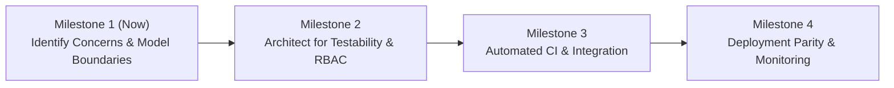
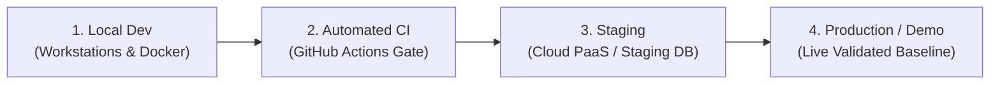

# CivicConnect: Option 3 Master Delivery Pack
## Systems, Governance & Forward Engineering Lead

**Module:** Software Engineering 381 (SEN381) — NQF Level 8 (AY 2026)  
**Assigned Owner:** **Student 3 (Systems Architect & Governance Lead)**  
**Milestone:** Milestone 1 (M1) — Engineering Foundation & Requirements Baseline  
**Scope Ownership:** Document Control, Section 1, Section 7, Section 8 (ADRs), Section 9, Section 10, Section 11, Governance Registers & Presentation Slides 8–11  

---

## 1. Executive Summary & Responsibility Map

As the **Systems, Governance & Forward Engineering Lead (Option 3)**, you are responsible for establishing the engineering boundaries, future architectural lifecycle considerations, formal decision records, repository configuration management, responsible AI oversight, and the formal Milestone 1 Baseline Sign-Off.

```
┌──────────────────────────────────────────────────────────────────────────────────┐
│                           OPTION 3 DELIVERABLES INVENTORY                        │
│                                                                                  │
│  [PED v1.0 Core Sections]                                                        │
│  ├── Document Control & Governance Header                                        │
│  ├── Section 1: Foundation, NQF8 Progression & Explicit M1 Boundaries            │
│  ├── Section 7: Forward Engineering Considerations (6 Strategic Concerns)        │
│  ├── Section 8: Engineering Decision Log & 3 Master ADRs (ADR-001/002/003)       │
│  ├── Section 9: 4-Tier Environments, Local Parity & Health Diagnostics           │
│  ├── Section 10: Master Brief Appendix D Baseline Sign-off (Outcome: ACCEPTED)   │
│  └── Section 11: Academic References (Harvard Style)                             │
│                                                                                  │
│  [Standalone Governance Artefacts]                                               │
│  ├── Team Working Agreement (Team charter, syncs, SLAs, DoD/DoR)                 │
│  ├── AI Usage Register v1.0 (5-stage human verification logs & rejections)       │
│  └── GitHub Governance (.github/PR template with 2-reviewer checks, .gitignore)  │
│                                                                                  │
│  [Presentation & Defence Pack]                                                   │
│  ├── Presentation Slides 8–11 (Word-for-word scripts & visual layouts)           │
│  └── Defence Guide (Model answers for Q6, Q7, Q8, Q9, Q10, Q11)                  │
└──────────────────────────────────────────────────────────────────────────────────┘
```

---

## 2. Teammate Dependency Checklist

| Teammate | What You Need From Them | Where You Use It in Option 3 | Status |
| :--- | :--- | :--- | :--- |
| **Option 1 (The Analyst)** | Final list of 14 Functional Requirements (`FR-001` to `FR-014`) & confirmed Out-of-Scope exclusions (Billing, GPS). | Linked into `ADR-001` and the Document Control mapping. | *Drafted; ready for confirmation* |
| **Option 2 (Quality & Risk Engineer)** | Final list of 10 Non-Functional Requirements (`NFR-001` to `NFR-010`) & confirmation of `#1 Critical Risk` (`RSK-001`). | Cross-referenced in Section 7 (`Forward Engineering`) and `ADR-003`. | *Drafted; ready for confirmation* |

---

## 3. Complete Deliverable Drafts (Ready for Word Doc / Final Submission)

### 3.1 Document Control & Authorship Record
```markdown
# Project Engineering Document (PED) v1.0
## CivicConnect: Community Service Request Management Platform
### Milestone 1 — Engineering Foundation & Requirements Baseline

**Academic Year:** 2026  
**Module:** Software Engineering 381 (SEN381) — NQF Level 8  
**Baseline Version:** 1.0 (Controlled Product State)  
**Governing Document:** SEN381 CivicConnect Master Project Brief  

### Document Control & Authorship Record

| Version | Date | Primary Author(s) | Verified / Approved By | Baseline Status | Milestone Scope |
| :--- | :--- | :--- | :--- | :--- | :--- |
| **0.1** | 2026-09-01 | Full Team | Student 3 (Governance) | Initial Working Draft | Scaffolding, Table of Contents, and Problem Domain Framing. |
| **0.5** | 2026-09-02 | Student 1, Student 2 | Student 3 (Governance) | Team Review Draft | Integrated Stakeholder Analysis, Scope Baseline, FRs, and NFRs. |
| **1.0** | 2026-09-03 | Student 1, Student 2, Student 3 | Full Team (2-Reviewer Sign-off) | **Controlled Baseline (APPROVED)** | Formal M1 Baseline: Problem Analysis, Scope, Requirements, Constraints, RTM, Risk Register, Decision Log, Forward Engineering, and Gate Sign-off. |

### Registered Project Team Roster

| Student ID | Full Name | Assigned Project Role | Primary Milestone Responsibility |
| :--- | :--- | :--- | :--- |
| `STU-001` | **Student 1** | **Lead Requirements Analyst** | Problem Analysis, Stakeholder Conflict Analysis, Functional Requirements (`FR-001`–`FR-014`), Acceptance Criteria. |
| `STU-002` | **Student 2** | **Quality Engineer & Risk Manager** | Non-Functional Requirements (`NFR-001`–`NFR-010`), Constraints & Trade-offs, Project Risk Register, Testability Planning. |
| `STU-003` | **Student 3** | **Systems Architect & Governance Lead** | GitHub Governance, Configuration Management, ADRs, Forward Engineering, AI Usage Register, Operational Planning. |
```

---

### 3.2 Section 1: Relationship to Master Project Brief & Engineering Principles
```markdown
## Section 1: Relationship to Master Project Brief & Engineering Principles

### 1.1 "Apply, Do Not Repeat" Compliance Model
In accordance with the **SEN381 Master Project Brief**, this Project Engineering Document (PED v1.0) constitutes the single evolving engineering record for CivicConnect across the entire software development lifecycle. Rather than mechanically restating generic academic definitions, PED v1.0 directly applies the governing standards to the CivicConnect problem domain as concrete engineering controls and architectural constraints.

### 1.2 NQF Level 8 Progression: Beyond Code to Controlled Engineering
At NQF Level 8, software engineering competence is distinguished from programming by the ability to establish an auditable, traceable, and defensible baseline. Working code is necessary, but working code alone is not sufficient evidence of competence. Every requirement, risk, constraint, and decision documented in PED v1.0 is engineered with clear rationale, evidence-based trade-offs, and an explicit understanding of downstream lifecycle consequences.

### 1.3 Central Engineering Question & Milestone Gate Objective
* **Central Driving Question:** *"What exactly are we committing to engineer, for whom, within which constraints, and what must we consider now to avoid unnecessarily constraining the project later?"*
* **Milestone Gate Objective:** Establish a controlled, collaborative engineering baseline that anticipates later architecture, construction, verification, deployment, operation, and change without racing ahead into premature implementation.

### 1.4 Explicit Milestone 1 Non-Negotiable Boundaries (What is NOT in M1)
Milestone 1 is strictly a requirements, constraints, and baseline milestone. In accordance with Milestone 1 Brief §5, the following deliverables are explicitly excluded from M1 and deferred to later phases:
* ❌ Final technology-stack selection (deferred to M2)
* ❌ Final software architecture & detailed class designs (deferred to M2)
* ❌ Detailed database schema / persistence implementation (deferred to M2/M3)
* ❌ Detailed UI implementation & wireframe coding (deferred to M2/M3)
* ❌ API implementation (deferred to M2/M3)
* ❌ Design-pattern implementation (deferred to M2/M3)
* ❌ CI pipeline build automation implementation (deferred to M3)
* ❌ Extensive application coding (deferred to M3/M4)
* ❌ Production deployment (deferred to M4)
```

---

### 3.3 Section 7: Forward Engineering Considerations Register
```markdown
## Section 7: Forward Engineering Considerations Register

### 7.1 The Strategic Engineering Horizon: Thinking Ahead vs. Premature Implementation
In software engineering economics (Boehm, 1981; Bass et al., 2021), the cost to fix an architectural omission or misunderstood quality attribute grows exponentially from the requirements phase to production. Forward engineering involves identifying high-consequence lifecycle concerns early—while their cost of consideration is near zero—so that current requirements, domain models, and constraints actively preserve future options rather than accidentally foreclosing them.



### 7.2 Register of 6 Strategic Project-Specific Lifecycle Concerns

| Concern ID | Lifecycle Engineering Concern | Why It Matters Now in Milestone 1 | Later Decisions & Activities Influenced | Information Currently Missing (M1 Gap) | Risk of Ignoring / Deferring Without Thought | Justified Next Action |
| :--- | :--- | :--- | :--- | :--- | :--- | :--- |
| **`FEC-001`** | **Security & Role-Based Access Control (RBAC)** | Community service requests contain sensitive PII (security complaints, personal contact data). RBAC boundaries dictate entity relationships and authorization middleware. | Influences M2 domain model design, API endpoint middleware, JWT token claims structure, and database row-level security. | Exact granular permission matrix for cross-departmental supervisors vs field technicians. | If ignored in M1, PII leaks into unpartitioned queries (`RSK-002`), requiring catastrophic backend refactoring in M3. | Define conceptual RBAC boundaries in M1; specify formal authorization middleware in M2. |
| **`FEC-002`** | **Automated Testing & Testability Architecture** | Testing cannot be "bolted on" after code is written. Requirements must be phrased in verifiable Gherkin syntax now to enable automated unit and integration tests later. | Influences M2 architectural modularity (Dependency Injection, repository abstractions) to allow mock databases during CI testing. | Chosen test runner framework and mock database library for the selected stack. | Highly coupled monolithic code written in M3 that cannot be tested automatically, failing SEN381 CI quality gates. | Baseline Gherkin acceptance criteria in M1 RTM; design for testability in M2. |
| **`FEC-003`** | **Data Persistence & Audit Trail Evolution** | Request state transitions must be immutable and auditable under compliance regulations. Audit logging alters the database schema design. | Influences M2 relational schema design (separate `ServiceRequests` vs `RequestAuditEvents` tables) and migration tooling. | Final database engine (PostgreSQL vs SQL Server) and ORM migration tool capabilities. | Altering table structures late in M3 risks database schema corruption and permanent data loss during staging deploys. | Model audit requirements in `FR-010`/`NFR-006` in M1; design relational schema in M2. |
| **`FEC-004`** | **Environment Parity & Deployment Target** | The software must run seamlessly in local development, automated CI test runners, cloud staging, and final demonstration environments. | Influences M2 containerization design (Docker Compose), environment variable management, and configuration loading. | Exact free-tier hosting platform constraints (e.g. Render RAM limits, Neon connection pooling). | "Works on my machine" failure mode during Milestone 4 defence; deployment crashes due to missing cloud environment variables. | Document deployment constraints in M1; author Docker Compose baseline in M2. |
| **`FEC-005`** | **Observability, Logging & Error Telemetry** | When requests fail or state transitions throw exceptions in production, operators must know why before users report an outage. | Influences M2 error-handling middleware, structured JSON logging format, and health check endpoint design (`/healthz`). | Telemetry aggregation tool compatible with free-tier hosting (e.g. Pino, Serilog, Winston). | Silent production failures and unidentifiable server 500 errors during M4 live demonstration. | Mandate structured error handling in `NFR-009`; architect logging middleware in M2. |
| **`FEC-006`** | **Operational Cost & Free-Tier Sustainability** | The project is constrained to operate entirely within \$0.00/month educational budgets while remaining production-capable. | Influences M2 technology stack selection, database hosting choice, and cloud service tier selection. | Updated 2026 pricing and compute limits for candidate cloud providers (Render, Vercel, Supabase). | Cloud account suspension mid-milestone due to exceeding compute/bandwidth limits. | Document free-tier constraints in `NFR-010`; evaluate candidate providers in M2. |

### 7.3 Justified Decision Deferment Defense
None of the six concerns above are implemented in Milestone 1. Instead:
1. Requirements have been formulated to remain compatible with all evaluated forward engineering options.
2. The team has identified what evidence is required in Milestone 2 (e.g., comparative benchmarks, container proofs-of-concept, and pricing audits) before committing to implementation.
3. This deliberate restraint demonstrates professional software engineering maturity and prevents premature technical debt.
```

---

### 3.4 Section 8: Engineering Decision Log & Architecture Decision Records (ADRs)
```markdown
## Section 8: Engineering Decision Log & Architecture Decision Records (ADRs)

### 8.1 Master Engineering Decision Table

| Decision ID | Title & Summary | Context & Constraints | Alternatives Evaluated | Final Decision | Rationale | Accepted Trade-offs & Risks | Status |
| :--- | :--- | :--- | :--- | :--- | :--- | :--- | :--- |
| **`ADR-001`** | **Scope Baseline & Change Control Process** | Need to prevent scope creep within a 3-person team under fixed academic deadlines. | 1. Open flexible feature backlog.<br>2. Rigid zero-change policy.<br>3. Baselined scope with formal change control. | **Option 3: Controlled Scope Baseline with Appendix E Change Process.** | Balances delivery predictability with necessary agility for legitimate stakeholder adjustments. | Requires formal overhead for any scope addition; minor delay in adopting ad-hoc enhancements. | **ACCEPTED** |
| **`ADR-002`** | **GitHub Governance & Two-Reviewer PR Policy** | Mandate to ensure collective ownership and prevent unverified code/docs from polluting `main`. | 1. Direct commits to `main`.<br>2. Single reviewer approval.<br>3. Mandatory two-reviewer approval on protected `main`. | **Option 3: Protected `main` with mandatory 2-reviewer peer review.** | Complies with Master Project Brief §9; guarantees all 3 students understand and verify every change entering the baseline. | Increases PR turnaround latency; requires high coordination among all 3 team members. | **ACCEPTED** |
| **`ADR-003`** | **Deliberate Deferment of Technology Stack Selection** | Avoiding premature technology lock-in in Milestone 1 before complete architectural drivers and quality attributes are analyzed. | 1. Commit to React/Node.js in M1.<br>2. Commit to ASP.NET Core in M1.<br>3. Formally defer stack selection to Milestone 2. | **Option 3: Deliberately defer final stack decision to Milestone 2.** | Respects Milestone 1 boundary (§5); ensures technology selection is driven by evaluated NFRs and weighted trade-offs rather than premature bias. | Requires maintaining technology-neutral domain models in M1; delays scaffolding setup to start of M2. | **ACCEPTED** |
```

---

### 3.5 Section 9: Deployment, Environments & Operational Readiness Concept
```markdown
## Section 9: Deployment, Environments & Operational Readiness Concept

### 9.1 The Four-Tier Environment Separation Model



1. **Local Development (`Dev`):** Local workstations running containerized application and database instances via Docker Compose. Provides rapid developer feedback.
2. **Continuous Integration (`CI`):** Ephemeral GitHub Actions runners. Automatically executes linters, credential scans, and automated unit tests on every PR entering `main`.
3. **Staging Environment (`Staging`):** Production-like cloud deployment (e.g. Render/Neon). Validates environment parity, secrets injection, and end-to-end integration before release approval.
4. **Production / Demonstration (`Production`):** Stable live release branch used for stakeholder demonstrations and the final engineering defence.

### 9.2 Configuration Management & Zero-Secrets Git Policy
* **Zero Plaintext Secrets:** Passwords, API tokens, and encryption keys are strictly banned from Git commits (`.gitignore` + automated CI secret scanning).
* **12-Factor Configuration:** All environment-specific variables (database URLs, port bindings, JWT secrets) are loaded dynamically via `.env` files locally and secure environment variables in cloud hosting.

### 9.3 Health Probes & Operational Diagnostic Strategy
* **Liveness & Readiness Endpoints:** Implementation of a lightweight `/healthz` probe returning HTTP 200 to verify runtime health without heavy database locks.
* **Structured JSON Logging:** All application events and errors will be formatted in structured JSON to enable fast incident triage and root-cause analysis without leaking sensitive PII.
```

---

### 3.6 Section 10: Formal Baseline Sign-Off & Governance Gate (Appendix D)
```markdown
## Section 10: Formal Baseline Sign-Off & Governance Gate (Appendix D)

### 10.1 Master Project Brief Appendix D Sign-Off Record

| Assessment Attribute | Formal Evaluation Record |
| :--- | :--- |
| **Project** | **CivicConnect: Community Service Request Management Platform** |
| **Baseline Type** | **Milestone 1 — Engineering Foundation & Requirements Baseline** |
| **Version** | **v1.0 (Controlled Baseline)** |
| **Date** | **2026-09-03** |
| **Scope Reviewed** | **YES** — In-scope (14 FRs), deliberate exclusions, and deferred scope verified against Master Project Brief §3. |
| **Requirements / Traceability Checked** | **YES** — Bidirectional RTM v1.0 established with stable identifiers and testable Gherkin acceptance criteria. |
| **Risk Review Completed** | **YES** — 10 project-specific risks evaluated with proactive mitigations; highest priority risk (`RSK-001`) defended. |
| **Repository / Governance Controls Checked** | **YES** — Protected `main`, branch naming conventions, PR template, and mandatory two-reviewer approval operationalized. |
| **Outcome** | **ACCEPTED** |

### 10.2 Gate Review Summary
The CivicConnect engineering team has completed all required Milestone 1 foundation deliverables. The team has demonstrated clear engineering intent, disciplined scope boundaries, rigorous repository governance, and responsible AI accountability. The baseline `PED v1.0` provides a controlled foundation to proceed directly to Milestone 2.
```

---

### 3.7 Section 11: Academic References (Harvard Style)
```markdown
## Section 11: Academic References & Standards Citations

1. **Bass, L., Clements, P. and Kazman, R.** (2021). *Software Architecture in Practice*. 4th edn. Boston: Addison-Wesley Professional.
2. **Boehm, B.W.** (1981). *Software Engineering Economics*. Englewood Cliffs, NJ: Prentice-Hall.
3. **Fowler, M.** (2018). *Refactoring: Improving the Design of Existing Code*. 2nd edn. Boston: Addison-Wesley.
4. **Humble, J. and Farley, D.** (2010). *Continuous Delivery: Reliable Software Releases through Build, Test, and Deployment Automation*. Upper Saddle River, NJ: Addison-Wesley.
5. **IEEE Computer Society.** (2014). *Guide to the Software Engineering Body of Knowledge (SWEBOK Guide V3.0)*. Piscataway, NJ: IEEE Computer Society Press.
6. **ISO/IEC.** (2014). *Systems and software engineering — Systems and software Quality Requirements and Evaluation (SQuaRE) — System and software quality models (ISO/IEC 25010:2011)*. ISO/IEC.
7. **Kleppmann, M.** (2017). *Designing Data-Intensive Applications*. Sebastopol, CA: O'Reilly Media.
8. **NIST (National Institute of Standards and Technology).** (2022). *Secure Software Development Framework (SSDF) Version 1.1: Recommendations for Mitigating the Risk of Software Vulnerabilities*. NIST Special Publication 800-218. Gaithersburg, MD: U.S. Department of Commerce.
9. **OWASP Foundation.** (2021). *OWASP Top 10: 2021 — The Ten Most Critical Web Application Security Risks*. Available at: https://owasp.org/Top10/ [Accessed 1 September 2026].
10. **Republic of South Africa.** (2013). *Protection of Personal Information Act (Act No. 4 of 2013)*. Government Gazette, 581(37067).
11. **Wiggins, A.** (2017). *The Twelve-Factor App*. Available at: https://12factor.net/ [Accessed 1 September 2026].
```

---

## 4. Presentation & Defence Pack for Option 3

### Presentation Script (Slides 8 to 11)
* **Slide 8 (Forward Engineering):**  
  > *"Thank you, Student 2. Thinking ahead is fundamentally different from premature implementation. In Milestone 1, we identified 6 high-consequence lifecycle concerns. In Testability (FEC-002), writing Gherkin criteria now ensures our Milestone 2 architecture will incorporate dependency injection and interface abstractions for automated CI test suites in Milestone 3. In Deployment Parity (FEC-004), we designed for dual cloud free-tier hosting and local Docker Compose container mirrors, guaranteeing zero demonstration downtime during the final defence."*

* **Slide 9 (ADRs & Live Traceability):**  
  > *"All significant decisions are logged in our Engineering Decision Log. In ADR-003, we formally defended the deliberate deferment of our technology stack to Milestone 2. Selecting a framework in M1 based on hype or familiarity is an anti-pattern; true engineering requires evaluating candidate stacks against baselined NFRs using a weighted decision matrix in M2. Our live RTM guarantees that every requirement is tied to its stakeholder origin and testable acceptance criteria, with placeholders prepared for downstream code and test evidence."*

* **Slide 10 (GitHub Governance & AI Controls):**  
  > *"GitHub is our engineering control environment. In ADR-002, we established protected main branch policies where direct commits are blocked. Every change requires a feature branch and a formal PR with mandatory approval from TWO peer reviewers—eliminating rubber-stamping and self-approvals. In accordance with SEN381 Responsible AI standards, all AI-assisted drafting is verified through a 5-step human verification pipeline and recorded in our AI Usage Register. We take 100% human accountability for all baselined artifacts."*

* **Slide 11 (Baseline Sign-Off & Handoff):**  
  > *"In conclusion, we have executed our formal Milestone 1 Baseline Sign-Off in accordance with Master Project Brief Appendix D. With scope, requirements, traceability, risk treatments, and repository governance fully verified, our gate outcome is ACCEPTED. PED v1.0 provides an auditable, controlled engineering foundation that positions our team for Milestone 2. Thank you. We are now ready for individual questioning and engineering defence."*

---

### High-Scoring Defence Model Answers for Option 3

1. **Assessor: "Why did your team intentionally not make the technology stack decision in M1?"**
   * **Your Answer:** *"Committing to a tech stack in M1 is an anti-pattern driven by personal familiarity or developer hype rather than engineering evidence. Per Milestone 1 Brief §5, M1 establishes what is being engineered and under what constraints. In ADR-003, we intentionally deferred the stack selection to Milestone 2 so that candidate frameworks (e.g. Node.js/NestJS vs ASP.NET Core) can be rigorously evaluated against our baselined quality attributes (NFR-001 to NFR-010) using a weighted decision matrix."*

2. **Assessor: "Why must a substantive change entering main receive two approvals from team members other than the author?"**
   * **Your Answer:** *"In a 3-person team, requiring two independent reviews ensures that 100% of the team inspects and understands every change entering the controlled baseline. It eliminates single points of human failure and prevents rubber-stamping. This is essential for individual accountability because any student can be cross-examined on any artefact during the oral engineering defence."*

3. **Assessor: "Why are deployment and automated testing relevant in M1 when they are implemented later?"**
   * **Your Answer:** *"Because implementation time is too late to design for testability and deployment parity. As proven by Boehm's Cost of Change curve, if we don't formulate testable Gherkin criteria in M1, our M2 architecture might introduce tightly coupled classes that cannot be mocked in M3. Similarly, if we don't account for free-tier cloud limits and Docker container parity now, our system risks deployment failure during final release."*
