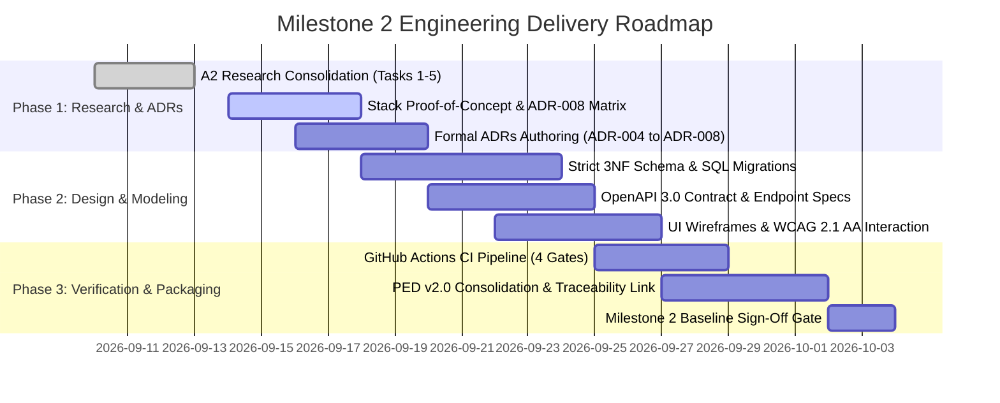

# CivicConnect: Milestone 2 Architecture & Engineering Plan
## Architecture, Design & Engineering Decisions Roadmap (PED v2.0 Planning)

**Academic Year:** 2026  
**Module:** Software Engineering 381 (SEN381) — NQF Level 8  
**Project:** CivicConnect (Community Service Request Management Platform)  
**Governing Documents:** SEN381 Master Project Brief Section 18, Section 20.2 & Assignment 2 Brief  
**Document Identifier:** `DOC-PLAN-M2-001`  
**Status:** APPROVED WORKING ROADMAP (Pre-Milestone 2)  

---

## 1. Executive Summary & Milestone 2 Objective

In strict accordance with the **SEN381 Master Project Brief Section 20.2**, Milestone 2 shifts from the *requirements baseline* of Milestone 1 to answering the central engineering question:

> **Central Driving Question:** *"How should we engineer the solution, and why?"*

While Milestone 1 baselined **what** must be engineered (14 Functional Requirements `FR-001`–`FR-014`, 10 Non-Functional Requirements `NFR-001`–`NFR-010`, and the 6-state ticket lifecycle) and deliberately deferred technology commitments via `ADR-003`, Milestone 2 commits to:
1. **Software Architecture & Structural Style:** Decomposing CivicConnect into decoupled, maintainable layers.
2. **Design Pattern Implementation:** Applying GoF structural and behavioral patterns to isolate domain volatility.
3. **Technology-Stack Commitment:** Resolving `ADR-003` using a formal, evidence-based Weighted Decision Matrix.
4. **Data & Persistence Design:** Normalizing the relational database schema, enforcing ACID transaction boundaries, and implementing optimistic concurrency control.
5. **API Contracts & Integration Architecture:** Designing OpenAPI 3.0 specifications and decoupled outbox patterns for external notification gateways.
6. **Information Architecture & UI Prototypes:** Authoring WCAG 2.1 AA accessible wireframes and interaction flows.
7. **PED Evolution (v1.0 to v2.0):** Updating the single evolving Project Engineering Document with architectural evidence.

---

## 2. Team Roster & Milestone 2 Engineering Ownership

| Student ID | Full Name | Designated Role | Primary Milestone 2 Engineering Ownership |
| :--- | :--- | :--- | :--- |
| **602826** | **Chris Fourie** | **Systems Architect & Governance Lead** | Macro-Architecture (Clean/Layered decomposition), Tech-Stack Weighted Matrix (`ADR-008`), SCM & 4 CI Quality Gates, GitHub Governance, PED v2.0 Consolidation. |
| **602369** | **Pandora Greyling** | **Quality Engineer & Risk Manager** | Database Persistence Architecture (`DOC-ARCH-DATA-001`), ACID Transaction Boundaries, Optimistic Concurrency (`ADR-006`), Automated Test Strategy, Risk Register v2.0. |
| **602006** | **Lisa Verson** | **Lead Requirements & Design Analyst** | Design Pattern Specifications (Observer `ADR-004`, Factory `ADR-005`), API Contracts (OpenAPI 3.0), Transactional Outbox (`ADR-007`), UI Wireframes & WCAG 2.1 AA Compliance. |

---

## 3. Architecturally Significant Requirements (ASRs) & Quality Drivers

Milestone 2 architectural decisions are strictly governed by the quality attributes baselined in Milestone 1:

| Baseline NFR | Metric / Threshold | Architectural Mechanism & Design Response in Milestone 2 |
| :--- | :--- | :--- |
| **`NFR-001` Performance** | API p95 latency $\le 500\text{ms}$ under 50 concurrent users. | In-memory caching for category taxonomies; indexed relational queries; asynchronous background dispatch for slow notifications. |
| **`NFR-002` Availability** | $\ge 99.0\%$ uptime on free-tier cloud PaaS. | Health probe endpoints (`/health/live`, `/health/ready`); stateless web tier enabling automated container restarts. |
| **`NFR-003` Usability** | WCAG 2.1 Level AA; core workflows within 3–4 clicks. | Semantic HTML5 structure, minimum 4.5:1 contrast ratios, screen-reader aria labels, mobile-first responsive layout. |
| **`NFR-004` Security & RBAC** | Enforced role authorization across all endpoints. | Layered authorization middleware / route guards; JWT claims validation; data-layer tenant/role filtering. |
| **`NFR-005` POPIA Privacy** | PII protection; AES-256 at rest; TLS 1.3 in transit. | Data minimization; optional "Anonymized Display" flag masking requester PII from technicians; field-level encryption. |
| **`NFR-006` Auditability** | Immutable audit trail for all state changes. | Append-only `service_request_audit_logs` table; database triggers/interceptor capturing timestamp, actor ID, and old/new state. |
| **`NFR-008` Testability** | $\ge 80\%$ automated branch test coverage gate. | Dependency Injection (DI) and Repository abstractions enabling mockable unit and integration test suites in CI. |
| **`NFR-010` Cost Sustainability** | Strictly \$0.00/month operational cloud expenditure. | Lightweight compute runtime (<512MB RAM); PostgreSQL on Supabase/Neon free tier; zero paid commercial dependencies. |

---

## 4. Macro-Architecture: Clean / Layered Architecture Style

To prevent high coupling and monolithic spaghetti code, CivicConnect adopts a **Clean / Layered Architecture** model with strict dependency inversion:

```
┌─────────────────────────────────────────────────────────────────────────┐
│                           PRESENTATION LAYER                            │
│   • Web Client UI (React / Next.js — WCAG 2.1 AA Compliant)             │
│   • REST API Controllers / Route Handlers (JSON Request/Response)       │
└────────────────────────────────────┬────────────────────────────────────┘
                                     │ Invokes DTOs & Commands
┌────────────────────────────────────▼────────────────────────────────────┐
│                        APPLICATION SERVICES LAYER                       │
│   • Use Case Handlers (CreateRequest, AssignTicket, UpdateStatus)        │
│   • Authorization Guards & Role Permission Filters                      │
│   • Domain Event Dispatcher (Observer Pattern — ADR-004)                │
└────────────────────────────────────┬────────────────────────────────────┘
                                     │ Coordinates Entities
┌────────────────────────────────────▼────────────────────────────────────┐
│                            DOMAIN CORE LAYER                            │
│   • Core Entities: ServiceRequest, User, Category, AuditRecord          │
│   • Finite State Machine Transition Rules (Guarded Invariants)          │
│   • Category Polymorphic Validation (Factory Method — ADR-005)          │
└────────────────────────────────────▲────────────────────────────────────┘
                                     │ Implements Abstractions
┌────────────────────────────────────┴────────────────────────────────────┐
│                       INFRASTRUCTURE / DATA LAYER                       │
│   • Relational Persistence: PostgreSQL / Supabase (Strict 3NF Schema)    │
│   • Repository Implementations & Unit-of-Work Pattern (ADR-006)         │
│   • Transactional Outbox Background Worker (ADR-007)                    │
│   • External Gateways: Email / SMS Dispatchers (Simulated / Free-Tier)  │
└─────────────────────────────────────────────────────────────────────────┘
```

---

## 5. Technology Stack Selection Framework (Resolving ADR-003)

In accordance with Master Project Brief Section 18.1, technology stack selection is an assessed engineering decision, not a personal preference exercise. Milestone 2 will evaluate candidate stacks against our baselined constraints using an empirical **Weighted Decision Matrix**:

### 5.1 Candidate Technology Stacks Under Evaluation

1. **Stack Option A (TypeScript / Node.js / NestJS / PostgreSQL):**
   * *Strengths:* Single-language full stack; lightweight memory footprint (<200MB RAM, easily fitting within free-tier 512MB caps); native JSON handling; mature Prisma/TypeORM ecosystem.
   * *Risks:* Dynamic typing nuances; async promise error management.
2. **Stack Option B (C# / ASP.NET Core Web API / React / PostgreSQL):**
   * *Strengths:* Enterprise-grade compile-time type safety; built-in Identity & RBAC middleware; high throughput; mature Entity Framework Core migrations.
   * *Risks:* Higher base memory footprint (250MB–350MB RAM); slightly slower cold-starts on free-tier Linux containers.
3. **Stack Option C (Python / FastAPI / React / PostgreSQL):**
   * *Strengths:* Rapid prototyping; clear async syntax; Pydantic validation.
   * *Risks:* Multi-threading and concurrency overhead; larger dependency container images.

### 5.2 Weighted Selection Criteria
* Architecture & NFR Fit (Weight: 25%)
* Free-Tier Cloud Quota & Memory Footprint (Weight: 20%)
* Team Capability & 3-Student Learning Curve (Weight: 20%)
* Automated Testing & Tooling Maturity (Weight: 15%)
* Local Docker Container Parity (Weight: 10%)
* Community Support & Vulnerability Maintenance (Weight: 10%)

*Outcome:* Documented formally in **`ADR-008`** in Milestone 2.

---

## 6. Milestone 2 Architecture Decision Records (ADRs) Inventory

| ADR ID | Decision Subject | Primary Architectural Driver | Alternatives Considered | Recommended Direction |
| :--- | :--- | :--- | :--- | :--- |
| **`ADR-004`** | **Observer Pattern for Lifecycle Event Notifications** | Maintainability (`NFR-008`), Loose Coupling | 1. Direct synchronous controller calls.<br>2. Distributed message queue (Kafka/RabbitMQ).<br>3. In-memory Observer Pattern. | **Adopt in-memory Observer Pattern with Domain Event Dispatcher** (protects free-tier memory and isolates entities). |
| **`ADR-005`** | **Factory Method for Request Validation & Intake** | Extensibility, Correctness | 1. Monolithic switch/case block.<br>2. Dynamic runtime reflection.<br>3. Factory Method with specialized validators. | **Adopt Factory Method Pattern** (clean open/closed principle for municipal ticket categories). |
| **`ADR-006`** | **Relational Persistence with Optimistic Concurrency** | Data Integrity (`NFR-009`), Auditability (`NFR-006`) | 1. Unstructured document store (MongoDB).<br>2. Pessimistic row-level locking.<br>3. Strict 3NF Relational Model with Optimistic Locking (`version`). | **Adopt Strict 3NF PostgreSQL with Optimistic Concurrency Control** (prevents lost updates without lock contention). |
| **`ADR-007`** | **Transactional Outbox Pattern for Gateway Integration** | Reliability (`NFR-002`), Fault Tolerance | 1. Direct synchronous HTTP REST calls.<br>2. Fire-and-forget in-process background threads.<br>3. Transactional Outbox Pattern. | **Adopt Transactional Outbox Pattern** (guarantees atomic database commits with reliable asynchronous retries). |
| **`ADR-008`** | **Technology Stack & Framework Commitment** | Cost (`NFR-010`), Performance (`NFR-001`), Team Capacity | 1. NestJS / TypeScript.<br>2. ASP.NET Core / C#.<br>3. FastAPI / Python. | **To be finalized in Milestone 2 via formal Weighted Decision Matrix**. |

---

## 7. Milestone 2 Work Breakdown Structure (WBS) & Milestones



---

## 8. Summary of Controlled Artefacts Feeding Milestone 2

1. **`Assignments/Assignment_2/SEN381_Assignment_2_Research_to_Engineering_Decisions.md`**: Comprehensive research foundation covering design patterns, persistence correctness, API integration, and CI quality gates.
2. **`docs/architecture/Database_Architecture_and_Persistence_Plan_v1.0.md`**: Complete entity-relationship schema, audit logging triggers, and concurrency control models.
3. **`docs/planning/Milestone_2_Architecture_and_Engineering_Plan.md`**: Macro-architectural roadmap, clean architecture layer specifications, and WBS execution schedule.
