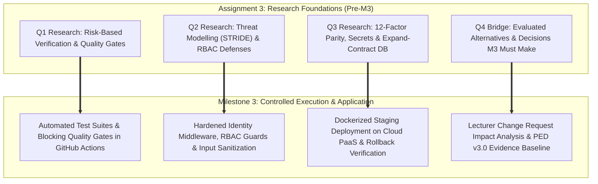

# CivicConnect: Milestone 3 Quality, Security & Release Readiness Plan
## Controlled Construction, Integration, Quality & Staging Deployment Roadmap (PED v3.0 Planning)

**Academic Year:** 2026  
**Module:** Software Engineering 381 (SEN381) — NQF Level 8  
**Project:** CivicConnect (Community Service Request Management Platform)  
**Governing Documents:** SEN381 Master Project Brief §20.3, §14, §15, §16, §17 & Assignment 3 Brief  
**Document Identifier:** `DOC-PLAN-M3-001`  
**Status:** WORKING ROADMAP (Pre-Milestone 3 Engineering Alignment)  

---

## 1. Executive Summary & Milestone 3 Objective

In strict accordance with the **SEN381 Master Project Brief Section 20.3**, Milestone 3 advances from the *architectural baseline* of Milestone 2 to answering the central engineering question:

> **Central Driving Question:** *"Can the team safely construct, change, integrate, verify and prepare the system for release?"*

Milestone 3 is the culmination of controlled software engineering where individual coding skills are integrated into an auditable team engineering environment. It requires the team to deliver:
1. **Substantial Working Implementation:** Constructing the core domain logic, persistence, and UI based on baselined M2 designs.
2. **Controlled Client Change Management:** Ingesting an official lecturer/client Change Request (CR) and conducting a formal 7-dimension impact analysis (`Appendix E`) before controlled implementation.
3. **Rigorous Configuration Management & CI:** Enforcing the mandatory **two-reviewer peer review rule** (`ADR-002`) and multi-stage automated CI quality gates on protected `main`.
4. **Comprehensive Quality & Test Evidence:** Generating traceable evidence across unit, integration, and regression suites rather than relying on unproven coverage numbers.
5. **Security Engineering & Threat Controls:** Implementing defensive controls for authentication, RBAC authorization, and secrets protection.
6. **Staging Deployment & Environment Parity:** Deploying an immutable release artifact to a staging environment mirroring production runtime, database, and configuration.
7. **Production Readiness & Rollback Preparation:** Verifying synthetic health checks, database backward compatibility, and documenting operational telemetry.
8. **PED Evolution (v2.0 to v3.0):** Updating the single evolving Project Engineering Document with all construction, change, test, and release evidence.

---

## 2. Research-to-Implementation Architecture: The A3 $\longrightarrow$ M3 Bridge

In strict adherence to the **"A3 Researches $\longrightarrow$ M3 Decides"** non-negotiable boundary:
* **Assignment 3** explores the problem space, evaluates tool trade-offs, analyzes failure modes, and establishes what evidence is required.
* **Milestone 3** evaluates CivicConnect's actual requirements, team constraints, and schedule to make, implement, and defend those decisions.

---

## 3. Team Engineering Ownership & Allocation for Milestone 3

| Student ID | Full Name | Designated Role | Primary Milestone 3 Engineering Ownership |
| :--- | :--- | :--- | :--- |
| **602826** | **Chris Fourie** | **Systems Architect & Governance Lead** | Automated CI/CD Pipeline Configuration, Branch Protection & Quality Gates, Staging Deployment & Environment Parity, Secrets Hardening, Rollback Drill & Operational Telemetry, PED v3.0 Master Consolidation. |
| **602369** | **Pandora Greyling** | **Quality Engineer & Risk Manager** | Automated Integration & API Test Suites, Mock Database Test Harness, Code Coverage & Mutation Analysis, Defect Register Management, Risk Register v3.0 Updates. |
| **602006** | **Lisa Verson** | **Lead Requirements & Design Analyst** | Client Change Request Ingestion & Impact Analysis (`Appendix E`), Core Functional Implementation (`FR-001`–`FR-014`), RBAC Middleware & Security Defenses, RTM v3.0 Traceability Synchronization. |

---

## 4. Key Milestone 3 Deliverables & Evidence Targets

### 4.1 Client Change Request & Controlled Impact Analysis
* In accordance with Master Project Brief §14 and `Appendix E`, when the lecturer issues the formal Milestone 3 Change Request, the team will not silently hack the code.
* Lisa Verson will lead the impact analysis evaluating: Requirements affected, Architecture/Design affected, UI/API/Data affected, Security/Privacy impact, Quality/Testing impact, Scope/Schedule impact, Cost impact, and Risk impact.
* The change must be formally approved by all 3 team members before implementation branches are spawned.

### 4.2 Automated Build, Quality Gates & CI Pipeline
* Chris Fourie will operationalize GitHub Actions workflows executing 4 sequential quality gates:
  1. `Gate 1: Build & Dependency Restoration` (Ensuring zero missing packages).
  2. `Gate 2: Static Analysis & Code Linting` (Zero high-severity linter defects).
  3. `Gate 3: Automated Unit & Concurrency Tests` (Passing domain state machine tests).
  4. `Gate 4: Automated API Integration Tests` (Executing against ephemeral test database).
* Commits to `main` remain strictly blocked; all integrations require **two independent non-author peer reviews** (`ADR-002`).

### 4.3 Staging Deployment & Environment Parity
* Chris Fourie will establish a production-mirroring staging environment on a free-tier PaaS (e.g., Render/Fly.io) backed by managed PostgreSQL (Neon).
* Verification of container parity, environment variable configuration injection, and automated synthetic health checks (`/healthz`).
* Demonstration of a verified rollback drill and backup restoration process.

### 4.4 Defect Register & Residual Risk Accounting
* Pandora Greyling will maintain the live Defect Register tracking defect ID, severity, root cause, resolution status, and regression test link.
* Unresolved defects will be honestly documented as residual engineering risks rather than concealed.

---

## 5. Traceability to Assignment 3 Findings

| A3 Finding ID | Domain | A3 Evaluated Research | Concrete M3 Engineering Implementation Plan |
| :---: | :--- | :--- | :--- |
| **F-01** | Quality | Automated API Integration Tests | Implement automated API contract tests for ticket lifecycle transitions against test database. |
| **F-02** | Quality | Multi-Tier Quality Gates | Configure GitHub Actions CI workflow blocking PRs on lint or unit test failure. |
| **F-03** | Security | Contextual BOLA/IDOR Tests | Author automated negative permission tests asserting HTTP 403 on cross-citizen ticket requests. |
| **F-04** | Security | Git Secret Scanning | Integrate automated Gitleaks / secret scan into pre-commit and CI verification pipeline. |
| **F-05** | Production | 12-Factor Environment Parity | Package web application into standardized Docker OCI image executed across Staging and Prod. |
| **F-06** | Production | Expand-Contract DB Migrations | Structure all database schema changes to be non-breaking and backward-compatible for rollback. |
